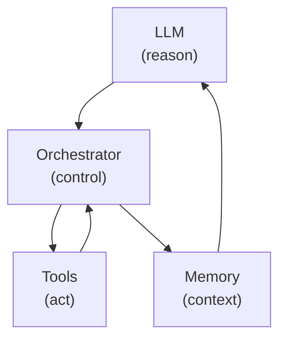

# Chaining Prompts for Agentic Reasoning

## Resumo
 - **O que:** Padrões para encadear prompts em fluxos de trabalho agentivos.
 - **Por que:** Reduz halluci­nações e permite validações entre etapas (gate checks).
 - **Como:** Decomponha tarefas, defina critérios de sucesso por etapa e use validações estruturadas (ex.: Pydantic, ast).

## 1) Por que o encadeamento de prompts importa

Modelos de Linguagem (LLMs) são fortes em geração de uma única interação, mas têm dificuldades em workflows de múltiplas etapas, especialmente quando a tarefa exige dados externos (por exemplo: tempo, calendário, inventário, APIs de política).

Agentes de IA resolvem isso combinando raciocínio com execução:

$$
	ext{Agent} = \text{LLM (reason)} + \text{Tools (act)} + \text{Orchestration (control)}
$$

### Componentes comuns de um agente

 - **LLM**: motor de raciocínio.
 - **Tools**: APIs/funções para recuperação e ações.
 - **Instructions**: comportamento e restrições de sistema.
 - **Memory**: contexto de curto prazo + histórico de longo prazo.
 - **Runtime/Orchestration Layer**: controla o loop e o uso de ferramentas.

Para alcançar metas complexas, agentes decompõem tarefas em etapas menores e avaliam o progresso em cada passo.



---

## 2) Encadeamento de Prompts: ideia central

O encadeamento conecta programaticamente saídas e entradas entre chamadas:

$$
	ext{Output}_1 \rightarrow \text{Input}_2,\quad \text{Output}_2 \rightarrow \text{Input}_3
$$

### Exemplo: fluxo para publicar no LinkedIn

1. **Pesquisa** → `RESPONSE_1`
2. **Resumir** usando `RESPONSE_1` → `RESPONSE_2`
3. **Rascunho** usando `RESPONSE_2` → `FINAL_RESPONSE`

Esse pipeline é mais controlável e manutenível do que um único prompt muito grande.

| Padrão | Quando usar | Compromissos |
|---|---:|---|
| Chain (ReAct) | Tarefas multi-etapa que requerem ferramentas | Controle determinístico, precisa de mais engenharia |
| Chain (CoT) | Raciocínios complexos em uma única chamada | Simples, mas arriscado para uso de ferramentas |

---

## 3) Por que o encadeamento é essencial para agentes

Pergunta: **"Que horas é minha consulta odontológica amanhã?"**

### Workflow rígido (hard-coded)
1. Perguntar ao modelo se os dados do calendário são necessários.
2. Se sim, chamar `get_calendar()`.
3. Pedir ao modelo para responder a partir da saída da ferramenta.

### Workflow agentivo (estilo ReAct)
1. `THOUGHT`: Preciso dos dados do calendário.
2. `ACTION`: `get_calendar("amanha")`
3. Orquestrador retorna observação (`"9am"`).
4. `THOUGHT`: Agora tenho a resposta.
5. `ACTION`: `final_answer("9am")`

O encadeamento liga essas ações, mas o encadeamento **sozinho** não é suficiente.

---

## 4) Validação de saída: Gate Checks

LLMs podem alucinar, falhar no formato ou ignorar instruções. Erros em etapas iniciais podem se propagar.

Gate checks adicionam controle de qualidade entre etapas:

 - **Passou**: prosseguir.
 - **Falhou**: interromper, tentar novamente ou tentar com feedback de falha.

### Pseudocódigo genérico

```python
output = call_llm(prompt_step1)

if validate_output(output):
	next_input = process(output)
	call_llm(prompt_step2, next_input)
else:
	handle_error(output)
```

### Poor vs Optimized (code-first)

Poor (sem validação):

```python
def run_simple_chain(prompts, llm):
	responses = []
	for p in prompts:
		responses.append(llm(p))
	return responses[-1]
```

Otimizado (validação + retries):

```python
from typing import Callable
def chain_with_validation(prompts: list[str], llm: Callable[[str], str],
						  validator: Callable[[str], bool], retries: int = 2):
	last = None
	for p in prompts:
		attempt = 0
		while attempt <= retries:
			out = llm(p if last is None else f"{p}\n\nPrevious:\n{last}")
			if validator(out):
				last = out
				break
			attempt += 1
		else:
			raise RuntimeError("Validation failed after retries")
	return last
```

### Estratégias típicas de falha

1. **Parar** imediatamente (fluxos de alto risco).
2. **Repetir** com o mesmo prompt.
3. **Repetir com feedback** (incluir a razão da falha explicitamente).

---

## 5) Tipos de Gate Checks

| Tipo | O que valida | Implementação comum |
|---|---|---|
| **Verificação de formato** | Forma JSON/XML, campos obrigatórios, tamanho | Pydantic, validação de esquema, APIs de saída estruturada |
| **Verificação de conteúdo** | Presença de palavras-chave, citações, relevância | Regex, similaridade por embeddings, checagens por segundo LLM |
| **Verificação lógica** | Consistência numérica/lógica, qualidade de código | `ast`, linters, testes unitários, restrições de política |

---

## 6) Caso de uso: geração de script para análise de dados

Objetivo: gerar código Python que leia um CSV, calcule a média de uma coluna e grave o resultado.

### Etapa 1 — Gerar esboço

O prompt solicita um plano curto e numerado.

Gate 1 (opcional):
 - formato em lista presente,
 - verbos-chave presentes (`read`, `process`, `write`).

### Etapa 2 — Gerar código a partir do esboço

O prompt injeta `outline_response` da Etapa 1.

**Gate 2**:
 - validar sintaxe via `ast.parse()` (ou linter).

### Etapa 3 — Refinar se a sintaxe falhar

Enviar o código gerado e os detalhes do erro de sintaxe como feedback.

Reexecutar o Gate 2 com contador máximo de tentativas.

### Fluxo fim-a-fim

1. Prompt 1 → Esboço → Gate 1
2. Prompt 2 → Código → Gate 2
3. Se falhar: Prompt 3 (corrigir) → Gate 2 (loop de tentativa)

---

## 7) Implementando encadeamentos em Python

Em tempo de execução, encadear prompts é gerenciar strings e chamadas sequenciais à API.

```python
prompt_step1 = """
Você é um assistente de programação prestativo.
Preciso de um script Python para ler input_data.csv,
calcular a média da coluna 'value' e gravar o resultado em output.txt.
Forneça um plano simples passo a passo.
"""

outline_response = get_completion(prompt_step1)

prompt_step2 = f"""
Com base no esboço abaixo, escreva código Python completo.
Use bibliotecas padrão e inclua comentários.

Esboço:
---
{outline_response}
---
"""

code_response = get_completion(prompt_step2)
```

Verificação de sintaxe:

```python
import ast

def check_python_syntax(code: str) -> tuple[bool, str]:
	try:
		ast.parse(code)
		return True, "Sem erros de sintaxe."
	except SyntaxError as e:
		return False, f"Erro de sintaxe: {e}"
```

---

## 8) Pydantic para saídas estruturadas confiáveis

Saídas em linguagem natural variam em estrutura e são difíceis de automatizar com segurança.

Pydantic resolve isso com schemas explícitos:

 - **Validação**: rejeita dados malformados ou incompletos.
 - **Parsing**: converte JSON em objetos tipados Python.

### Por que isso importa nas cadeias

Pydantic funciona como um gate check entre etapas:

$$
	ext{LLM JSON} \xrightarrow{\text{Pydantic validate}} \text{Typed Object} \rightarrow \text{Next Step}
$$

### Modelos de exemplo: `OrderItem` e `Order`

```python
from pydantic import BaseModel, Field
from typing import List, Optional


class OrderItem(BaseModel):
	sku: str = Field(..., description="Stock Keeping Unit")
	quantity: int = Field(..., description="Quantidade pedida")
	item_name: Optional[str] = Field(None, description="Nome do item, se disponível")


class Order(BaseModel):
	order_id: int = Field(..., description="Identificador único do pedido")
	customer_email: Optional[str] = Field(None, description="Email do cliente")
	items: List[OrderItem] = Field(..., description="Itens do pedido")
	total_amount: float = Field(..., description="Valor total do pedido")
```

### Gate de validação

```python
from pydantic import ValidationError

def validate_order_payload(payload: dict) -> tuple[bool, str]:
	try:
		Order.model_validate(payload)
		return True, "Payload válido"
	except ValidationError as e:
		return False, e.json()
```

---

## 9) Regras práticas de projeto

1. Divida tarefas grandes em prompts específicos por etapa.
2. Defina critérios explícitos de sucesso para cada etapa.
3. Adicione gate checks determinísticos quando possível.
4. Limite tentativas para evitar loops infinitos.
5. Registre prompt/saída/validação a cada iteração.
6. Use saídas estruturadas + Pydantic para confiabilidade máquina-a-máquina.

---

## 10) Recapitulação

 - A decomposição de tarefas melhora a qualidade do raciocínio.
 - O encadeamento de prompts cria um pipeline programável.
 - Gate checks evitam propagação de erros.
 - Pydantic torna as saídas de agentes mais robustas e interoperáveis.

Esses padrões formam a base de workflows agentivos confiáveis em produção.