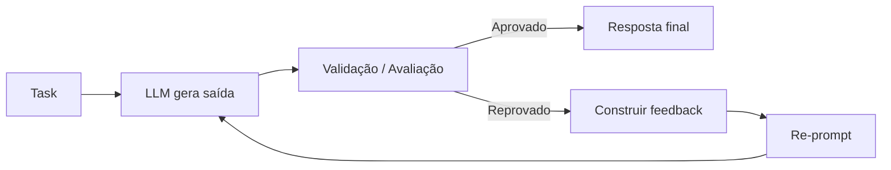

# LLM Feedback Loops

## 1. Conceito Fundamental

**Feedback Loop** é um ciclo iterativo em que o agente:
1. gera uma saída,
2. avalia o resultado,
3. transforma a avaliação em feedback,
4. tenta novamente com base nesse feedback.

$$
\text{Output}_{t+1} = \text{LLM}\big(\text{Task} + \text{Feedback}(\text{Output}_t)\big)
$$

> Em vez de uma única tentativa (*one-shot*), o agente melhora progressivamente até atingir um critério de qualidade.

---

## 2. Arquitetura do Loop

- 🧠 **Generator LLM**: produz a primeira versão da resposta.
- 🧪 **Evaluator**: mede qualidade (pode ser outro LLM, regras ou testes).
- 🛠️ **Tooling/Validators**: executa checks objetivos (testes, parser, schema).
- 🧾 **Feedback Builder**: converte erros e observações em instruções acionáveis.
- 🔁 **Orchestrator**: controla número de iterações, critério de parada e logs.

### Fluxo (visão prática)



---

## 3. Fontes de Feedback

| Fonte | Como funciona | Exemplo de feedback |
|---|---|---|
| **Autoavaliação (Self-Correction)** | O próprio LLM revisa sua resposta com critérios explícitos | "Tom está informal; reescreva com linguagem profissional." |
| **Ferramentas Externas** | O output é executado/avaliado por ferramenta real | "Teste `test_sort_numbers_basic` falhou: esperado `[1,2,3]`, obtido `[3,2,1]`." |
| **Validação Programática** | Regras objetivas em código | "JSON inválido: campo obrigatório `email_address` ausente." |
| **Input do Usuário** | Feedback humano direto | "Inclua opções de atividades ao ar livre no roteiro." |

---

## 4. Monitoramento: o que medir

Sem monitoramento, o loop vira tentativa e erro sem controle. Monitore:

- **Qualidade da saída**: aderência a formato, precisão técnica, completude.
- **Taxa de erro**: quantos critérios falham por iteração.
- **Aderência ao objetivo**: percentual de requisitos já atendidos.
- **Convergência**: melhora real entre iterações ou estagnação.
- **Trace por passo (logs)**: prompt, resposta, feedback e decisão em cada ciclo.

### Exemplo de evolução esperada

| Iteração | Testes passando | Status |
|---|---:|---|
| 1 | 0/3 | Output inicial com erros |
| 2 | 1/3 | Melhorou após feedback |
| 3 | 2/3 | Erros restantes isolados |
| 4 | 3/3 | Critério de sucesso atingido |

---

## 5. Exemplo Técnico: Refinamento Iterativo de Código

### Objetivo
Gerar uma função Python `sort_numbers(numbers)` que retorne **nova lista** ordenada em ordem crescente.

### Ciclo
1. LLM gera código inicial.
2. Runner executa testes.
3. Falhas viram feedback estruturado.
4. LLM reescreve a função com base nesse feedback.
5. Repetir até passar em todos os testes ou atingir limite de iterações.

```python
from dataclasses import dataclass
from typing import Callable


@dataclass
class LoopResult:
    code: str
    passed: bool
    test_report: str
    iterations: int


def refine_code_with_feedback(
    task_prompt: str,
    llm_call: Callable[[str], str],
    run_tests: Callable[[str], tuple[bool, str]],
    max_iterations: int = 5,
) -> LoopResult:
    """Executa um feedback loop para refinar código gerado por LLM."""

    prompt = task_prompt
    code = ""
    report = ""

    for i in range(1, max_iterations + 1):
        code = llm_call(prompt)
        passed, report = run_tests(code)

        if passed:
            return LoopResult(code=code, passed=True, test_report=report, iterations=i)

        prompt = (
            "Reescreva a função mantendo a assinatura original e corrija os erros.\n"
            f"CODIGO_ANTERIOR:\n{code}\n\n"
            f"FEEDBACK_TESTES:\n{report}\n"
        )

    return LoopResult(code=code, passed=False, test_report=report, iterations=max_iterations)
```

> **Boas práticas de segurança:** execute código gerado em ambiente isolado (sandbox), com limite de tempo e recursos.

---

## 6. Regras de Engenharia para Loops Confiáveis

- Defina **critério de sucesso objetivo** antes de iniciar o loop.
- Escreva feedback em formato **específico e acionável**.
- Limite iterações (`max_iterations`) para evitar loops infinitos.
- Prefira validações determinísticas (testes, schema) quando possível.
- Logue cada passo para depuração e melhoria do workflow.

---

## 7. Key Takeaways

- Feedback loops tornam agentes LLM mais confiáveis para tarefas complexas.
- A qualidade do sistema depende da qualidade do mecanismo de feedback.
- Monitorar o ciclo é obrigatório para avaliar progresso e corrigir falhas de projeto.
- Iteração bem projetada aproxima agentes de comportamento realmente agêntico.
 
---

## Implementing an AI That Learns From Its Mistakes

Você aprendeu que podemos guiar uma IA através de tarefas complexas em múltiplas etapas. Mas o que acontece quando a IA comete um erro durante o processo?

Uma experiência comum ao usar IA para geração de código: pedimos ao modelo um trecho e ele devolve algo quase perfeito — mas com um pequeno bug, erro de sintaxe ou requisito não atendido. O impulso imediato é consertar o código manualmente.

E se pudéssemos ensinar a própria IA a corrigir seus erros? Essa é a ideia central por trás da implementação de um Loop de Feedback com LLMs.

Vamos ver na prática.

### Cenário: Cartão de Perfil (HTML/CSS)

Precisamos que a IA gere o HTML e CSS de um cartão de perfil simples e estilizado.

#### Tentativa 1 — Geração Inicial (com falha)

Primeiro, damos ao modelo o prompt inicial:

```python
# Prompt inicial para o cartão de perfil
prompt_initial = """
Você é um desenvolvedor web. Gere o HTML e o CSS para um cartão de perfil de usuário.
Deve conter:
- Um container com fundo cinza claro e sombra sutil.
- Um placeholder para a imagem do avatar.
- O nome e o cargo do usuário abaixo do avatar.
"""

# Supomos que chamamos o LLM e obtemos `initial_code`
# initial_code = get_completion(prompt_initial)
# print(initial_code)
```

Saída provável (com falha): o modelo pode gerar código funcional, porém com um defeito de design — por exemplo, esquecer de centralizar o texto do nome e do cargo, deixando o cartão desalinhado.

#### Etapa 2 — Mecanismo de Feedback

Em vez de consertar manualmente, atuamos como revisor de código e fornecemos feedback. Em aplicações reais, esse feedback pode vir de um linter, um teste de regressão visual ou, como no exercício, de uma suíte de testes automatizados.

Para demonstração, o feedback será uma descrição em linguagem natural do problema:

```python
# Feedback descrevendo o problema da primeira versão
feedback = "O código gerado está bom como ponto de partida, mas apresenta um defeito de layout: o nome e o cargo não estão centralizados no cartão. Corrija o CSS para centralizar o texto."
```

#### Etapa 3 — Loop de Feedback (Prompt Corretivo)

Agora o mais importante: construímos um novo prompt que inclui o código anterior e o feedback específico.

```python
# Prompt corretivo que pede ao modelo revisar seu próprio código
prompt_corrective = f"""
Você é um desenvolvedor web. Você gerou anteriormente um código que contém um erro.
Por favor, revise o código para corrigir o problema descrito no feedback.

Seu código anterior:
---
<HTML_E_CSS_DA_VERSAO_INICIAL>
---

Feedback sobre seu código:
---
{feedback}
---

Por favor, forneça o HTML e o CSS completos e corrigidos.
"""

# corrected_code = get_completion(prompt_corrective)
# print(corrected_code)
```

Saída provável: o modelo retorna uma versão corrigida onde, por exemplo, `text-align: center;` ou regras equivalentes foram aplicadas corretamente.

Este loop simples — Gerar → Avaliar → Feedback → Revisar — é a base para sistemas de IA que se auto-aperfeiçoam.

Próximo passo: automatizar o feedback substituindo a revisão manual por uma suíte de testes Python que atue como avaliador. Construa um loop que:

- chama o LLM para gerar código;
- executa testes em sandbox (unit tests, validações de DOM/CSS, linters);
- gera `feedback` estruturado a partir dos resultados dos testes;
- reprompts o LLM com o código + feedback;
- repete até `all_tests_pass` ou `max_iterations`.

---

## 🧪 Exercícios Práticos

Para aplicar os conceitos deste tópico na prática, consulte:

- 📓 [Lesson 5: Implementando Feedback Loops com LLMs](../exercises/08-lesson-5-implementing-llm-feedback-loops.ipynb) — implementação completa de um loop de feedback iterativo: geração de código, execução de testes automatizados, feedback estruturado e re-prompting até convergência

---

**Tópico anterior:** [Encadeamento de Prompts para Raciocínio Agêntico](07-chaining-prompts-for-agentic-reasoning.md) | [Próximo Tópico: Módulo 1 — Índice →](1_Prompting_for_Effective_LLM_Reasoning_and_Planning/README.md)
