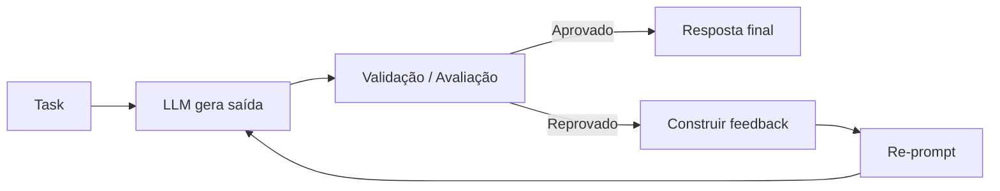

# LLM Feedback Loops

## 1. Conceito Fundamental

**Feedback Loop** é um ciclo iterativo em que o agente:
1. gera uma saída,
2. avalia o resultado,
3. transforma a avaliação em feedback,
4. tenta novamente com base nesse feedback.

$$
\text{Output}_{t+1} = \text{LLM}\big(\text{Task} + \text{Feedback}(\text{Output}_t)\big)
$$

> Em vez de uma única tentativa (*one-shot*), o agente melhora progressivamente até atingir um critério de qualidade.

---

## 2. Arquitetura do Loop

- 🧠 **Generator LLM**: produz a primeira versão da resposta.
- 🧪 **Evaluator**: mede qualidade (pode ser outro LLM, regras ou testes).
- 🛠️ **Tooling/Validators**: executa checks objetivos (testes, parser, schema).
- 🧾 **Feedback Builder**: converte erros e observações em instruções acionáveis.
- 🔁 **Orchestrator**: controla número de iterações, critério de parada e logs.

### Fluxo (visão prática)


```mermaid
flowchart LR
    A[Task] --> B[LLM gera saída]
    B --> C[Validação / Avaliação]
    C -->|Aprovado| D[Resposta final]
    C -->|Reprovado| E[Construir feedback]
    E --> F[Re-prompt]
    F --> B
```

---

## 3. Fontes de Feedback

| Fonte | Como funciona | Exemplo de feedback |
|---|---|---|
| **Autoavaliação (Self-Correction)** | O próprio LLM revisa sua resposta com critérios explícitos | "Tom está informal; reescreva com linguagem profissional." |
| **Ferramentas Externas** | O output é executado/avaliado por ferramenta real | "Teste `test_sort_numbers_basic` falhou: esperado `[1,2,3]`, obtido `[3,2,1]`." |
| **Validação Programática** | Regras objetivas em código | "JSON inválido: campo obrigatório `email_address` ausente." |
| **Input do Usuário** | Feedback humano direto | "Inclua opções de atividades ao ar livre no roteiro." |

---

## 4. Monitoramento: o que medir

Sem monitoramento, o loop vira tentativa e erro sem controle. Monitore:

- **Qualidade da saída**: aderência a formato, precisão técnica, completude.
- **Taxa de erro**: quantos critérios falham por iteração.
- **Aderência ao objetivo**: percentual de requisitos já atendidos.
- **Convergência**: melhora real entre iterações ou estagnação.
- **Trace por passo (logs)**: prompt, resposta, feedback e decisão em cada ciclo.

### Exemplo de evolução esperada

| Iteração | Testes passando | Status |
|---|---:|---|
| 1 | 0/3 | Output inicial com erros |
| 2 | 1/3 | Melhorou após feedback |
| 3 | 2/3 | Erros restantes isolados |
| 4 | 3/3 | Critério de sucesso atingido |

---

## 5. Exemplo Técnico: Refinamento Iterativo de Código

### Objetivo
Gerar uma função Python `sort_numbers(numbers)` que retorne **nova lista** ordenada em ordem crescente.

### Ciclo
1. LLM gera código inicial.
2. Runner executa testes.
3. Falhas viram feedback estruturado.
4. LLM reescreve a função com base nesse feedback.
5. Repetir até passar em todos os testes ou atingir limite de iterações.

```python
from dataclasses import dataclass
from typing import Callable


@dataclass
class LoopResult:
    code: str
    passed: bool
    test_report: str
    iterations: int


def refine_code_with_feedback(
    task_prompt: str,
    llm_call: Callable[[str], str],
    run_tests: Callable[[str], tuple[bool, str]],
    max_iterations: int = 5,
) -> LoopResult:
    """Executa um feedback loop para refinar código gerado por LLM."""

    prompt = task_prompt
    code = ""
    report = ""

    for i in range(1, max_iterations + 1):
        code = llm_call(prompt)
        passed, report = run_tests(code)

        if passed:
            return LoopResult(code=code, passed=True, test_report=report, iterations=i)

        prompt = (
            "Reescreva a função mantendo a assinatura original e corrija os erros.\n"
            f"CODIGO_ANTERIOR:\n{code}\n\n"
            f"FEEDBACK_TESTES:\n{report}\n"
        )

    return LoopResult(code=code, passed=False, test_report=report, iterations=max_iterations)
```

> **Boas práticas de segurança:** execute código gerado em ambiente isolado (sandbox), com limite de tempo e recursos.

---

## 6. Regras de Engenharia para Loops Confiáveis

- Defina **critério de sucesso objetivo** antes de iniciar o loop.
- Escreva feedback em formato **específico e acionável**.
- Limite iterações (`max_iterations`) para evitar loops infinitos.
- Prefira validações determinísticas (testes, schema) quando possível.
- Logue cada passo para depuração e melhoria do workflow.

---

## 7. Key Takeaways

- Feedback loops tornam agentes LLM mais confiáveis para tarefas complexas.
- A qualidade do sistema depende da qualidade do mecanismo de feedback.
- Monitorar o ciclo é obrigatório para avaliar progresso e corrigir falhas de projeto.
- Iteração bem projetada aproxima agentes de comportamento realmente agêntico.
 - Iteração bem projetada aproxima agentes de comportamento realmente agêntico.
 
---

## Implementing an AI That Learns From Its Mistakes

You've learned that we can guide an AI through complex, multi-step tasks. But what happens when the AI makes a mistake along the way?

Here's a common experience when using AI for code generation: you ask it to create a code snippet, and it returns something that is almost perfect. It has a small bug, a syntax error, or it doesn't quite meet all the requirements. Your instinct is to manually fix the code yourself.

But what if we could teach the AI to fix its own mistakes? This is the core idea behind implementing an LLM Feedback Loop.

Let's see how this works in practice.

### Scenario: Profile Card (HTML/CSS)

We need an AI to generate the HTML and CSS for a simple, styled user profile card.

#### Attempt 1: The Initial (Flawed) Generation

First, we'll give the AI a prompt with our initial request.

```python
# The initial prompt for the profile card
prompt_initial = """
You are a web developer. Generate the HTML and CSS for a user profile card.
It should have:
- A container with a light grey background and a subtle shadow.
- An avatar image placeholder.
- The user's name and title below the avatar.
"""

# Let's assume we call the LLM and get a response
# initial_code = get_completion(prompt_initial)
# print(initial_code)
```

Likely (Flawed) Output: Let's imagine the AI returns code that is functional but has a design flaw. For example, maybe it forgets to center the text, making the card look unprofessional.

#### Step 2: The Feedback Mechanism

Instead of fixing the CSS ourselves, we will act as a code reviewer and provide feedback. In a real application, this feedback could come from an automated linter, a visual regression test, or, as we'll see in the exercise, a suite of unit tests.

For this demonstration, our feedback will be a simple, natural language description of the problem:

```python
# The feedback describes the problem with the initial code
feedback = "The generated code is a good start, but it has a design flaw: The user's name and title text are not centered within the card. Please fix the CSS to center-align the text."
```

#### Step 3: The Feedback Loop (The Corrective Prompt)

Now for the most important part. We will create a new prompt that includes both the AI's original, flawed code and our specific feedback.

```python
# A new prompt that asks the AI to revise its own work
prompt_corrective = f"""
You are a web developer. You previously generated some code that had an error.
Please revise the code to fix the issue described in the feedback.

Your previous code:
---
<HTML_AND_CSS_FROM_INITIAL_CODE>
---

Feedback on your code:
---
{feedback}
---

Please provide the complete, corrected HTML and CSS.
"""

# The AI now receives its own work plus our correction
# corrected_code = get_completion(prompt_corrective)
# print(corrected_code)
```

Likely Output: The AI now returns a corrected version of the code where the CSS `text-align: center;` property has been correctly applied.

This simple loop—Generate → Evaluate → Feedback → Revise—is the foundation of creating self-improving AI systems.

Next step: automate the feedback by using Python unit tests as the evaluator and build a loop where tests produce structured feedback consumed by the corrective prompt. Implement the loop in a notebook or script that runs the LLM in a sandbox, executes tests, and reprompts until all tests pass or a maximum iteration count is reached.
