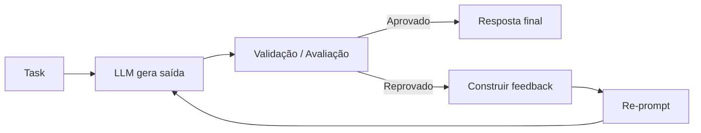

# LLM Feedback Loops

## 1. Conceito Fundamental

**Feedback Loop** é um ciclo iterativo em que o agente:
1. gera uma saída,
2. avalia o resultado,
3. transforma a avaliação em feedback,
4. tenta novamente com base nesse feedback.

$$
\text{Output}_{t+1} = \text{LLM}\big(\text{Task} + \text{Feedback}(\text{Output}_t)\big)
$$

> Em vez de uma única tentativa (*one-shot*), o agente melhora progressivamente até atingir um critério de qualidade.

---

## 2. Arquitetura do Loop

- 🧠 **Generator LLM**: produz a primeira versão da resposta.
- 🧪 **Evaluator**: mede qualidade (pode ser outro LLM, regras ou testes).
- 🛠️ **Tooling/Validators**: executa checks objetivos (testes, parser, schema).
- 🧾 **Feedback Builder**: converte erros e observações em instruções acionáveis.
- 🔁 **Orchestrator**: controla número de iterações, critério de parada e logs.

### Fluxo (visão prática)


```mermaid
flowchart LR
    A[Task] --> B[LLM gera saída]
    B --> C[Validação / Avaliação]
    C -->|Aprovado| D[Resposta final]
    C -->|Reprovado| E[Construir feedback]
    E --> F[Re-prompt]
    F --> B
```

---

## 3. Fontes de Feedback

| Fonte | Como funciona | Exemplo de feedback |
|---|---|---|
| **Autoavaliação (Self-Correction)** | O próprio LLM revisa sua resposta com critérios explícitos | "Tom está informal; reescreva com linguagem profissional." |
| **Ferramentas Externas** | O output é executado/avaliado por ferramenta real | "Teste `test_sort_numbers_basic` falhou: esperado `[1,2,3]`, obtido `[3,2,1]`." |
| **Validação Programática** | Regras objetivas em código | "JSON inválido: campo obrigatório `email_address` ausente." |
| **Input do Usuário** | Feedback humano direto | "Inclua opções de atividades ao ar livre no roteiro." |

---

## 4. Monitoramento: o que medir

Sem monitoramento, o loop vira tentativa e erro sem controle. Monitore:

- **Qualidade da saída**: aderência a formato, precisão técnica, completude.
- **Taxa de erro**: quantos critérios falham por iteração.
- **Aderência ao objetivo**: percentual de requisitos já atendidos.
- **Convergência**: melhora real entre iterações ou estagnação.
- **Trace por passo (logs)**: prompt, resposta, feedback e decisão em cada ciclo.

### Exemplo de evolução esperada

| Iteração | Testes passando | Status |
|---|---:|---|
| 1 | 0/3 | Output inicial com erros |
| 2 | 1/3 | Melhorou após feedback |
| 3 | 2/3 | Erros restantes isolados |
| 4 | 3/3 | Critério de sucesso atingido |

---

## 5. Exemplo Técnico: Refinamento Iterativo de Código

### Objetivo
Gerar uma função Python `sort_numbers(numbers)` que retorne **nova lista** ordenada em ordem crescente.

### Ciclo
1. LLM gera código inicial.
2. Runner executa testes.
3. Falhas viram feedback estruturado.
4. LLM reescreve a função com base nesse feedback.
5. Repetir até passar em todos os testes ou atingir limite de iterações.

```python
from dataclasses import dataclass
from typing import Callable


@dataclass
class LoopResult:
    code: str
    passed: bool
    test_report: str
    iterations: int


def refine_code_with_feedback(
    task_prompt: str,
    llm_call: Callable[[str], str],
    run_tests: Callable[[str], tuple[bool, str]],
    max_iterations: int = 5,
) -> LoopResult:
    """Executa um feedback loop para refinar código gerado por LLM."""

    prompt = task_prompt
    code = ""
    report = ""

    for i in range(1, max_iterations + 1):
        code = llm_call(prompt)
        passed, report = run_tests(code)

        if passed:
            return LoopResult(code=code, passed=True, test_report=report, iterations=i)

        prompt = (
            "Reescreva a função mantendo a assinatura original e corrija os erros.\n"
            f"CODIGO_ANTERIOR:\n{code}\n\n"
            f"FEEDBACK_TESTES:\n{report}\n"
        )

    return LoopResult(code=code, passed=False, test_report=report, iterations=max_iterations)
```

> **Boas práticas de segurança:** execute código gerado em ambiente isolado (sandbox), com limite de tempo e recursos.

---

## 6. Regras de Engenharia para Loops Confiáveis

- Defina **critério de sucesso objetivo** antes de iniciar o loop.
- Escreva feedback em formato **específico e acionável**.
- Limite iterações (`max_iterations`) para evitar loops infinitos.
- Prefira validações determinísticas (testes, schema) quando possível.
- Logue cada passo para depuração e melhoria do workflow.

---

## 7. Key Takeaways

- Feedback loops tornam agentes LLM mais confiáveis para tarefas complexas.
- A qualidade do sistema depende da qualidade do mecanismo de feedback.
- Monitorar o ciclo é obrigatório para avaliar progresso e corrigir falhas de projeto.
- Iteração bem projetada aproxima agentes de comportamento realmente agêntico.
