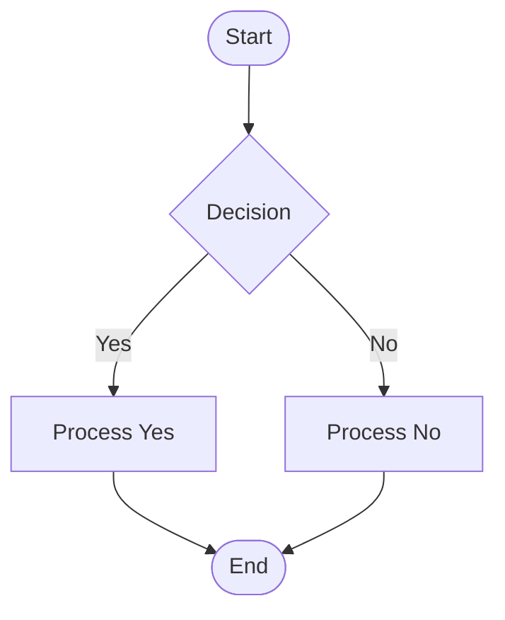

# Introdução a Agentic Workflows

---

## 1. Conceito Fundamental: o que é um agente de IA? 🧠

Um agente moderno usa um Modelo de Linguagem Grande (LLM) como núcleo de raciocínio e coordena ferramentas para executar ações no mundo digital.

### Equação do Agente
$$ \text{Agente} = \text{Percepção} + \text{Raciocínio (LLM)} + \text{Ação (Ferramentas)} $$

### Componentes principais
| Componente | Função |
| :--- | :--- |
| **🧠 LLM** | Raciocínio, geração de instruções e planejamento |
| **👀 Percepção** | Coleta dados do ambiente (APIs, sensores, logs) |
| **🧭 Planejamento** | Divide metas em passos acionáveis |
| **🛠️ Ação (Tools)** | Executa tarefas (APIs, comandos, DB) |

## 2. O que é um agentic workflow? 🔁

Um agentic workflow é um fluxo adaptativo onde um ou vários agentes colaboram, replanejam e executam ações para atingir metas complexas. Difere da automação tradicional por ser orientado a objetivos e por se ajustar a novos dados.

| Automação Tradicional | Agentic Workflow |
|---|---|
| Fluxo fixo, passo a passo | Fluxo adaptativo, dirigido por metas |
| Sem aprendizado em execução | Reavalia e ajusta estratégias |
| Baixa autonomia | Alta autonomia e integração de ferramentas |

### Exemplo (fluxograma)


A diferença prática é: agentes podem buscar informações externas, reavaliar planos e executar novas ações sem intervenção humana direta.

## 3. Limitações de abordagens determinísticas

Funções determinísticas produzem a mesma saída para uma entrada fixa — úteis, porém rígidas para cenários abertos.

```python
def deterministic_response(query: str) -> str:
    """Exemplo educacional: respostas baseadas em palavras-chave."""
    q = query.lower()
    if "tempo" in q:
        return "Hoje está ensolarado."
    if "hora" in q:
        return "São 12:00."
    return "Não sei responder a isso."
```

Agentes com LLMs generalizam melhor e conseguem lidar com pedidos não previstos pelo programador.

## 4. Agentes com LLMs e integração de ferramentas

Agentes equipados com LLMs percebem, planejam e usam ferramentas para obter dados em tempo real ou executar operações externas.

Exemplo de padrão genérico para chamada LLM (ilustrativo, não depende de SDK específico):

```python
def llm_generate(query: str, llm_call) -> str:
    """Padrão: encapsula chamada ao LLM e trata erros de forma genérica."""
    try:
        response = llm_call(
            prompt=query,
            max_tokens=150,
        )
        return response.get("text", "")
    except Exception as exc:
        return f"Erro ao gerar resposta: {exc}"
```

Para dados em tempo real (ex.: saldo bancário) o agente deve chamar uma tool/API autorizada, processar a resposta e então raciocinar com o LLM.

## 5. Próximos passos neste módulo

- Compreender os componentes de um agente e suas responsabilidades
- Comparar automação clássica vs. agentic workflows em estudos de caso
- Implementar exemplos práticos em Python integrando ferramentas externas

---

**Exercício demonstrado:** [2_Agentic_Workflows/exercises/1-starter.py](2_Agentic_Workflows/exercises/1-starter.py)
