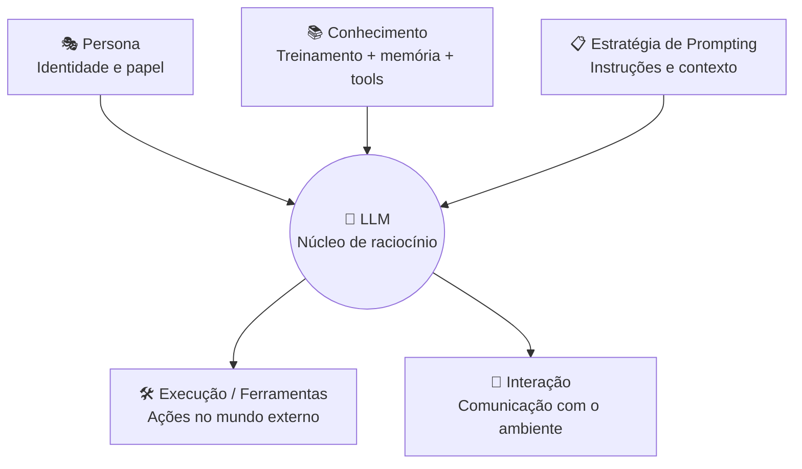
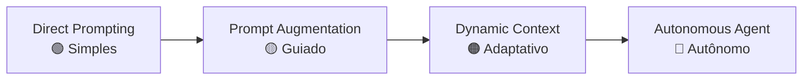

# O Agente de IA Moderno

---

## 1. Conceito Fundamental

$$
\text{Agente de IA} = \text{LLM (cérebro)} + \text{Percepção} + \text{Planejamento} + \text{Execução (Ferramentas)}
$$

Um agente de IA moderno usa um **Large Language Model (LLM)** como unidade central de processamento. Essa arquitetura permite que o sistema compreenda objetivos, raciocine sobre situações complexas e tome decisões — indo além da automação baseada em scripts fixos.

> **Definição técnica:** Um agente percebe seu ambiente, raciocina sobre o que observa, formula planos e executa ações para atingir metas específicas, com alto grau de autonomia.

---

## 2. Automação Tradicional vs. Sistema Agêntico

| Dimensão | Automação Tradicional | Sistema Agêntico |
| :--- | :--- | :--- |
| **Fluxo** | Passos fixos e sequenciais | Passos decididos dinamicamente |
| **Adaptação** | Nenhuma — script determinístico | Reavalia estratégia com novos dados |
| **Tomada de decisão** | Regras explícitas do programador | LLM raciocina sobre a melhor ação |
| **Exemplo típico** | Campanha de e-mail drip (subscribe → welcome → follow-up) | AutoGPT resolvendo tarefas abertas |
| **Autonomia** | Baixa | Alta |
| **Tolerância a cenários não previstos** | Nula | Alta |

> **Critério-chave:** Se o sistema *executa passos prescritos*, é automação. Se o sistema *decide quais passos executar*, é agêntico.

---

## 3. Arquitetura: 5 Componentes do Agente



### 🎭 Persona — *Quem o agente é*

- Define identidade: cargo e personalidade (ex.: analista de negócios formal vs. suporte amigável).
- Configurada via **system prompt** — geralmente invisível ao usuário final.
- Controla: função, tom/estilo, limites de expertise e formato de saída (JSON, bullets, tabelas).
- Efeito: **estreita** as capacidades amplas do LLM em uma identidade focada e previsível.

### 📚 Conhecimento — *O que o agente sabe*

| Camada | Descrição |
| :--- | :--- |
| **Treinamento LLM** | Conhecimento amplo do modelo pré-treinado |
| **Fine-tuning** | Conhecimento especializado via datasets específicos |
| **Ferramentas externas** | Dados em tempo real: DBs, APIs, buscas web |
| **Memória de curto prazo** | Contexto da sessão atual |
| **Memória de longo prazo** | Informações persistidas entre sessões |

### 📋 Estratégia de Prompting — *Como o agente se comunica com o LLM*

$$
\text{Prompt efetivo} = \text{System Prompt} + \text{Contexto Incorporado} + \text{Técnica de Engenharia} + \text{Estrutura da Instrução}
$$

| Elemento | Função |
| :--- | :--- |
| **System Prompts** | Instruções fundacionais de persona, restrições e formato |
| **Context Incorporation** | Memória, saídas de ferramentas e histórico de conversa |
| **Técnicas de PE** | Zero-shot, Few-shot, Chain-of-Thought, ReAct |
| **Estrutura da instrução** | Objetivos, passos, restrições, formato de resposta |

### 🛠️ Execução / Ferramentas — *O que o agente pode fazer*

- **Interagir com o mundo externo:** APIs de clima, buscas web, sensores.
- **Manipular dados:** consultas a bancos de dados, scripts Python, cálculos.
- **Conectar sistemas:** envio de e-mails, atualização de registros, chamadas a APIs externas.
- **Orquestrar tarefas:** acionar agentes especializados para sub-tarefas.

```python
def call_tool(tool_name: str, params: dict, tool_registry: dict) -> str:
    """Padrão genérico para despacho de ferramentas por um agente."""
    tool_fn = tool_registry.get(tool_name)
    if tool_fn is None:
        return f"Ferramenta '{tool_name}' não encontrada."
    try:
        return tool_fn(**params)
    except Exception as exc:
        return f"Erro ao executar '{tool_name}': {exc}"
```

### 🔗 Interação — *Como o agente se comunica com o ambiente*

| Canal | Exemplos |
| :--- | :--- |
| **Receber input** | Texto do usuário, chamadas de API, dados de sensores |
| **Entregar output** | Resposta em texto, JSON estruturado, acionamento de ações |
| **Comunicação inter-agente** | Protocolos como MCP (Model Context Protocol) |

---

## 4. Espectro de Tipos de Agentes

$$
\text{Complexidade} \propto \text{Autonomia} \propto \text{Sofisticação do contexto com o LLM}
$$

| Tipo | Papel do LLM | Gestão de Contexto | Autonomia | Caso de Uso Típico |
| :--- | :--- | :--- | :---: | :--- |
| **Direct Prompting** | Respondedor / Gerador | Estático (dentro do prompt) | Baixa | Q&A simples, geração básica de texto |
| **Prompt Augmentation** | Respondedor guiado | Contexto estático pré-aumentado (ex.: RAG) | Baixa–Média | Q&A com RAG, tarefas few-shot |
| **Dynamic Context Augmentation** | Processador adaptativo | Atualização dinâmica via memória e ferramentas | Média | Conversas multi-turno, uso de ferramentas |
| **Autonomous Agent** | Planejador / Executor / Raciocinador | Memória interna e externa dinâmica | Alta | Tarefas complexas, resolução autônoma de problemas |

### Progressão no espectro



- **Direct Prompting:** Relay básico — envia prompt do usuário ao LLM e retorna a resposta. Ideal para fluxos de tarefa única simples.
- **Prompt Augmentation:** Enriquece o prompt antes do envio (persona, exemplos few-shot, documentos recuperados). Habilita passos especializados dentro de um fluxo.
- **Dynamic Context Augmentation:** Usa ferramentas e memória para atualizar o contexto do LLM em tempo real. Essencial para fluxos multi-etapa dinâmicos.
- **Autonomous Agent:** LLM para planejamento complexo, tomada de decisão e execução multi-etapa com mínima intervenção humana. Atua como orquestrador de fluxos sofisticados.

---

## 5. Padrão de Implementação Genérico

O trecho abaixo ilustra o loop central de um agente autônomo simples — perceber, raciocinar, agir, observar:

```python
from typing import Callable


def agent_loop(
    goal: str,
    perceive: Callable[[], str],
    reason: Callable[[str, str], str],
    act: Callable[[str], str],
    max_steps: int = 5,
) -> str:
    """
    Loop genérico de agente: Percepção → Raciocínio → Ação.

    Args:
        goal:      Objetivo de alto nível do agente.
        perceive:  Coleta observação do ambiente.
        reason:    Dado objetivo + observação, produz próxima ação.
        act:       Executa ação e retorna resultado.
        max_steps: Limite de segurança para iterações.

    Returns:
        Resultado da última ação executada.
    """
    result = ""
    for step in range(max_steps):
        observation = perceive()
        action = reason(goal, observation)

        if action == "DONE":
            break

        result = act(action)

    return result
```

---

## 6. Golden Rules

> **Regra 1 — Agente ≠ Automação**
> A presença de LLM não define um sistema agêntico. O critério é a capacidade de *decidir* quais passos executar, não apenas executá-los.

> **Regra 2 — Contexto é soberania**
> O tipo de agente é determinado pela sofisticação do contexto fornecido ao LLM: estático → aumentado → dinâmico → autônomo.

> **Regra 3 — Persona estreita, não limita**
> Um system prompt bem definido transforma capacidades amplas do LLM em comportamento focado e previsível, sem perder a flexibilidade central.

> **Regra 4 — Ferramentas são os olhos e mãos**
> Sem ferramentas, o agente opera apenas com conhecimento estático de treinamento. Ferramentas habilitam percepção e ação no mundo real.

> **Regra 5 — Autonomia exige limite**
> Agentes autônomos requerem restrições explícitas (max steps, guardrails) para evitar loops infinitos ou ações não intencionais.

---

**Próximo tópico:** [Modelagem de Agentic Workflows](03-agentic-workflow-modeling.md) — Do processo determinístico ao design agent-centric, tipos de agentes e padrões Evaluation/Crew Manager.
