# Modelagem de Agentic Workflows

---

## 1. Conceito Fundamental

$$
\text{Workflow Agêntico} = \text{Automação Determinística} \xrightarrow{\text{Generalização}} \text{Sistema Inteligente e Adaptativo}
$$

Modelagem de workflows agênticos é o processo de **desenhar os blueprints** de equipes de agentes de IA que colaboram para realizar tarefas complexas. O objetivo é criar sistemas poderosos o suficiente para lidar com diversidade de tarefas e flexíveis o suficiente para se adaptar quando as condições mudam.

> **Definição técnica:** Modelagem Agêntica é a prática de projetar sistemas centrados nos agentes — suas capacidades, objetivos, regras de decisão e mecanismos de adaptação — em vez de mapear apenas a sequência de passos de um processo.

---

## 2. Da Automação Simples ao Workflow Agêntico

A maioria dos workflows agênticos evolui a partir de automações existentes. A progressão típica:

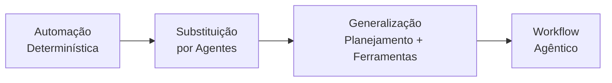

| Estágio | Características | Exemplo |
| :--- | :--- | :--- |
| **Automação Determinística** | Script fixo, sequência imutável | Auto-responder de e-mail |
| **Agentes em Processo Fixo** | Agentes substituem passos, mas fluxo permanece rígido | Agentes individuais sem coordenação |
| **Generalização (Agêntico)** | Planning agent coordena; ferramentas escolhidas dinamicamente | Assistente de código com planejamento |

> **O salto crítico:** A generalização acontece quando um **agente de planejamento** interpreta novos pedidos, decide quais agentes e ferramentas acionar e adapta o fluxo sem reprogramação manual.

### Exemplo Concreto: Assistente de Código Evoluindo

| Versão | Tipo | Capacidade |
| :--- | :--- | :--- |
| **Determinística** | Responde apenas uma pergunta Python específica | Escopo fixo |
| **Agêntica** | Planejamento → Python/Java/Debug/Features → Ferramentas → Decisão | Escopo aberto |

### O que NÃO é um Workflow Agêntico

A presença de IA ou LLM em etapas individuais **não torna o workflow agêntico**. O critério é se o **workflow em si** decide quais etapas executar e em que ordem.

| Nível | Estrutura | Por que NÃO é agêntico |
| :--- | :--- | :--- |
| **1. Linear com IA** | Etapas sequenciais fixas (ex.: coleta → validação → scoring → decisão), cada uma podendo usar LLM | O fluxo executa sempre a mesma sequência — nenhuma decisão de roteamento ocorre no nível do workflow |
| **2. Com nó de decisão** | Fluxo com `{Test OK?}` levando a dois caminhos predefinidos | Ambos os caminhos são conhecidos a priori; o workflow não cria rotas novas |
| **3. Com seleção de tarefa** | Agente seleciona Tarefa A, B ou C — mesmo usando IA na seleção | O conjunto de caminhos possíveis está fechado pelo designer; só o caminho escolhido varia |

> **Critério definitivo:** Um workflow é agêntico quando **o próprio workflow** decide *quais* etapas executar e *em que ordem*, determinando esse conjunto dinamicamente com base no contexto e objetivo — não a priori pelo designer.

---

## 3. Workflows vs. Chatbots

| Dimensão | Workflow Agêntico | Chatbot Contínuo |
| :--- | :--- | :--- |
| **Escopo** | Início e fim definidos — completa um job | Conversação aberta, sem fim definido |
| **Objetivo** | Atingir resultado específico | Manter conversa |
| **Iteração** | Agentes revisam e melhoram o próprio trabalho | Respostas imediatas por mensagem |
| **Caminhos** | Encontra rotas alternativas mais eficientes | Sequencial por turno |

> **Regra prática:** Se o sistema tem um resultado final definido e pode iterar para melhorá-lo, é um workflow agêntico.

---

## 4. Modelagem: Process-Centric vs. Agent-Centric

$$
\text{Modelagem} = \begin{cases} \text{Process-Centric} & \text{foco: sequência de tarefas} \\ \text{Agent-Centric} & \text{foco: capacidades, objetivos e decisões dos agentes} \end{cases}
$$

| Dimensão | Process-Centric | Agent-Centric |
| :--- | :--- | :--- |
| **Foco** | Sequência e dependências de tarefas | Capacidades e objetivos dos agentes |
| **Decisões** | Regras simples e fixas | Frameworks de avaliação e escolha |
| **Adaptação** | Nenhuma | Regras de aprendizado e ajuste por feedback |
| **Constraints** | Implícitas no fluxo | Explícitas como restrições do ambiente |
| **Feedback** | Não modelado | Loops de feedback entre estágios |
| **Representação** | Fluxograma linear | Grafo de agentes com capacidades e conexões |

### O que definir em uma modelagem Agent-Centric

- 🎯 **Estrutura de objetivos:** O que cada agente quer alcançar e como medir sucesso
- 🛠️ **Capacidades:** O que cada agente consegue fazer (ferramentas, habilidades)
- 🧭 **Frameworks de decisão:** Como o agente avalia opções e escolhe ações
- 🔄 **Regras de adaptação:** Como o agente aprende ou ajusta com base em feedback
- 🌐 **Constraints do ambiente:** Limites e regras do mundo em que opera
- 🔁 **Loops de feedback:** Como informações de estágios posteriores retroalimentam estágios anteriores

---

## 5. Tipos de Agentes como Blocos de Construção

| Tipo | Papel | Complexidade |
| :--- | :--- | :---: |
| 🔹 **Direct Prompt Agent** | Envia query diretamente ao LLM | Básica |
| 🎭 **Augmented Prompt Agent** | Adiciona persona/system prompt antes do envio | Baixa |
| 📚 **Knowledge Augmented Prompt Agent** | Usa persona + base de conhecimento curada; ignora conhecimento geral do LLM | Média |
| 🔍 **RAG Knowledge Prompt Agent** | Recupera informações dinamicamente antes de responder | Média |
| ✅ **Evaluation Agent** | Controla qualidade: avalia output de outros agentes contra critérios | Média–Alta |
| 🗺️ **Routing Agent** | Gerente de projetos: direciona tarefas ao agente especializado correto | Média |
| 📋 **Action Planning Agent** | Decompõe objetivo complexo em sequência de passos executáveis | Alta |

### Espectro de Complexidade

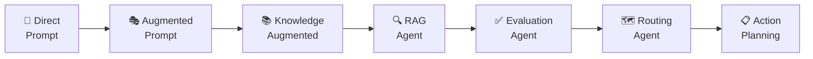

---

## 6. Representação Visual de Workflows

A visualização é a principal ferramenta para comunicar e projetar workflows agênticos. O princípio é criar um mapa: cada tarefa é um nó e as setas mostram o fluxo de informação ou controle.

### Diretrizes de Visualização

| Diretriz | Regra |
| :--- | :--- |
| **Símbolos padrão** | Retângulos para tarefas, losangos para decisões |
| **Rótulos claros** | Nome conciso e descritivo (ex.: "Analisar Feedback do Cliente", não "Analisar Dados") |
| **Inputs & Outputs visíveis** | Deixar explícito o que cada tarefa consome e produz |
| **Granularidade adequada** | Escolher nível de detalhe conforme o público: visão geral ou sub-tarefas |

### Exemplo: Ciclo de Vida de Desenvolvimento

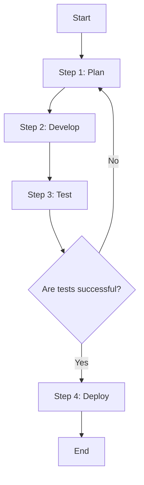

---

## 7. Padrão: Evaluation Agent

O Evaluation Agent implementa um **ciclo de controle de qualidade iterativo** — padrão fundamental em workflows agênticos de alta confiabilidade.

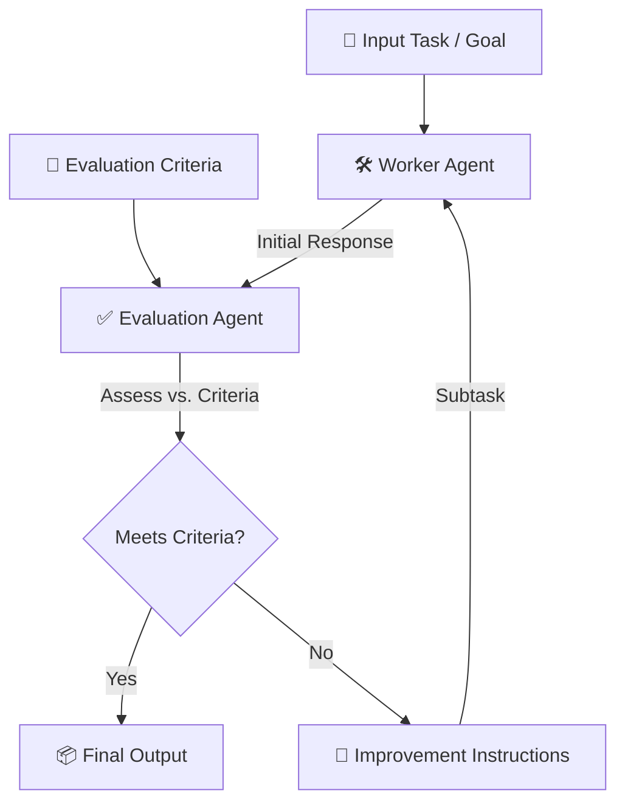

### Implementação Genérica

```python
from typing import Callable


def evaluation_loop(
    task: str,
    criteria: list[str],
    worker: Callable[[str], str],
    evaluator: Callable[[str, list[str]], tuple[bool, str]],
    max_iterations: int = 3,
) -> str:
    """
    Ciclo genérico de avaliação iterativa entre Worker e Evaluator.

    Args:
        task:           Descrição da tarefa a ser executada.
        criteria:       Lista de critérios de qualidade.
        worker:         Agente executor — recebe instrução e retorna resposta.
        evaluator:      Agente avaliador — retorna (aprovado, instruções_melhoria).
        max_iterations: Limite de ciclos de revisão.

    Returns:
        Resposta aprovada ou melhor resultado após max_iterations.
    """
    response = worker(task)
    for _ in range(max_iterations):
        approved, instructions = evaluator(response, criteria)
        if approved:
            return response
        response = worker(f"{task}\n\nInstruções de melhoria: {instructions}")
    return response
```

---

## 8. Padrão: Crew Manager (Multi-Agente)

Workflows complexos usam um **Crew Manager** como ponto central de coordenação entre agentes especializados.

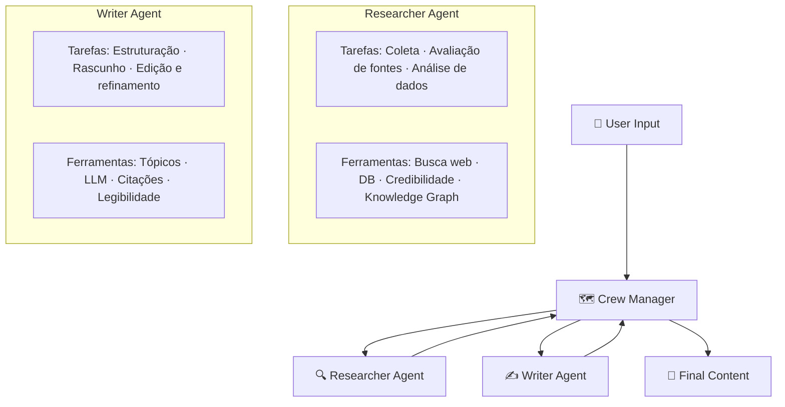

### Knowledge Augmented Prompt Agent — Fluxo Interno

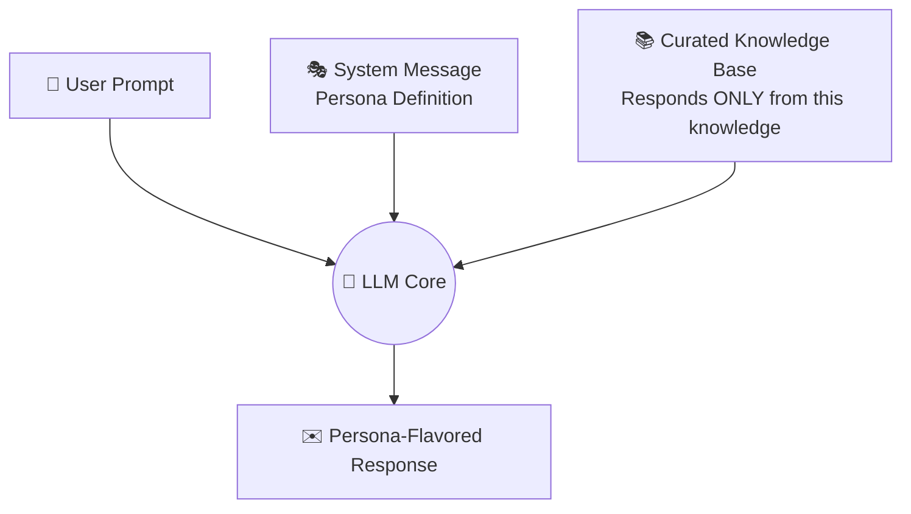

---

## 9. Como Identificar Candidatos a Agentes

Ao transformar um workflow determinístico em agêntico, use este método sistemático para identificar onde introduzir agentes:

| Categoria | Indicador no Workflow | Por que é um Candidato |
| :--- | :--- | :--- |
| 🔗 **Etapas sequenciais** | Passos que aguardam o anterior para começar | Podem virar agentes paralelos, eliminando gargalos de espera |
| 🔀 **Pontos de inflexão** | Nós de decisão (`{Has Stock?}`, `{Weather OK?}`) | Um agente inteligente avalia o contexto dinamicamente — sem caminhos fixos predefinidos |
| ⏳ **Estados de espera** | Passos bloqueados por recurso externo não disponível | Um agente pode monitorar, negociar e desviar o fluxo quando necessário |

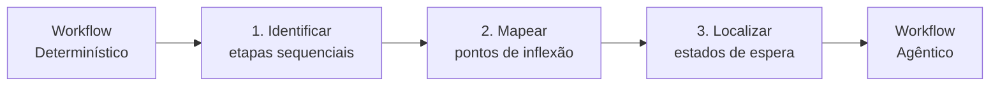

---

## 10. Exercício Aplicado: Emergency Aid Dispatch

Este exercício demonstra a transformação de um workflow determinístico real em agêntico, seguindo o método da seção anterior.

### Workflow Determinístico (original)

Sequencial e ineficiente: estoque é verificado *antes* do clima, que é verificado *antes* das estradas — cada etapa bloqueia a próxima.

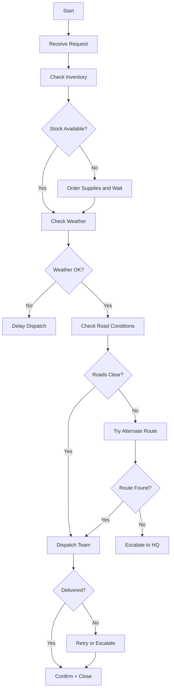

**Candidatos identificados pelo método:**
- `Check Inventory`, `Check Weather`, `Check Road Conditions` → etapas sequenciais → **paralelizáveis**
- `{Stock Available?}`, `{Weather OK?}`, `{Roads Clear?}` → pontos de inflexão → **candidatos a agentes inteligentes**
- `Order Supplies and Wait` → estado de espera → **candidato a agente de monitoramento**

### Workflow Agêntico (solução)

Um **StrategicAgent** coordena três agentes paralelos. Resultado: sem gargalos sequenciais, sem espera forçada.

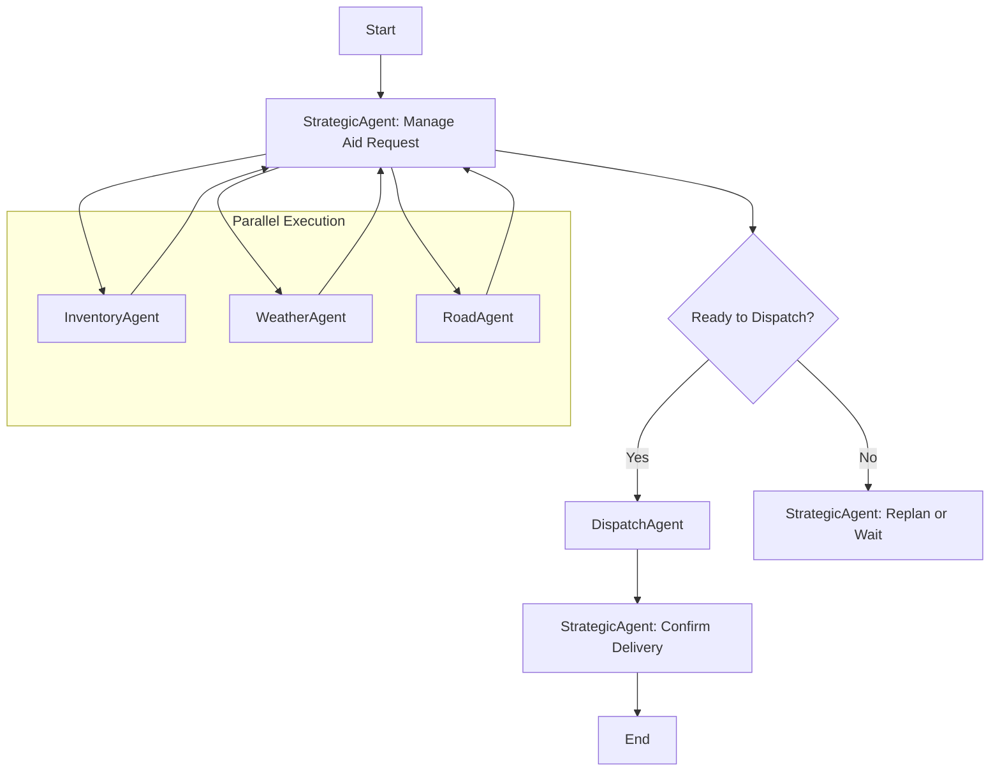

### Comparação

| Aspecto | Determinístico | Agêntico |
| :--- | :--- | :--- |
| **Verificações** | Sequenciais — cada uma bloqueia a próxima | Paralelas — todas executam simultaneamente |
| **Espera por estoque** | Bloqueia todo o fluxo | InventoryAgent reporta ao StrategicAgent independentemente |
| **Decisão de despacho** | Depende de 3 condições em série | StrategicAgent sintetiza tudo e decide |
| **Falha no roteamento** | Escalate to HQ (saída forçada) | StrategicAgent replana internamente |

---

## 11. Padrões de Coordenação em Frameworks

Frameworks reais implementam padrões distintos de comunicação multi-agente. Os três mais comuns:

### AutoGen: Padrão Standard (3 Agentes)

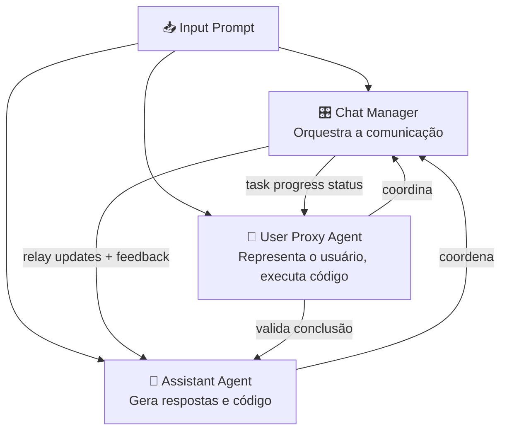

**Dinâmica:** O ChatManager orquestra a conversa entre o AssistantAgent (gera soluções) e o UserProxyAgent (valida e executa). Os três colaboram até o prompt ser completamente respondido.

### AutoGen: Padrão Nested (Worker + Critic)

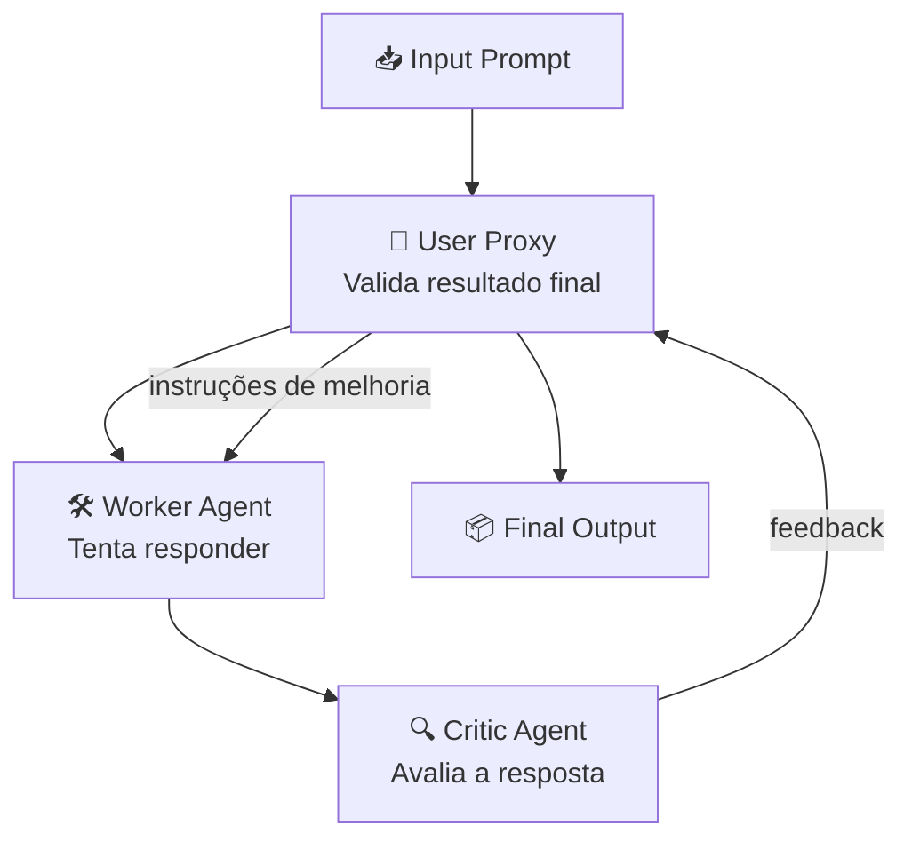

**Dinâmica:** O Critic avalia o Worker e alimenta o UserProxy com feedback. O UserProxy decide se o resultado é suficiente ou envia de volta ao Worker com instruções de melhoria.

### Comparação de Padrões de Frameworks

| Framework | Agentes Principais | Coordenador | Ideal para |
| :--- | :--- | :--- | :--- |
| **AutoGen Standard** | Assistant + UserProxy | ChatManager | Tarefas de código e análise colaborativa |
| **AutoGen Nested** | Worker + Critic | UserProxy | Refinamento iterativo de qualidade |
| **CrewAI** | Researcher + Writer (+ outros) | Crew Manager | Pesquisa e produção de conteúdo estruturado |

---

## 12. Golden Rules

> **Regra 1 — Comece pelo determinístico**
> Toda boa modelagem agêntica parte do mapeamento do processo determinístico existente. Agentifique o que você já entende.

> **Regra 2 — Generalize com intenção**
> Adicione um planning agent apenas quando o sistema precisar lidar com variedade de tarefas. Complexidade sem necessidade é débito técnico.

> **Regra 3 — Visualize sempre**
> Um workflow não documentado visualmente é um workflow não comunicado. Use Mermaid ou diagramas equivalentes para cada design agêntico.

> **Regra 4 — Defina critérios antes de executar**
> O Evaluation Agent só funciona se os critérios de qualidade forem definidos antes da execução, não depois.

> **Regra 5 — Escolha o agente pelo papel, não pela tecnologia**
> Routing, Planning, Evaluation — defina primeiro o papel funcional, depois escolha a implementação.

---

## 13. Implementação em Python: Da Teoria ao Código

$$
\text{Sistema Agêntico em Python} = \text{Classes (Blueprints)} + \text{Instanciação (Configuração)} + \text{Orquestração (Fluxo)}
$$

### Abordagens de Implementação

| Abordagem | Descrição | Trade-off |
| :--- | :--- | :--- |
| **Frameworks existentes** | LangChain, CrewAI, AutoGen — abstrações pré-construídas | Velocidade alta, controle limitado |
| **Do zero** | Python + LLM direto — lógica central customizada | Máximo controle e compreensão profunda |

> **Princípio:** Implementar "do zero" revela o que acontece dentro dos frameworks mais complexos — o conhecimento é diretamente transferível.

### Três Componentes Centrais

| Componente | Papel | Implementação |
| :--- | :--- | :--- |
| 🧠 **LLM Models** | Motor de inteligência — processa e gera respostas | Design flexível para trocar modelos sem reescrever o sistema |
| 🛠️ **Agent Logic & Prompting** | Define comportamento: comunicação com LLM + capacidades específicas | Classes Python com método `run()` por tipo de agente |
| 🔄 **Workflow Orchestration** | Gerencia sequência e fluxo de dados entre agentes | Script separado que instancia e coordena os agentes |

### Separação de Responsabilidades

Uma estrutura Python que espelha a separação lógica de conceitos:

```
seu_projeto/
├── agent_definitions.py   # Blueprints (classes) dos agentes
└── main_workflow.py       # Instanciação + Orquestração do workflow
```

| Camada | Responsabilidade |
| :--- | :--- |
| `agent_definitions.py` | **Blueprints** — classes que definem atributos e o método `run()` de cada agente |
| `main_workflow.py` | **Instanciação** — cria objetos configurados para cada papel no workflow |
| `main_workflow.py` | **Orquestração** — define sequência e passagem de dados entre instâncias |

### Exemplo do Exercício: Workflow "Information Processing"

O exercício [`exercises/3-agentic-workflow.py`](../exercises/3-agentic-workflow.py) implementa um workflow sequencial com três agentes especializados:

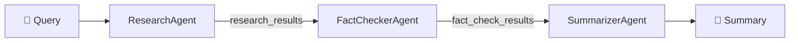

**Agentes definidos:**

```python
class Agent:
    """Blueprint base — interface comum para todos os agentes."""
    def __init__(self, name: str):
        self.name = name

    def run(self, input_data):
        raise NotImplementedError("Cada agente deve implementar run().")


class ResearchAgent(Agent):
    """Busca e retorna informações sobre um tópico."""
    def run(self, query: str) -> str:
        # Simula pesquisa — em produção: chamada de API ou LLM
        return f"Research results for '{query}': contains uncertain claims."


class FactCheckerAgent(Agent):
    """Verifica informações e sinaliza conteúdo suspeito."""
    suspicious_keywords = ["error", "uncertain", "debated"]

    def run(self, text: str) -> dict:
        flags = [kw for kw in self.suspicious_keywords if kw in text.lower()]
        return {"text": text, "accuracy": "high", "verified_claims": 3, "flags": flags}


class SummarizerAgent(Agent):
    """Sintetiza o texto em um resumo conciso."""
    def run(self, text: str) -> str:
        return f"Summary: {text[:50]}..."
```

**Orquestração no workflow:**

```python
# Instanciação — cada agente configurado para seu papel
researcher   = ResearchAgent("Research Assistant")
fact_checker = FactCheckerAgent("Fact Checker")
summarizer   = SummarizerAgent("Summarizer")

# Orquestração — sequência explícita com passagem de dados
query              = "Agentic workflows in AI systems"
research_results   = researcher.run(query)
fact_check_results = fact_checker.run(research_results)         # output vira input
summary            = summarizer.run(fact_check_results["text"]) # output vira input
```

### Padrões Aprendidos com o Exercício

| Conceito | Implementação no Código |
| :--- | :--- |
| **Agente como classe Python** | Cada agente: `__init__` (configuração) + `run()` (lógica de negócio) |
| **Herança para interface comum** | Classe base `Agent` garante que todos implementem `run()` |
| **Passagem explícita de dados** | Output de `researcher.run()` → input de `fact_checker.run()` — fluxo legível |
| **Especialização por herança** | `FactCheckerAgent` adiciona `suspicious_keywords` sem alterar a interface |
| **Tratamento de erro na orquestração** | A lógica de fluxo checa flags entre etapas — os agentes não se conhecem |

> **Princípio de modularidade:** Cada agente é independente e testável. A orquestração decide como combiná-los — os agentes não se chamam diretamente.

---

**Tópico anterior:** [O Agente de IA Moderno](02-the-modern-ai-agent.md)
