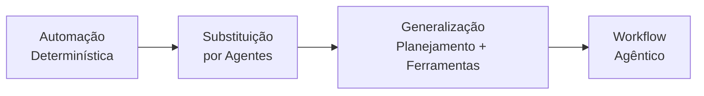
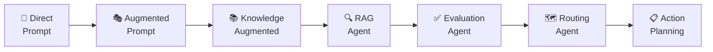
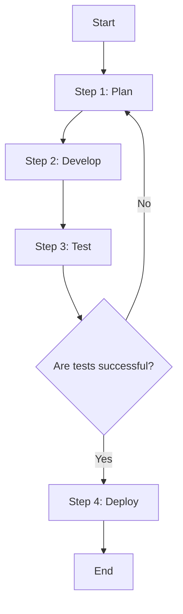
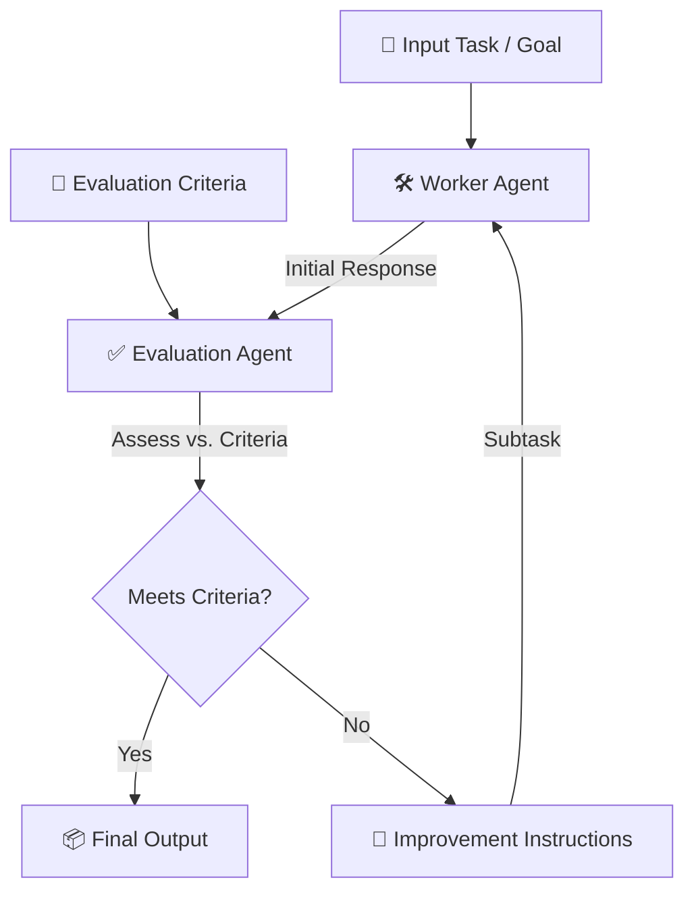
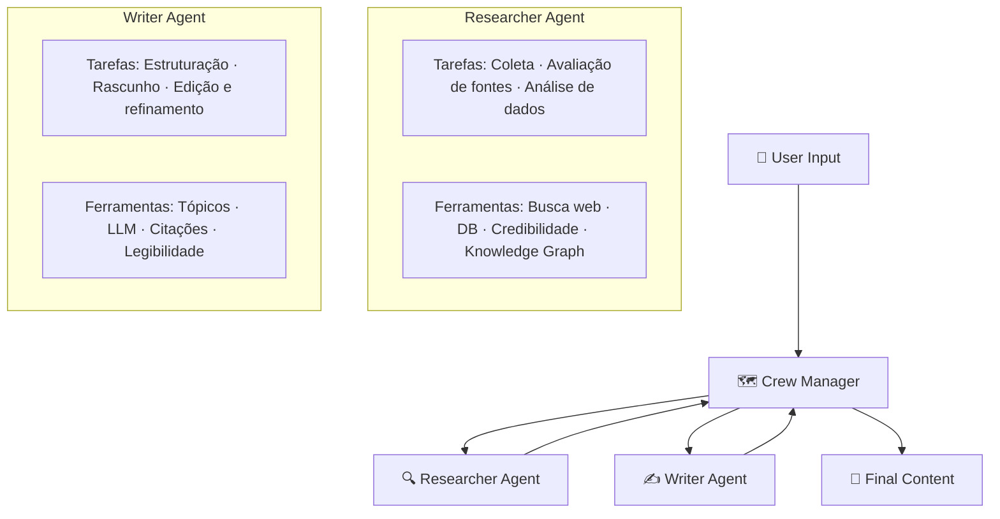
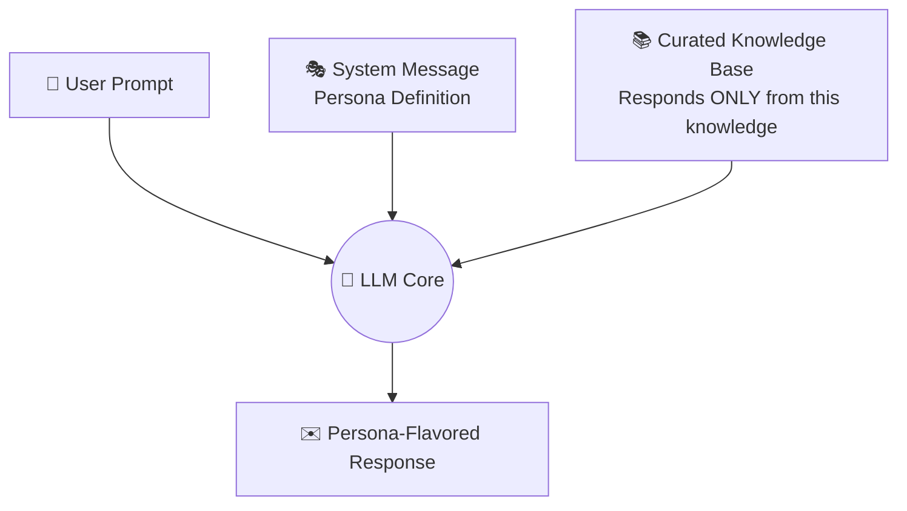

# Modelagem de Agentic Workflows

---

## 1. Conceito Fundamental

$$
\text{Workflow Agêntico} = \text{Automação Determinística} \xrightarrow{\text{Generalização}} \text{Sistema Inteligente e Adaptativo}
$$

Modelagem de workflows agênticos é o processo de **desenhar os blueprints** de equipes de agentes de IA que colaboram para realizar tarefas complexas. O objetivo é criar sistemas poderosos o suficiente para lidar com diversidade de tarefas e flexíveis o suficiente para se adaptar quando as condições mudam.

> **Definição técnica:** Modelagem Agêntica é a prática de projetar sistemas centrados nos agentes — suas capacidades, objetivos, regras de decisão e mecanismos de adaptação — em vez de mapear apenas a sequência de passos de um processo.

---

## 2. Da Automação Simples ao Workflow Agêntico

A maioria dos workflows agênticos evolui a partir de automações existentes. A progressão típica:



| Estágio | Características | Exemplo |
| :--- | :--- | :--- |
| **Automação Determinística** | Script fixo, sequência imutável | Auto-responder de e-mail |
| **Agentes em Processo Fixo** | Agentes substituem passos, mas fluxo permanece rígido | Agentes individuais sem coordenação |
| **Generalização (Agêntico)** | Planning agent coordena; ferramentas escolhidas dinamicamente | Assistente de código com planejamento |

> **O salto crítico:** A generalização acontece quando um **agente de planejamento** interpreta novos pedidos, decide quais agentes e ferramentas acionar e adapta o fluxo sem reprogramação manual.

### Exemplo Concreto: Assistente de Código Evoluindo

| Versão | Tipo | Capacidade |
| :--- | :--- | :--- |
| **Determinística** | Responde apenas uma pergunta Python específica | Escopo fixo |
| **Agêntica** | Planejamento → Python/Java/Debug/Features → Ferramentas → Decisão | Escopo aberto |

---

## 3. Workflows vs. Chatbots

| Dimensão | Workflow Agêntico | Chatbot Contínuo |
| :--- | :--- | :--- |
| **Escopo** | Início e fim definidos — completa um job | Conversação aberta, sem fim definido |
| **Objetivo** | Atingir resultado específico | Manter conversa |
| **Iteração** | Agentes revisam e melhoram o próprio trabalho | Respostas imediatas por mensagem |
| **Caminhos** | Encontra rotas alternativas mais eficientes | Sequencial por turno |

> **Regra prática:** Se o sistema tem um resultado final definido e pode iterar para melhorá-lo, é um workflow agêntico.

---

## 4. Modelagem: Process-Centric vs. Agent-Centric

$$
\text{Modelagem} = \begin{cases} \text{Process-Centric} & \text{foco: sequência de tarefas} \\ \text{Agent-Centric} & \text{foco: capacidades, objetivos e decisões dos agentes} \end{cases}
$$

| Dimensão | Process-Centric | Agent-Centric |
| :--- | :--- | :--- |
| **Foco** | Sequência e dependências de tarefas | Capacidades e objetivos dos agentes |
| **Decisões** | Regras simples e fixas | Frameworks de avaliação e escolha |
| **Adaptação** | Nenhuma | Regras de aprendizado e ajuste por feedback |
| **Constraints** | Implícitas no fluxo | Explícitas como restrições do ambiente |
| **Feedback** | Não modelado | Loops de feedback entre estágios |
| **Representação** | Fluxograma linear | Grafo de agentes com capacidades e conexões |

### O que definir em uma modelagem Agent-Centric

- 🎯 **Estrutura de objetivos:** O que cada agente quer alcançar e como medir sucesso
- 🛠️ **Capacidades:** O que cada agente consegue fazer (ferramentas, habilidades)
- 🧭 **Frameworks de decisão:** Como o agente avalia opções e escolhe ações
- 🔄 **Regras de adaptação:** Como o agente aprende ou ajusta com base em feedback
- 🌐 **Constraints do ambiente:** Limites e regras do mundo em que opera
- 🔁 **Loops de feedback:** Como informações de estágios posteriores retroalimentam estágios anteriores

---

## 5. Tipos de Agentes como Blocos de Construção

| Tipo | Papel | Complexidade |
| :--- | :--- | :---: |
| 🔹 **Direct Prompt Agent** | Envia query diretamente ao LLM | Básica |
| 🎭 **Augmented Prompt Agent** | Adiciona persona/system prompt antes do envio | Baixa |
| 📚 **Knowledge Augmented Prompt Agent** | Usa persona + base de conhecimento curada; ignora conhecimento geral do LLM | Média |
| 🔍 **RAG Knowledge Prompt Agent** | Recupera informações dinamicamente antes de responder | Média |
| ✅ **Evaluation Agent** | Controla qualidade: avalia output de outros agentes contra critérios | Média–Alta |
| 🗺️ **Routing Agent** | Gerente de projetos: direciona tarefas ao agente especializado correto | Média |
| 📋 **Action Planning Agent** | Decompõe objetivo complexo em sequência de passos executáveis | Alta |

### Espectro de Complexidade



---

## 6. Representação Visual de Workflows

A visualização é a principal ferramenta para comunicar e projetar workflows agênticos. O princípio é criar um mapa: cada tarefa é um nó e as setas mostram o fluxo de informação ou controle.

### Diretrizes de Visualização

| Diretriz | Regra |
| :--- | :--- |
| **Símbolos padrão** | Retângulos para tarefas, losangos para decisões |
| **Rótulos claros** | Nome conciso e descritivo (ex.: "Analisar Feedback do Cliente", não "Analisar Dados") |
| **Inputs & Outputs visíveis** | Deixar explícito o que cada tarefa consome e produz |
| **Granularidade adequada** | Escolher nível de detalhe conforme o público: visão geral ou sub-tarefas |

### Exemplo: Ciclo de Vida de Desenvolvimento



---

## 7. Padrão: Evaluation Agent

O Evaluation Agent implementa um **ciclo de controle de qualidade iterativo** — padrão fundamental em workflows agênticos de alta confiabilidade.



### Implementação Genérica

```python
from typing import Callable


def evaluation_loop(
    task: str,
    criteria: list[str],
    worker: Callable[[str], str],
    evaluator: Callable[[str, list[str]], tuple[bool, str]],
    max_iterations: int = 3,
) -> str:
    """
    Ciclo genérico de avaliação iterativa entre Worker e Evaluator.

    Args:
        task:           Descrição da tarefa a ser executada.
        criteria:       Lista de critérios de qualidade.
        worker:         Agente executor — recebe instrução e retorna resposta.
        evaluator:      Agente avaliador — retorna (aprovado, instruções_melhoria).
        max_iterations: Limite de ciclos de revisão.

    Returns:
        Resposta aprovada ou melhor resultado após max_iterations.
    """
    response = worker(task)
    for _ in range(max_iterations):
        approved, instructions = evaluator(response, criteria)
        if approved:
            return response
        response = worker(f"{task}\n\nInstruções de melhoria: {instructions}")
    return response
```

---

## 8. Padrão: Crew Manager (Multi-Agente)

Workflows complexos usam um **Crew Manager** como ponto central de coordenação entre agentes especializados.



### Knowledge Augmented Prompt Agent — Fluxo Interno



---

## 9. Golden Rules

> **Regra 1 — Comece pelo determinístico**
> Toda boa modelagem agêntica parte do mapeamento do processo determinístico existente. Agentifique o que você já entende.

> **Regra 2 — Generalize com intenção**
> Adicione um planning agent apenas quando o sistema precisar lidar com variedade de tarefas. Complexidade sem necessidade é débito técnico.

> **Regra 3 — Visualize sempre**
> Um workflow não documentado visualmente é um workflow não comunicado. Use Mermaid ou diagramas equivalentes para cada design agêntico.

> **Regra 4 — Defina critérios antes de executar**
> O Evaluation Agent só funciona se os critérios de qualidade forem definidos antes da execução, não depois.

> **Regra 5 — Escolha o agente pelo papel, não pela tecnologia**
> Routing, Planning, Evaluation — defina primeiro o papel funcional, depois escolha a implementação.

---

**Tópico anterior:** [O Agente de IA Moderno](02-the-modern-ai-agent.md)
**Próximo tópico:** [Padrões de Agentic Workflows](04-agentic-workflow-patterns.md) — Prompt Chaining, Routing, Paralelização, Evaluator e Orchestrator.
