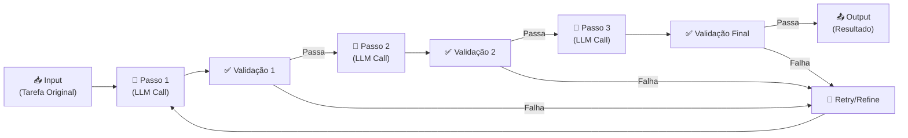
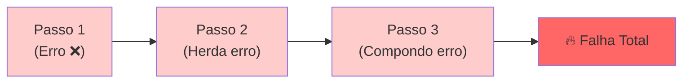

# Padrões de Agentic Workflows: Prompt Chaining

---

## 1. Conceito Fundamental

$$
\text{Prompt Chaining} = \text{Decomposição de Tarefas} + \text{Encadeamento de Chamadas LLM}
$$

**Definição técnica:** Prompt chaining é um padrão de workflow agêntico onde uma tarefa complexa é decomposta em uma sequência de passos menores e mais gerenciáveis. Cada passo é uma chamada LLM distinta, e a saída de um passo alimenta diretamente a entrada do próximo.

> **Analogia do Mundo Real:** Assim como uma linha de montagem em uma fábrica divide a construção de um carro em estações especializadas (não um único operário tentando fazer tudo), prompt chaining divide um problema complexo em subtarefas focadas. Cada "trabalhador" (chamada LLM) concentra-se apenas em sua tarefa específica.

**Por que usar?**
- 🎯 **Maior Clareza**: Cada chamada LLM é mais simples e direta
- 🔄 **Raciocínio Aprofundado**: Múltiplos passos permitem raciocínio progressivo
- 📊 **Redução de Alucinações**: Mantendo o modelo focado em subtarefas
- 🛠️ **Debugging Facilitado**: Pontos de falha isolados e bem definidos

---

## 2. Arquitetura & Componentes

### Fluxo Básico de Prompt Chaining



### Componentes-Chave

| Componente | Papel | Descrição |
| :--- | :--- | :--- |
| 📥 **Input** | Tarefa Inicial | A pergunta ou requisição original do usuário |
| 🔗 **Passo** | Processamento Sequencial | Uma chamada LLM focada em uma subtarefa |
| ✅ **Validação** | Controle de Qualidade | Gate que verifica se a saída está correta antes de passar adiante |
| 🔄 **Tratamento de Erro** | Recuperação | Retry, re-prompt com feedback, ou fallback |
| 📤 **Output** | Resultado Final | A resposta consolidada após todos os passos |

---

## 3. O Desafio: Propagação de Erros

### Problema

Uma característica-chave do prompt chaining é que a saída de um passo alimenta diretamente o próximo — criando uma **cadeia de dependências**.



**Exemplo Real:**
- Passo 1: Análise de dados financeiros produz valor incorreto
- Passo 2: Cálculo de juros usa valor errado
- Passo 3: Relatório final propaga o erro composto
- **Resultado:** Decisões incorretas baseadas em dados falhos

### Solução: Validação Intermediária

A resposta é **validação intermediária**: verificar sistematicamente a precisão, relevância e formato da saída de cada passo *antes* de passá-la adiante.

> **Metáfora:** Pontos de "controle de qualidade" (gates) na linha de montagem. Cada gate certifica-se de que a saída intermediária está alinhada com o esperado.

---

## 4. Estratégias de Validação

### Quatro Abordagens Principais

| Abordagem | Como Funciona | Melhor Para | Exemplo |
| :--- | :--- | :--- | :--- |
| **🔧 Verificações Programáticas** | Código customizado testa condições explícitas | Estrutura, formato, limites | JSON válido? Resumo ≤ 500 chars? Valor entre 0-100? |
| **🤖 Validação por LLM** | Outra chamada LLM avalia a saída anterior | Qualidades sutis (precisão, relevância, tom) | "Este resumo é preciso e relevante?" |
| **📏 Validação por Regras** | Regras predefinidas checam padrões esperados | Conformidade com formato | Email tem saudação e fechamento? |
| **📊 Confidence Scoring** | Usa scores de confiança do próprio LLM | Avaliação rápida de incerteza | Score > 0.85? Senão, retry |

**Decisão:** Escolha baseado no contexto — ou combine estratégias.

---

## 5. Tratamento de Falhas na Validação

Quando a validação detecta um problema, temos várias estratégias:

| Estratégia | Descrição | Quando Usar |
| :--- | :--- | :--- |
| **🔄 Retry Simples** | Re-executar o passo | Problemas transitórios de LLM |
| **💬 Re-prompt com Feedback** | Incorporar crítica da validação na nova prompt | Erros sistemáticos ("seu resumo é muito longo") |
| **🛑 Fallback** | Encerrar chain ou rotear para caminho alternativo | Múltiplas falhas ou edge cases críticos |
| **🤔 Critique & Refine** | LLM critica sua própria saída, depois refina | Iteração controlada e transparente |
| **📝 Logging & Monitoring** | Registrar cada input, output e resultado de validação | Debugging e análise pós-execução |

---

## 6. Gerenciamento de Contexto

### O Dilema

- **Pouco contexto:** LLM "esquece" detalhes importantes de passos anteriores
- **Muito contexto:** Degrade de performance, excesso de tokens, janela de contexto excedida

### Estratégias de Balanceamento

#### 1. **Passing Seletivo de Contexto**
Passar *apenas* as partes mais relevantes da saída anterior.

```python
# ❌ Evite: Passar tudo
def chaining_poor(user_input: str) -> str:
    step1_output = llm_call("Analyze: " + user_input)  # Muito texto
    step2_input = "Use this context: " + step1_output  # Tudo acoplado
    return llm_call(step2_input)

# ✅ Faça: Extrair apenas o essencial
def chaining_better(user_input: str, llm_call: Callable) -> str:
    step1_output = llm_call(f"Analyze: {user_input}")
    relevant_part = extract_summary(step1_output)  # Extrai essência
    step2_input = f"Use this finding: {relevant_part}"
    return llm_call(step2_input)
```

#### 2. **Reiteration Contextual**
Re-apresentar detalhes críticos em cada nova prompt para evitar esquecimento.

```python
def chaining_with_reiteration(user_input: str, context_rules: str) -> str:
    """A cada passo, relembra o objetivo e regras."""
    step1 = llm_call(f"""
    Objetivo Original: {user_input}
    Regras a Seguir: {context_rules}
    ---
    Tarefa Passo 1: [análise específica]
    """)

    step2 = llm_call(f"""
    Objetivo Original: {user_input}
    Regras a Seguir: {context_rules}
    Resultado Passo 1: {step1}
    ---
    Tarefa Passo 2: [ação seguinte]
    """)
    return step2
```

---

## 7. Arquitetura de Implementação

### Padrão Genérico: Chain Executor

```python
from typing import Callable, Any, Optional

class ChainStep:
    """Representa um passo na cadeia."""
    def __init__(
        self,
        name: str,
        prompt_template: str,
        validator: Optional[Callable[[str], bool]] = None,
        error_handler: Optional[Callable] = None
    ):
        self.name = name
        self.prompt_template = prompt_template
        self.validator = validator
        self.error_handler = error_handler

class PromptChain:
    """Gerencia execução sequencial de passos com validação."""
    def __init__(self, steps: list[ChainStep]):
        self.steps = steps
        self.execution_log = []

    def execute(self, initial_input: str, llm_call: Callable) -> str:
        """Executa a cadeia com validação e tratamento de erro."""
        context = initial_input

        for step in self.steps:
            # Log início do passo
            self.execution_log.append({
                "step": step.name,
                "input": context,
                "status": "running"
            })

            # Executa prompt
            prompt = step.prompt_template.format(context=context)
            output = llm_call(prompt)

            # Valida output
            if step.validator:
                if not step.validator(output):
                    if step.error_handler:
                        output = step.error_handler(output, context)
                    else:
                        raise ValueError(f"Validação falhou em {step.name}")

            # Log resultado
            self.execution_log.append({
                "step": step.name,
                "output": output,
                "status": "completed"
            })

            # Contexto para próximo passo
            context = output

        return context
```

### Exemplo de Uso

```python
# Define passos com validators
analysis_step = ChainStep(
    name="Análise",
    prompt_template="Analise os dados: {context}",
    validator=lambda x: len(x) > 50  # Validação simples
)

summary_step = ChainStep(
    name="Sumarização",
    prompt_template="Resuma concisamente: {context}",
    validator=lambda x: 100 < len(x) < 500  # Comprimento esperado
)

# Monta a cadeia
chain = PromptChain([analysis_step, summary_step])

# Executa
result = chain.execute("Dados financeiros Q4", llm_call=call_gpt)
```

---

## 8. Regras de Ouro (Golden Rules)

### ✅ Faça

1. **Decomponha tarefas em subtarefas atômicas.** Cada LLM call deve responder uma pergunta clara e focada.
2. **Implemente validação após cada passo.** Não deixe erros propagarem.
3. **Use logging extensivo.** Registre inputs, outputs e resultados de validação para debugging.
4. **Passe contexto seletivamente.** Inclua apenas o necessário e suficiente.
5. **Teste estratégias de erro.** Verifique retry, re-prompting e fallback em casos reais.
6. **Documente dependências.** Deixe claro qual saída de um passo alimenta qual entrada do próximo.

### ❌ Evite

1. **Cadeias muito longas sem checkpoints.** Risco exponencial de erro.
2. **Validadores muito frouxos.** Erros silenciosos são piores que falhas explícitas.
3. **Overloading de contexto.** Passar "tudo" aumenta alucinações.
4. **Retry infinito.** Defina limites e triggers para fallback.
5. **Falta de monitoramento.** Sem logs, é impossível saber onde falhou.

---

## 9. Armadilhas Comuns & Debugging

| Armadilha | Sintoma | Solução |
| :--- | :--- | :--- |
| **Erro não detectado cedo** | Passo 4 falha porque passo 1 estava errado | Valide agressivamente após cada passo |
| **Perda de contexto** | LLM no passo 3 "esqueceu" objetivo original | Use reiteration de contexto crítico |
| **Contexto excedido** | Token limit atingido no meio da cadeia | Implemente passagem seletiva de contexto |
| **Retry infinito** | Sistema trava tentando corrigir indefinidamente | Defina max_retries e fallback explícito |
| **Validador muito restritivo** | Válidas saídas são rejeitadas | Teste validators com exemplos reais |

---

## 10. Resumo & Próximos Passos

Você dominou **Prompt Chaining**, um dos padrões mais poderosos de agentic workflows.

### Habilidades Desenvolvidas
✅ **Task Decomposition** — Dividir problemas complexos em subtarefas
✅ **Sequential Prompting** — Estruturar LLM calls que se alimentam
✅ **Error Prevention & Recovery** — Validação e tratamento de falhas
✅ **Context Management** — Balancear informação vs. performance
✅ **Implementation & Monitoring** — Código robusto com logging

### Próximas Explorations
- **Parallelização:** O que fazer quando múltiplas tarefas podem rodar simultaneamente?
- **Agentic Orchestration:** Quando você quer que o sistema escolha *qual* prompt executar?
- **Tool Integration:** Como integrar APIs e ferramentas em cadeias de prompts?

---

[← Tópico Anterior: Modelagem de Agentic Workflows](03-agentic-workflow-modeling.md) | [Próximo Tópico: Padrões de Agentic Workflows: Routing →](05-agentic-workflow-patterns-routing.md)
