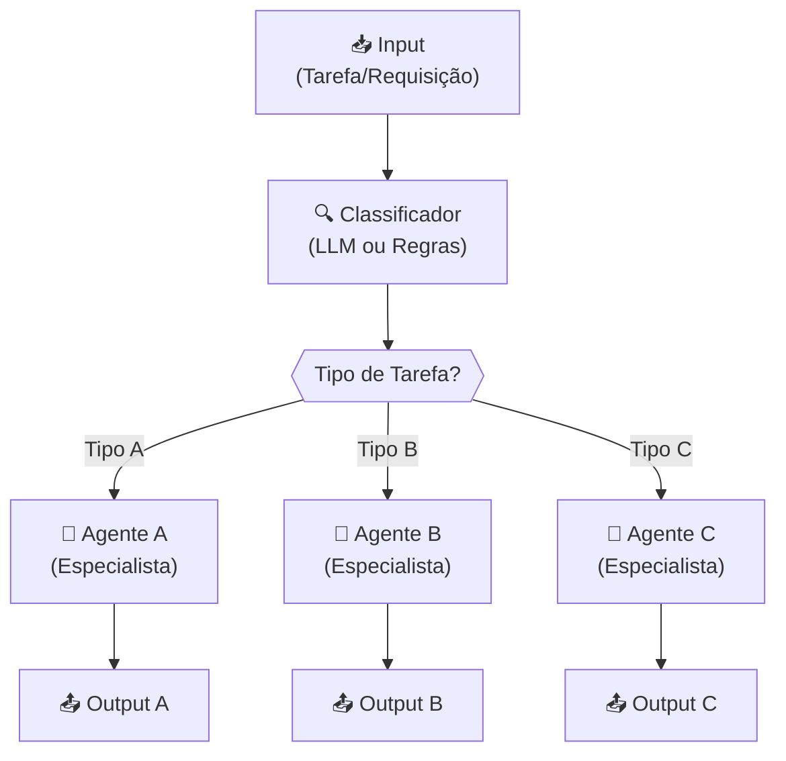
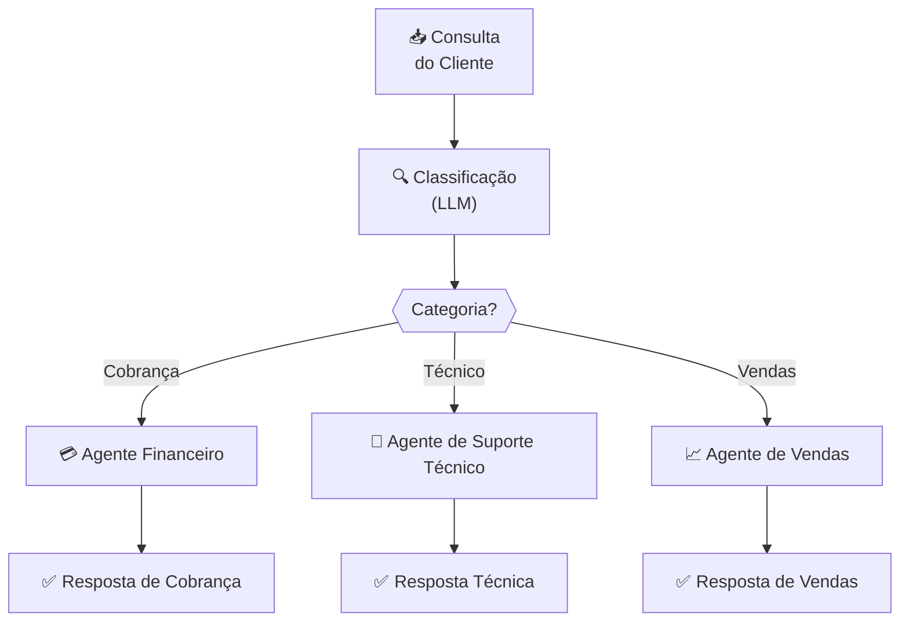
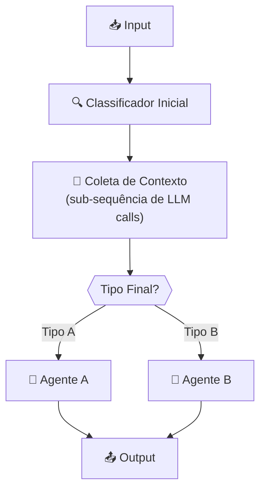

# Padrões de Agentic Workflows: Routing

---

## 1. Conceito Fundamental

$$
\text{Routing} = \text{Classificação} + \text{Task Dispatch}
$$

**Definição técnica:** O padrão Routing é um mecanismo de workflow agêntico que analisa e categoriza entradas (inputs) para, em seguida, direcioná-las dinamicamente ao agente, prompt chain ou módulo mais adequado para processá-las. Em vez de um único componente tratar todos os tipos de tarefa, o Routing garante que cada tarefa seja enviada ao "especialista" correto.

> **Analogia do Mundo Real:** Assim como uma central de triagem médica avalia a gravidade e o tipo de cada caso antes de encaminhá-lo ao departamento certo (clínica geral, urgência, UTI), o Routing classifica cada requisição e a despacha ao agente mais preparado.

**Por que usar Routing?**

| Benefício | Descrição |
| :--- | :--- |
| 🎯 **Especialização de Tarefas** | Direciona inputs a agentes otimizados para cada tipo de tarefa → melhor desempenho e precisão |
| 💰 **Otimização de Recursos** | Tarefas simples → modelos mais rápidos/baratos; tarefas complexas → modelos mais poderosos |
| 🔄 **Flexibilidade** | Lida com tipos de requisições diversas escolhendo dinamicamente o caminho certo |
| 📈 **Escalabilidade** | Novos agentes especializados podem ser adicionados sem reestruturar o sistema |

---

## 2. Arquitetura & Componentes

$$
\text{Input} \xrightarrow{\text{Estágio 1}} \text{Classificação} \xrightarrow{\text{Estágio 2}} \text{Task Dispatch} \xrightarrow{} \text{Agente Especialista}
$$

### Fluxo do Padrão Routing



### Componentes-Chave

| Componente | Papel | Descrição |
| :--- | :--- | :--- |
| 📥 **Input** | Entrada do Sistema | Requisição do usuário ou saída de um agente de planejamento |
| 🔍 **Classificador** | Estágio 1: Classificação | Analisa o input e determina seu tipo, categoria ou intenção |
| 🔀 **Dispatcher** | Estágio 2: Task Dispatch | Implementa a lógica de ramificação com base na classificação |
| 🤖 **Agente Especialista** | Worker | Agente, prompt chain ou função otimizada para aquele tipo de tarefa |
| 📤 **Output** | Resposta Final | Resultado produzido pelo agente especialista correspondente |

---

## 3. Estágio 1: Classificação

**Objetivo:** Determinar com precisão a *natureza* do input — tipo, categoria, intenção ou complexidade.

> **Regra crítica:** A precisão da classificação determina o sucesso de todo o sistema. Uma classificação errada envia a tarefa ao agente errado, gerando ineficiência e resultados incorretos.

### Métodos de Classificação

| Método | Como Funciona | Vantagens | Desvantagens |
| :--- | :--- | :--- | :--- |
| **📏 Rule-based** | Keywords, expressões regulares, condicionais | Determinístico, rápido, sem custo de LLM | Pouco flexível, difícil de manter |
| **🤖 LLM-based** | Prompt → LLM → label estruturado | Captura nuance e contexto complexo | Latência, custo, não determinístico |

**Decisão de método:** Considere complexidade do input, precisão necessária e restrições de latência/custo. Para inputs simples e bem definidos, prefira rule-based. Para inputs contextuais e ambíguos, prefira LLM-based.

---

## 4. Estágio 2: Task Dispatch

**Objetivo:** Pegar o input classificado e direcioná-lo ao componente mais adequado.

O dispatch implementa **ramificações (branching)** com base no resultado da classificação:

```
Se Tipo == "A" → despachar para Agente A
Se Tipo == "B" → despachar para Agente B
Se Tipo == "C" → despachar para Agente C
```

> A *adequação* de cada agente ou caminho de processamento é definida por sua expertise ou capacidade designada, alinhada às categorias do classificador.

### Exemplo: Roteamento de Suporte ao Cliente



---

## 5. Implementação

### Padrão Genérico: Router com Classificação LLM

```python
from typing import Callable


def classify_input(
    user_input: str,
    categories: list[str],
    llm_call: Callable
) -> str:
    """Usa LLM para classificar o input em uma das categorias definidas."""
    category_list = "\n".join(f"- {cat}" for cat in categories)
    prompt = f"""Analyze the user request and classify it into ONE of these categories:
{category_list}

User request: {user_input}

Respond with ONLY the category name, exactly as listed above."""
    return llm_call(prompt).strip()


def route_input(
    user_input: str,
    agent_registry: dict[str, Callable],
    llm_call: Callable
) -> str:
    """Classifica e despacha o input ao agente especialista correspondente."""
    categories = list(agent_registry.keys())
    category = classify_input(user_input, categories, llm_call)

    if category not in agent_registry:
        raise ValueError(
            f"Classificação inválida: '{category}'. Esperado: {categories}"
        )

    specialist_agent = agent_registry[category]
    return specialist_agent(user_input)
```

### Exemplo de Uso

```python
# Define agentes especialistas com system prompts dedicados
def billing_agent(query: str) -> str:
    return llm_call(f"You are a billing specialist. Answer: {query}")

def tech_support_agent(query: str) -> str:
    return llm_call(f"You are a technical support expert. Answer: {query}")

def sales_agent(query: str) -> str:
    return llm_call(f"You are a sales consultant. Answer: {query}")


# Registra agentes por categoria
agent_registry = {
    "Billing": billing_agent,
    "Technical Support": tech_support_agent,
    "Sales": sales_agent,
}

# Roteia a consulta ao especialista correto
result = route_input(
    user_input="I can't connect to the server after updating my account settings.",
    agent_registry=agent_registry,
    llm_call=call_gpt
)
```

---

## 6. Padrão Avançado: Router com Sub-Orquestração

Em alguns casos, o router precisa **orquestrar uma sub-sequência de chamadas LLM** para reunir contexto antes de delegar ao especialista final.



```python
def router_with_context_gathering(
    user_input: str,
    agent_registry: dict[str, Callable],
    llm_call: Callable
) -> str:
    """Router que coleta contexto adicional antes de despachar."""
    # Passo 1: Classificação inicial
    categories = list(agent_registry.keys())
    initial_category = classify_input(user_input, categories, llm_call)

    # Passo 2: Coletar contexto relevante para a categoria identificada
    context_prompt = f"""
The user query has been classified as: {initial_category}

Gather the key facts and context needed to answer this query:
Query: {user_input}
"""
    enriched_context = llm_call(context_prompt)

    # Passo 3: Dispatch com contexto enriquecido
    enriched_input = f"{user_input}\n\nContext: {enriched_context}"
    specialist_agent = agent_registry.get(initial_category)
    return specialist_agent(enriched_input)
```

---

## 7. Comparativo: Routing vs Prompt Chaining

| Dimensão | Prompt Chaining | Routing |
| :--- | :--- | :--- |
| **Estrutura** | Linear / Sequencial | Condicional / Ramificada |
| **Fluxo** | Sempre o mesmo caminho | Caminho dinâmico baseado no input |
| **Especialização** | Passos em série para o mesmo problema | Agentes distintos para tipos distintos de tarefa |
| **Melhor para** | Tarefas complexas com múltiplos passos encadeados | Tarefas diversas que requerem expertise diferente |
| **Exemplo** | Análise → Resumo → Formatação | Billing query → Billing Agent |

---

## 8. Regras de Ouro (Golden Rules)

### ✅ Faça

1. **Defina categorias mutuamente exclusivas e exaustivas.** A classificação deve ter cobertura total sem ambiguidade.
2. **Valide a saída do classificador.** Trate explicitamente casos onde o label retornado não existe no registry.
3. **Construa agentes especialistas focados.** Cada agente deve ter prompt e expertise bem definidos.
4. **Documente categorias e critérios.** Torne explícito o que cada categoria significa e como se diferencia das demais.
5. **Teste edge cases de classificação.** Inputs ambíguos são os mais críticos para a robustez do sistema.

### ❌ Evite

1. **Categorias vagas ou sobrepostas.** Aumentam a taxa de erro de classificação.
2. **Router monolítico.** Não ponha toda a lógica de negócio dentro do classificador.
3. **Ignorar classificações inválidas.** Sempre trate retornos inesperados de forma explícita.
4. **Agentes genéricos demais.** Perdem a vantagem central do Routing: a especialização.

---

## 9. Armadilhas Comuns & Debugging

| Armadilha | Sintoma | Solução |
| :--- | :--- | :--- |
| **Classificação incorreta** | Tarefa enviada ao agente errado; resposta irrelevante | Refine prompt do classificador; adicione exemplos (few-shot) |
| **Categoria não coberta** | `KeyError` ou fallback silencioso | Defina handler padrão (`"Unknown"`) explícito |
| **Ambiguidade nas categorias** | LLM retorna labels diferentes para inputs similares | Reduza sobreposição semântica; adicione critérios de desempate |
| **Agentes muito genéricos** | Performance similar independente da rota tomada | Revise system prompts; especialize vocabulário e exemplos |
| **Custo elevado de classificação** | Latência e custo de token altos | Avalie se rule-based resolve; use modelos menores para classificação |

---

## 10. Resumo & Próximos Passos

Você dominou o padrão **Routing**, habilitando sistemas de IA a distribuir tarefas inteligentemente para os especialistas certos.

### Habilidades Desenvolvidas

✅ **LLM-Based Classification** — Classificar queries e tarefas usando Large Language Models com base em contexto e intenção
✅ **Designing Specialized Agents** — Criar agentes com roles e capabilities distintos, cada um definido por seu prompt e propósito
✅ **Routing & Orchestration** — Orquestrar sub-sequências de LLM calls para enriquecimento de contexto antes de delegar ao especialista final

---

[← Tópico Anterior: Padrões de Agentic Workflows: Prompt Chaining](04-agentic-workflow-patterns-prompt-chaining.md)
