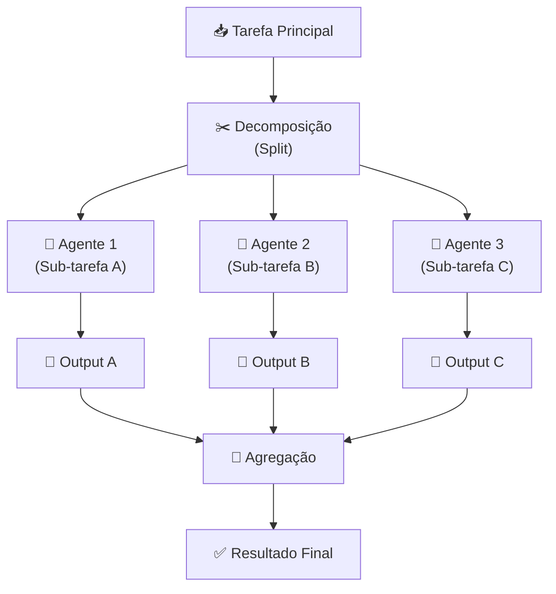
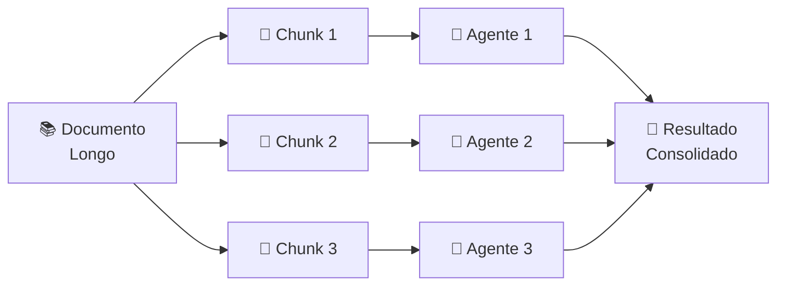
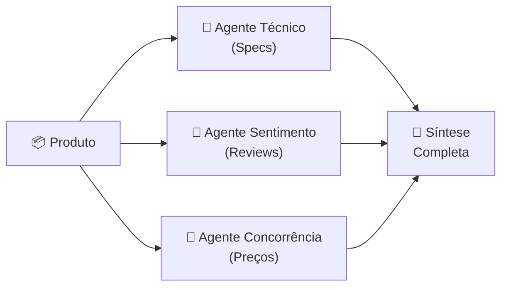

# Padrões de Agentic Workflows: Paralelização

---

## 1. Conceito Fundamental

$$
\text{Paralelização} = \text{Decomposição} + \text{Execução Paralela} + \text{Agregação}
$$

**Definição técnica:** Paralelização é um padrão de workflow agêntico em que múltiplos agentes trabalham em diferentes partes de uma tarefa — ou na mesma tarefa — simultaneamente. Inspirado no padrão *scatter-gather* da computação distribuída, o fluxo dispersa sub-tarefas para múltiplos workers e reúne seus resultados em uma saída coerente.

> **Analogia:** Assim como em um projeto de equipe cada membro atua em sua parte ao mesmo tempo — em vez de uma única pessoa fazer tudo em sequência — agentes paralelos dividem o trabalho e entregam resultados simultâneos.

**Quando usar Paralelização?**

| Critério | Recomendação |
| :--- | :--- |
| Sub-tarefas **independentes** entre si | ✅ Ideal para Paralelização |
| Sub-tarefas **dependentes** (output de A → input de B) | ❌ Prefira Prompt Chaining |
| Grande volume de dados divisíveis | ✅ Use Sectioning/Sharding |
| Necessidade de múltiplas perspectivas ou consenso | ✅ Use Identical Tasks / Voting |

> **Regra de Ouro — Pré-requisito absoluto:** As sub-tarefas devem ser **largamente independentes**. Se o Agente A precisar esperar o Agente B para fazer seu trabalho, use Prompt Chaining para as partes dependentes.

---

## 2. Arquitetura & Componentes

$$
\text{Tarefa Principal} \xrightarrow{\text{Decomposição}} \text{Sub-tarefas} \xrightarrow{\text{Paralelo}} \text{Outputs} \xrightarrow{\text{Agregação}} \text{Resultado Final}
$$

### Fluxo do Padrão Paralelização



### Componentes-Chave

| Componente | Papel | Descrição |
| :--- | :--- | :--- |
| 📥 **Tarefa Principal** | Entrada do Sistema | Problema complexo a ser resolvido |
| ✂️ **Decompositor** | Estágio 1: Split | Divide a tarefa em sub-tarefas independentes |
| 🤖 **Agentes Workers** | Estágio 2: Execução Paralela | Processam sub-tarefas simultaneamente |
| 🔗 **Agregador** | Estágio 3: Gather | Combina os outputs em um resultado coerente |
| ✅ **Resultado Final** | Saída do Sistema | Resposta unificada, enriquecida ou consolidada |

---

## 3. Estratégias de Decomposição de Tarefas

Antes de paralelizar, é necessário decompor a tarefa. Três estratégias principais:

### 3.1 Sectioning / Sharding (Seccionamento)

**Quando usar:** Entradas grandes e divisíveis (documentos longos, datasets).

**Como funciona:** Divide o input em pedaços (*chunks*) menores. Cada agente processa um chunk em paralelo.



**Exemplo:** Resumir cada capítulo de um livro simultaneamente com um agente por capítulo.

---

### 3.2 Aspect-Based Decomposition (Decomposição por Aspectos)

**Quando usar:** Um único assunto que requer análise de múltiplas dimensões independentes.

**Como funciona:** Agentes diferentes analisam facetas distintas do mesmo objeto ao mesmo tempo.



**Exemplo:** Análise de produto com um agente para specs técnicas, outro para sentimento dos usuários e outro para preços de concorrentes.

---

### 3.3 Identical Tasks for Diversity or Voting (Tarefas Idênticas)

**Quando usar:** Necessidade de diversidade criativa ou confiabilidade por consenso.

**Como funciona:** A mesma tarefa é executada por múltiplos agentes (potencialmente com prompts ou modelos variados). Os resultados são comparados ou submetidos a votação.

**Exemplo:** Três agentes respondem à mesma pergunta de classificação; a resposta mais frequente (maioria) é escolhida como resposta final.

---

### Tabela Comparativa: Estratégias de Decomposição

| Estratégia | Tipo de Input | Objetivo Principal | Exemplo |
| :--- | :--- | :--- | :--- |
| **Sectioning/Sharding** | Grande e divisível | Processar em paralelo por volume | Resumo por capítulo de um livro |
| **Aspect-Based** | Único assunto, múltiplas facetas | Análise multidimensional | Review de produto (técnico + sentimento + preço) |
| **Identical Tasks** | Qualquer | Diversidade criativa ou consenso/votação | Classificação por maioria de votos |

---

## 4. Estratégias de Agregação de Outputs

Após a execução paralela, os outputs precisam ser combinados. Quatro estratégias principais:

| Estratégia | Como Funciona | Quando Usar |
| :--- | :--- | :--- |
| 🔗 **Concatenação** | Junta os outputs sequencialmente | Partes uniformes → documento completo |
| 🏆 **Comparação & Seleção** | Avalia outputs por critérios predefinidos e escolhe o melhor | Múltiplas soluções para o mesmo problema |
| 🗳️ **Votação / Maioria** | Conta ocorrências; a mais frequente vence | Classificações e respostas objetivas |
| 🧠 **Synthesizer LLM** | Um LLM dedicado integra outputs diversos em resposta coesa | Outputs heterogêneos que exigem síntese contextual |

> **Regra prática:** Prefira **Concatenação** para outputs estruturados e uniformes. Use o **Synthesizer LLM** quando os outputs forem heterogêneos e precisarem de integração semântica.

---

## 5. Implementação em Python: Paralelização com `threading`

O módulo `threading` do Python é a ferramenta padrão para gerenciar operações paralelas de agentes:

```python
import threading
from typing import Callable


def run_agents_in_parallel(
    agents: list[Callable],
    shared_results: dict,
    task_input: str
) -> dict:
    """
    Generic parallel agent runner using threading.

    Args:
        agents: List of agent functions to run concurrently.
        shared_results: Dict to collect results from all threads.
        task_input: The input passed to each agent.

    Returns:
        Populated shared_results dict.
    """
    threads = []

    for agent_fn in agents:
        t = threading.Thread(
            target=agent_fn,
            args=(task_input, shared_results)
        )
        threads.append(t)
        t.start()

    for t in threads:
        t.join()  # Aguarda todas as threads concluírem

    return shared_results
```

> **Ponto crítico — `thread.join()`:** Sem `join()`, o programa principal pode terminar antes que as threads concluam, resultando em outputs incompletos ou perdidos.

### Pattern: Aspect-Based com Synthesizer LLM

```python
def analyze_sentiment(input_text: str, results: dict) -> None:
    """Agent: analyzes user sentiment from text."""
    results["sentiment"] = llm_call(
        system="You are a sentiment analysis expert.",
        user=input_text
    )


def analyze_technical(input_text: str, results: dict) -> None:
    """Agent: extracts technical specifications."""
    results["technical"] = llm_call(
        system="You are a technical specifications expert.",
        user=input_text
    )


def analyze_competitive(input_text: str, results: dict) -> None:
    """Agent: evaluates competitive positioning."""
    results["competitive"] = llm_call(
        system="You are a competitive pricing and market expert.",
        user=input_text
    )


def synthesize(results: dict) -> str:
    """Synthesizer LLM: integrates all parallel outputs."""
    combined = "\n".join(f"{k.upper()}: {v}" for k, v in results.items())
    return llm_call(
        system="Synthesize these independent analyses into one coherent final report.",
        user=combined
    )


# Execution
shared: dict = {}
agents = [analyze_sentiment, analyze_technical, analyze_competitive]
run_agents_in_parallel(agents, shared, task_input="Product review text...")
final_report = synthesize(shared)
```

---

## 6. Análise Comparativa: Padrões de Workflow

| Critério | Prompt Chaining | Routing | Paralelização |
| :--- | :--- | :--- | :--- |
| **Dependência entre etapas** | Alta (output → input) | Baixa (ramificação) | **Nenhuma (independência total)** |
| **Velocidade de execução** | Sequencial | Sequencial (por rota) | **Mais rápida (concorrente)** |
| **Diversidade de output** | Baixa | Média | **Alta** |
| **Complexidade de implementação** | Baixa | Média | **Alta (concorrência)** |
| **Ideal para** | Workflows encadeados | Tarefas heterogêneas | **Alto volume e/ou múltiplas perspectivas** |

---

## 7. Boas Práticas (Golden Rules)

### ✅ Faça

1. **Garanta independência das sub-tarefas.** Valide que nenhum agente depende do output de outro antes de iniciar.
2. **Use `thread.join()` sempre.** Aguarde todas as threads antes de agregar resultados.
3. **Proteja o dicionário compartilhado.** Em cenários de alta concorrência, use `threading.Lock()` para evitar race conditions.
4. **Escolha a estratégia de agregação adequada.** Concatenação para uniformidade; Synthesizer LLM para heterogeneidade.
5. **Monitore falhas individuais.** Uma thread com erro não deve derrubar todo o pipeline — implemente tratamento de exceção por agente.

### ❌ Evite

1. **Paralelizar tarefas dependentes.** Se o output de A alimenta B, use Prompt Chaining para esse par.
2. **Ignorar sincronização.** Não assuma que threads terminam em ordem específica.
3. **Dicionários compartilhados sem controle.** Em sistemas de produção com muitas threads, race conditions são reais.
4. **Aggregator genérico demais.** Um Synthesizer LLM sem prompt especializado produz outputs mediocres.

---

## 8. Armadilhas Comuns & Debugging

| Armadilha | Sintoma | Solução |
| :--- | :--- | :--- |
| **Sub-tarefas dependentes** | Resultados incorretos ou incompletos por ordem de execução | Reavalie dependências; mova partes dependentes para Prompt Chaining |
| **Thread não joinada** | Output parcial; programa termina antes das threads | Adicione `t.join()` para cada thread criada |
| **Race condition** | Dados corrompidos no dict compartilhado | Use `threading.Lock()` ao escrever em `shared_results` |
| **Synthesizer sem contexto** | Síntese genérica e superficial | Enriqueça o prompt do Synthesizer com contexto e critérios explícitos |
| **Chunks muito pequenos** | Overhead de threads supera o ganho de velocidade | Ajuste o tamanho dos chunks; avalie se a paralelização compensa |

---

## 9. Resumo & Próximos Passos

Você dominou o padrão **Paralelização**, habilitando múltiplos agentes a trabalhar simultaneamente para processar tarefas complexas de forma eficiente e rica em perspectivas.

### Habilidades Desenvolvidas

✅ **Designing for Parallelism** — Decompor tarefas complexas em sub-tarefas independentes para execução concorrente
✅ **Concurrent Python Code** — Gerenciar threads com `threading` (create, start, join)
✅ **Managing Concurrent Data** — Coletar resultados de múltiplas threads via dicionário compartilhado
✅ **Specialized Agent Prompts** — Definir roles distintos e guiar análises LLM por system prompts direcionados
✅ **Synthesizer Agents** — Construir agentes cuja função é integrar múltiplos inputs em um output coerente de alto nível

---

[← Tópico Anterior: Padrões de Agentic Workflows: Routing](05-agentic-workflow-patterns-routing.md)
