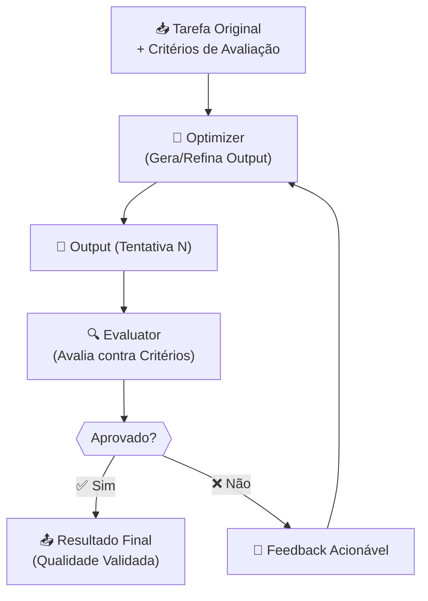
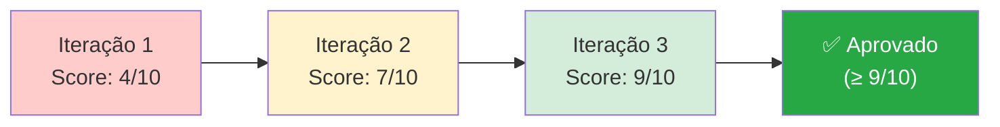
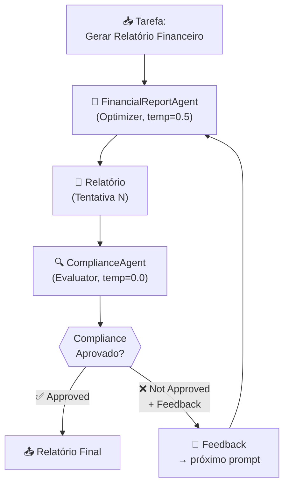

# Padrões de Agentic Workflows: Evaluator-Optimizer

---

## 1. Conceito Fundamental

$$
\text{Evaluator-Optimizer} = \text{Geração} + \text{Avaliação} + \text{Refinamento Iterativo}
$$

**Definição técnica:** O padrão Evaluator-Optimizer é um workflow agêntico de ciclo fechado no qual um agente **Optimizer** (gerador) produz uma saída e um agente **Evaluator** (revisor) a avalia contra critérios predefinidos, fornecendo feedback acionável. O Optimizer então refina a saída com base nesse feedback, e o ciclo se repete até que os critérios de qualidade sejam atingidos ou uma condição de parada seja satisfeita.

> **Analogia:** Imagine um escritor (Optimizer) que entrega seu rascunho a um editor exigente (Evaluator). O editor marca problemas específicos e devolve com instruções claras. O escritor revisa e re-submete. Esse ciclo continua até que o editor aprove a publicação.

**Quando usar Evaluator-Optimizer?**

| Critério | Recomendação |
| :--- | :--- |
| Tarefa exige **alta qualidade e precisão** (relatórios, código, planos) | ✅ Ideal para Evaluator-Optimizer |
| Output deve **atender a critérios complexos ou regulatórios** | ✅ Use critérios de avaliação explícitos |
| Qualidade "suficiente" no primeiro rascunho é aceitável | ❌ Prefira Prompt Chaining simples |
| Sub-tarefas são **independentes** entre si | ❌ Prefira Paralelização |

> **Regra de Ouro — Pré-requisito absoluto:** Defina critérios de avaliação **claros, específicos e mensuráveis** antes de iniciar o ciclo. Sem critérios bem definidos, o Evaluator não tem base para fornecer feedback útil.

---

## 2. Arquitetura & Componentes

$$
\text{Tarefa} \xrightarrow{\text{Optimizer}} \text{Output}_n \xrightarrow{\text{Evaluator}} \begin{cases} \text{Aprovado} \rightarrow \text{Resultado Final} \\ \text{Feedback} \rightarrow \text{Optimizer (nova iteração)} \end{cases}
$$

### Fluxo do Padrão Evaluator-Optimizer



### Componentes-Chave

| Componente | Papel | Descrição |
| :--- | :--- | :--- |
| 📥 **Tarefa Original** | Entrada do Sistema | Problema a ser resolvido + critérios de sucesso |
| 🤖 **Optimizer** | Gerador / Refinador | Produz o output inicial e o refina com base no feedback recebido |
| 📄 **Output** | Artefato Intermediário | Rascunho gerado em cada iteração |
| 🔍 **Evaluator** | Revisor / Crítico | Avalia o output contra critérios predefinidos e produz feedback |
| 📝 **Feedback** | Canal de Melhoria | Instruções específicas e construtivas para o Optimizer |
| 📤 **Resultado Final** | Saída Validada | Output que atingiu os critérios de qualidade exigidos |

---

## 3. Três Elementos Essenciais do Ciclo

O poder do Evaluator-Optimizer depende de três elementos bem definidos:

### 3.1 Critérios de Avaliação Claros (Clear Evaluation Criteria)

**O que são:** Os padrões objetivos contra os quais o Evaluator avalia o output.

**Características de bons critérios:**

| Característica | Descrição | Exemplo |
| :--- | :--- | :--- |
| **Específicos** | Indicam exatamente o que verificar | "O relatório deve conter projeções de receita para 3 anos" |
| **Mensuráveis** | Permitem avaliação objetiva | "Nenhuma afirmação especulativa sem dados de suporte" |
| **Não ambíguos** | Uma única interpretação possível | "Linguagem formal, sem gírias ou coloquialismos" |

> **Regra:** Critérios vagos ("seja bom") produzem feedback vago. Critérios precisos ("use dados quantitativos para toda projeção financeira") produzem refinamento direcionado.

---

### 3.2 Feedback Acionável (Actionable Feedback)

**O que é:** As instruções específicas que o Evaluator fornece ao Optimizer para guiar o refinamento.

| Feedback Ruim ❌ | Feedback Acionável ✅ |
| :--- | :--- |
| "Melhore o relatório" | "O parágrafo 3 faz uma projeção especulativa. Substitua por dados do Q3 2025." |
| "Torne mais profissional" | "Remova os 4 adjetivos superlativos e substitua por métricas quantitativas." |
| "Está quase bom" | "O critério 'linguagem formal' foi atingido. Falta atender: projeções com dados de suporte (parágrafo 2) e disclosure de riscos (ausente)." |

**Estrutura recomendada do feedback:**
1. **Status** por critério (aprovado/reprovado)
2. **Localização** do problema (onde no output)
3. **Instrução de correção** (o que fazer para resolver)

---

### 3.3 Condições de Parada (Stopping Conditions)

**Por que são essenciais:** Um loop iterativo sem condição de saída pode executar indefinidamente.

| Condição de Parada | Quando Usar |
| :--- | :--- |
| ✅ **Todos os critérios atendidos** | Cenário ideal — o output atingiu a qualidade exigida |
| 🔢 **Número máximo de iterações** | Safety net — impede loops infinitos (ex: máx. 5 tentativas) |
| 📉 **Retornos decrescentes** | Melhoria entre iterações é negligível — parar e aceitar |



---

## 4. Implementação em Python: Financial Report Generator

O exemplo a seguir demonstra o padrão Evaluator-Optimizer com um gerador de relatórios financeiros verificado por um agente de compliance.

### Visão Geral da Arquitetura



### Pattern: Evaluator-Optimizer com Compliance

```python
from typing import Callable

# Maximum number of refinement iterations (stopping condition)
MAX_ITERATIONS = 5


def evaluator_optimizer_loop(
    task: str,
    optimizer_fn: Callable[[str, str], str],
    evaluator_fn: Callable[[str], tuple[bool, str]],
    max_iterations: int = MAX_ITERATIONS,
) -> tuple[str, int]:
    """
    Generic Evaluator-Optimizer loop.

    Args:
        task: The original task description.
        optimizer_fn: Function(task, feedback) -> generated output.
        evaluator_fn: Function(output) -> (approved: bool, feedback: str).
        max_iterations: Safety limit for the loop.

    Returns:
        Tuple of (final_output, iterations_used).
    """
    feedback = ""

    for attempt in range(1, max_iterations + 1):
        # Optimizer generates or refines
        output = optimizer_fn(task, feedback)
        print(f"--- Attempt #{attempt} ---")
        print(f"Output preview: {output[:200]}...")

        # Evaluator assesses against criteria
        approved, feedback = evaluator_fn(output)

        if approved:
            print(f"✅ Approved on attempt #{attempt}")
            return output, attempt

        print(f"❌ Not approved. Feedback: {feedback}")

    print(f"⚠️ Max iterations ({max_iterations}) reached.")
    return output, max_iterations
```

### Implementação dos Agentes

```python
def financial_report_agent(task: str, feedback: str) -> str:
    """
    Optimizer agent: generates/refines a financial report.
    Uses higher temperature (0.5) for creative generation.
    """
    prompt = f"Task: {task}"
    if feedback:
        prompt += f"\n\nPrevious feedback to address:\n{feedback}"

    return llm_call(
        system=(
            "You are a financial report writer. "
            "Produce a professional, data-driven report. "
            "Use formal language, cite sources, and avoid speculation."
        ),
        user=prompt,
        temperature=0.5,
    )


def compliance_agent(report_text: str) -> tuple[bool, str]:
    """
    Evaluator agent: checks report against compliance criteria.
    Uses temperature=0.0 for deterministic, rule-like evaluation.

    Criteria:
      1. No speculative claims without supporting data
      2. Formal, professional language throughout
      3. Risk disclosure section present
      4. All projections backed by quantitative data
    """
    evaluation = llm_call(
        system=(
            "You are a strict compliance reviewer for financial reports. "
            "Evaluate the report against these criteria:\n"
            "1. No speculative claims without data support\n"
            "2. Formal, professional language\n"
            "3. Risk disclosure section present\n"
            "4. All projections backed by quantitative data\n\n"
            "Respond with 'Approved' if all criteria are met.\n"
            "Otherwise respond with 'Not Approved' followed by "
            "specific, actionable feedback for each failed criterion."
        ),
        user=report_text,
        temperature=0.0,
    )

    approved = evaluation.strip().lower().startswith("approved")
    return approved, evaluation


# Execution
final_report, iterations = evaluator_optimizer_loop(
    task="Generate a Q4 2025 financial performance report for investors.",
    optimizer_fn=financial_report_agent,
    evaluator_fn=compliance_agent,
)
print(f"\nFinal report generated in {iterations} iteration(s).")
```

> **Observação sobre `temperature`:**
> - **Evaluator (temp=0.0):** Determinístico — avaliação consistente e previsível, como um juiz aplicando regras fixas.
> - **Optimizer (temp=0.5):** Semi-criativo — gera conteúdo variado mas focado, como um escritor competente.

---

## 5. Análise Comparativa: Padrões de Workflow

| Critério | Prompt Chaining | Routing | Paralelização | **Evaluator-Optimizer** |
| :--- | :--- | :--- | :--- | :--- |
| **Estrutura** | Sequencial linear | Ramificação dinâmica | Concorrente | **Ciclo iterativo** |
| **Dependência entre etapas** | Alta (output → input) | Baixa (ramificação) | Nenhuma | **Alta (feedback → refinamento)** |
| **Melhoria incremental** | Nenhuma | Nenhuma | Nenhuma | **Sim (a cada iteração)** |
| **Velocidade** | Média | Rápida (por rota) | Rápida (paralela) | **Lenta (múltiplas iterações)** |
| **Qualidade do output** | Boa | Boa | Diversa | **Alta (refinada iterativamente)** |
| **Ideal para** | Tarefas sequenciais | Tarefas heterogêneas | Alto volume | **Alta precisão / compliance** |

---

## 6. Boas Práticas (Golden Rules)

### ✅ Faça

1. **Defina critérios antes de implementar o loop.** Sem critérios claros, o Evaluator não tem base para avaliar.
2. **Torne o feedback acionável.** Instrua o Evaluator a indicar *o quê* está errado, *onde* está e *como* corrigir.
3. **Estabeleça um limite máximo de iterações.** Previna loops infinitos com um safety net (ex: `MAX_ITERATIONS = 5`).
4. **Use `temperature` diferenciada.** Evaluator baixo (0.0) para consistência; Optimizer moderado (0.3–0.7) para criatividade controlada.
5. **Acumule o feedback no prompt.** Inclua o feedback da iteração anterior no prompt do Optimizer para guiar o refinamento.

### ❌ Evite

1. **Critérios vagos.** "Melhore a qualidade" é inútil — especifique: "Toda projeção deve ter dados de suporte quantitativos."
2. **Loop sem condição de saída.** Sempre implemente pelo menos o limite máximo de iterações.
3. **Feedback genérico.** "Não aprovado, tente novamente" não dá ao Optimizer informação suficiente para melhorar.
4. **Ignorar retornos decrescentes.** Se o score não melhora entre iterações, aceite o melhor resultado e encerre.
5. **Mesmo `temperature` para ambos os agentes.** O Evaluator precisa ser determinístico; o Optimizer precisa de alguma criatividade.

---

## 7. Armadilhas Comuns & Debugging

| Armadilha | Sintoma | Solução |
| :--- | :--- | :--- |
| **Critérios indefinidos** | Evaluator aprova tudo ou rejeita sem justificativa clara | Defina critérios explícitos e mensuráveis no system prompt |
| **Feedback não acionável** | Optimizer repete os mesmos erros a cada iteração | Reformule o prompt do Evaluator para exigir feedback com localização + instrução |
| **Loop infinito** | Processo nunca termina; consome recursos indefinidamente | Implemente `MAX_ITERATIONS` como safety net |
| **Retornos decrescentes** | Score estagna após 2-3 iterações | Adicione detecção de plateau; aceite o melhor resultado |
| **Feedback conflitante** | Optimizer tenta corrigir X mas quebra Y | Numere critérios e exija avaliação item por item |
| **Evaluator muito permissivo** | Output de baixa qualidade é aprovado na primeira tentativa | Revise e refine os critérios; use `temperature=0.0` no Evaluator |

---

## 8. O que Observar na Demo

Ao executar a demo do Financial Report Generator, foque em:

| Ponto de Atenção | O que Observar |
| :--- | :--- |
| 🔢 **Tentativas** | Cada `Attempt #N` no console representa uma iteração do ciclo |
| 📝 **Feedback do ComplianceAgent** | Instruções específicas quando o draft não é aprovado |
| 🔄 **Evolução do prompt** | O prompt do FinancialReportAgent muda a cada tentativa (acumula feedback) |
| 📈 **Melhoria do relatório** | O `report_text` se torna mais compliant a cada iteração |
| 🌡️ **Temperature settings** | ComplianceAgent (0.0) = determinístico; FinancialReportAgent (0.5) = criativo |

---

## 9. Resumo & Próximos Passos

Você dominou o padrão **Evaluator-Optimizer**, habilitando a criação de outputs de alta qualidade através de um ciclo de geração, crítica e refinamento iterativo.

### Habilidades Desenvolvidas

✅ **Designing Iterative AI Systems** — Projetar workflows onde agentes interagem em loop, construindo sobre outputs anteriores
✅ **Crafting Evaluation Criteria** — Definir critérios claros, específicos e mensuráveis para avaliação automatizada
✅ **Prompting for Feedback & Refinement** — Instruir LLMs a avaliar conteúdo contra critérios e a usar feedback para melhorar gerações subsequentes
✅ **Temperature Strategy** — Calibrar `temperature` por papel (baixo para avaliação determinística, moderado para geração criativa)
✅ **Safety Mechanisms** — Implementar condições de parada para garantir que loops iterativos sejam finitos e eficientes

---

## 🧪 Exercícios Práticos

Para aplicar os conceitos deste tópico na prática, consulte:

- 🐍 [Evaluator-Optimizer — Demo](../exercises/7-agentic-evaluator-optimizer-demo.py) — demonstração completa do padrão com FinancialReportAgent (optimizer) e ComplianceAgent (evaluator) em loop iterativo com MAX_RETRIES
- 🐍 [Evaluator-Optimizer — Exercício](../exercises/7-agentic-evaluator-optimizer.py) — exercício com esqueleto para implementar o padrão aplicado a geração de receitas com múltiplas restrições (gluten-free, vegan, calorias, proteína)

---

[← Tópico Anterior: Padrões de Agentic Workflows: Paralelização](06-agentic-workflow-patterns-parallelization.md) | [Próximo Tópico: Padrões de Agentic Workflows: Orchestrator-Workers →](08-agentic-workflow-patterns-orchestrator-workers.md)
