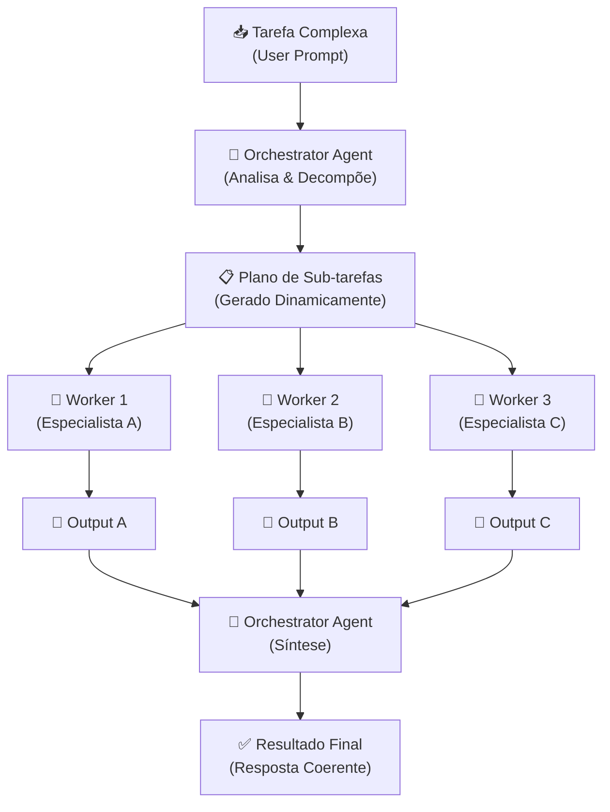
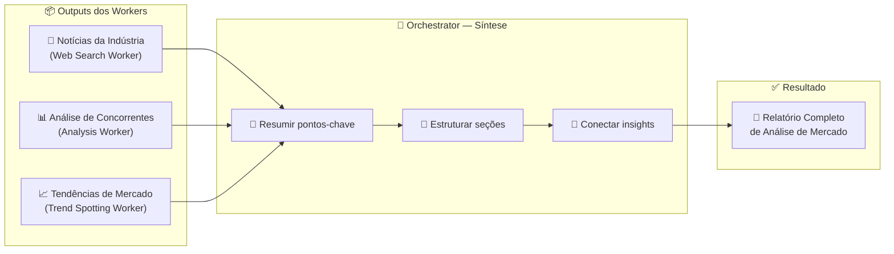

# Padrões de Agentic Workflows: Orchestrator-Workers

---

## 1. Conceito Fundamental

$$
\text{Orchestrator-Workers} = \text{Decomposição Dinâmica} + \text{Delegação Inteligente} + \text{Síntese}
$$

**Definição técnica:** Orchestrator-Workers é um padrão de workflow agêntico multi-agente no qual um **agente Orchestrator** central analisa uma tarefa complexa, decompõe-a dinamicamente em sub-tarefas em tempo de execução, delega cada sub-tarefa a **agentes Worker** especializados e, ao final, sintetiza os resultados parciais em uma saída coerente e completa.

> **Analogia:** Imagine um gerente de projetos experiente (Orchestrator) liderando uma equipe de especialistas contratados (Workers). O gerente compreende o projeto como um todo, divide-o em entregas, atribui cada entrega ao especialista mais qualificado e, ao final, integra todas as contribuições em um produto final coeso.

**Quando usar Orchestrator-Workers?**

| Critério | Recomendação |
| :--- | :--- |
| Tarefa **complexa** com caminho de solução desconhecido | ✅ Ideal para Orchestrator-Workers |
| Sub-tarefas precisam ser **determinadas dinamicamente** | ✅ Use decomposição em runtime |
| Cada sub-tarefa exige **competências distintas** | ✅ Delegue a Workers especializados |
| Sub-tarefas são **fixas e pré-definidas** | ❌ Prefira Paralelização simples |
| Fluxo linear sequencial | ❌ Prefira Prompt Chaining |

> **Regra de Ouro — Pré-requisito absoluto:** O Orchestrator deve possuir **capacidade de planejamento** suficiente para decompor a tarefa e selecionar os Workers adequados. Sem inteligência de decomposição, o padrão colapsa em uma simples distribuição fixa.

---

## 2. Arquitetura & Componentes

$$
\text{Tarefa Complexa} \xrightarrow{\text{Orchestrator}} \text{Sub-tarefas Dinâmicas} \xrightarrow{\text{Workers}} \text{Outputs Parciais} \xrightarrow{\text{Síntese}} \text{Resultado Final}
$$

### Fluxo do Padrão Orchestrator-Workers



### Componentes-Chave

| Componente | Papel | Descrição |
| :--- | :--- | :--- |
| 📥 **Tarefa Complexa** | Entrada do Sistema | Requisição de alto nível que exige múltiplas competências |
| 🧠 **Orchestrator Agent** | Coordenador Central | Analisa a tarefa, gera plano de sub-tarefas, delega e sintetiza |
| 📋 **Plano de Sub-tarefas** | Artefato Dinâmico | Lista de sub-tarefas gerada em runtime pelo Orchestrator |
| 🔧 **Worker Agents** | Especialistas | Agentes com competências específicas que executam sub-tarefas |
| 📄 **Outputs Parciais** | Resultados Intermediários | Entregas individuais de cada Worker |
| ✅ **Resultado Final** | Saída do Sistema | Produto coerente integrado pelo Orchestrator |

---

## 3. O Papel do Orchestrator: Orquestração

O Orchestrator executa duas funções críticas: **orquestração** (decomposição + delegação) e **síntese**. Esta seção foca na primeira.

### 3.1 Decomposição Dinâmica de Tarefas

**O que é:** O Orchestrator analisa a requisição em **tempo de execução** e decide quais sub-tarefas são necessárias. O plano não é fixo — para cada nova requisição, o Orchestrator avalia o contexto e gera sub-tarefas adequadas.

> **Exemplo concreto — Relatório de Análise de Mercado (Veículos Elétricos na Europa):**
>
> O Orchestrator recebe a requisição e determina dinamicamente:
> 1. 📰 **Coleta de Notícias** → delegada ao Web Research Worker
> 2. 📊 **Análise de Estratégias de Concorrentes** → delegada ao Data Analysis Worker
> 3. 📈 **Identificação de Tendências de Mercado** → delegada ao Trend Spotting Worker

**Diferencial:** O Orchestrator **não segue um checklist fixo**. Ele analisa a requisição e decide, em tempo de execução, quais peças de trabalho são necessárias. Essa capacidade de decidir dinamicamente o "o quê" e "para quem" é o núcleo de seu poder de orquestração.

### 3.2 Delegação Inteligente

O Orchestrator atribui cada sub-tarefa ao Worker mais adequado com base nas competências especializadas de cada um.

| Sub-tarefa | Worker Designado | Competência |
| :--- | :--- | :--- |
| 📰 Coleta de Notícias | 🌐 Web Research Worker | Busca e curadoria de informações na web |
| 📊 Análise de Concorrentes | 📊 Data Analysis Worker | Análise quantitativa e comparativa de dados |
| 📈 Tendências de Mercado | 📈 Trend Spotting Worker | Identificação de padrões e projeções |

---

## 4. O Papel do Orchestrator: Síntese

$$
\text{Síntese} = \sum_{i=1}^{n} \text{Output}_i \xrightarrow{\text{Integração Inteligente}} \text{Produto Final Coerente}
$$

**Definição:** Síntese é o processo de tomar múltiplos outputs parciais e diversos e combiná-los em uma saída única, coerente e valiosa. Não é mera concatenação — é **integração inteligente** que conecta informações de fontes diferentes para criar compreensão nova ou um produto completo.

### Processo de Síntese (Exemplo: Market Analysis Report)



### O que a Síntese Envolve

| Ação | Descrição |
| :--- | :--- |
| 📝 **Sumarização** | Extrair os dados mais relevantes de cada output parcial |
| 📑 **Estruturação** | Organizar a informação com introdução, seções temáticas e conclusão |
| 🔗 **Integração** | Conectar insights de diferentes fontes para gerar entendimento holístico |
| 🎯 **Alinhamento** | Garantir que o produto final responda diretamente à requisição original |

> **Regra:** Síntese **não é** simplesmente "grampear páginas". O Orchestrator deve **conectar** as informações de forma inteligente, identificando relações entre os outputs dos Workers para produzir compreensão nova.

---

## 5. Orchestrator-Workers vs Paralelização Simples

A distinção central entre Orchestrator-Workers e Paralelização simples reside em **inteligência dinâmica vs eficiência estática**.

| Aspecto | 🧠 Orchestrator-Workers | ⚡ Paralelização Simples |
| :--- | :--- | :--- |
| **Metáfora** | Gerente de projetos inteligente | Linha de montagem |
| **Decomposição** | **Dinâmica** — gerada em runtime pelo Orchestrator | **Estática** — sub-tarefas pré-definidas |
| **Flexibilidade** | Alta — adapta-se a problemas novos e imprevistos | Baixa — funciona para cargas de trabalho conhecidas |
| **Delegação** | Inteligente — atribui a tarefa ao Worker mais adequado | Fixa — cada slot executa uma função predeterminada |
| **Complexidade** | Alta — requer LLM com capacidade de planejamento | Baixa — divisão mecânica do trabalho |
| **Síntese** | Ativa — Orchestrator integra outputs de forma semântica | Passiva — agregação por concatenação/votação |
| **Caso de uso ideal** | Problemas complexos com caminho de solução desconhecido | Trabalho repetitivo claramente divisível em chunks independentes |

> **Em essência:** Orchestrator-Workers traz **inteligência dinâmica e adaptabilidade** para desafios complexos, enquanto Paralelização simples oferece **eficiência no processamento** de cargas de trabalho previsíveis e divisíveis.

---

## 6. Implementação Conceitual em Python

```python
from typing import Callable


def orchestrate(
    task: str,
    planner: Callable[[str], list[dict]],
    workers: dict[str, Callable],
    synthesizer: Callable[[list[str]], str],
) -> str:
    """
    Generic Orchestrator-Workers pattern.

    Args:
        task: High-level task description from the user.
        planner: Function that decomposes the task into subtasks.
                 Returns list of dicts with 'worker' and 'description'.
        workers: Registry mapping worker names to callable agents.
        synthesizer: Function that combines partial outputs into
                     a coherent final result.

    Returns:
        Synthesized final output.
    """
    # Step 1: Dynamic decomposition
    subtasks = planner(task)

    # Step 2: Delegation to specialized workers
    partial_outputs = []
    for subtask in subtasks:
        worker_name = subtask["worker"]
        description = subtask["description"]
        worker_fn = workers[worker_name]
        result = worker_fn(description)
        partial_outputs.append(result)

    # Step 3: Synthesis
    return synthesizer(partial_outputs)
```

### Exemplo de Uso com LLM

```python
import json


def llm_planner(task: str) -> list[dict]:
    """Use an LLM to dynamically decompose a task."""
    response = llm_call(
        system=(
            "You are a project planner. Decompose the task into subtasks. "
            "Return a JSON array of objects with 'worker' and 'description'."
        ),
        user=task,
    )
    return json.loads(response)


def web_research_worker(description: str) -> str:
    """Worker specialized in web research."""
    return llm_call(
        system="You are a web research specialist.",
        user=description,
    )


def data_analysis_worker(description: str) -> str:
    """Worker specialized in data analysis."""
    return llm_call(
        system="You are a data analysis expert.",
        user=description,
    )


def trend_spotting_worker(description: str) -> str:
    """Worker specialized in identifying market trends."""
    return llm_call(
        system="You are a trend analysis specialist.",
        user=description,
    )


def llm_synthesizer(outputs: list[str]) -> str:
    """Synthesize partial outputs into a cohesive report."""
    combined = "\n---\n".join(outputs)
    return llm_call(
        system=(
            "You are a report synthesizer. Combine the following "
            "partial analyses into a single cohesive report."
        ),
        user=combined,
    )


# Execute the orchestration
workers_registry = {
    "web_research": web_research_worker,
    "data_analysis": data_analysis_worker,
    "trend_spotting": trend_spotting_worker,
}

report = orchestrate(
    task="Market analysis report for electric vehicles in Europe",
    planner=llm_planner,
    workers=workers_registry,
    synthesizer=llm_synthesizer,
)
```

> **Ponto crítico — Planejamento LLM:** O `planner` é o componente mais sensível. Se o LLM gerar um plano ruim (sub-tarefas incompletas, Workers inexistentes), todo o workflow falha. Valide a saída do planner antes de executar.

---

## 7. Armadilhas Comuns & Debugging

| Armadilha | Sintoma | Solução |
| :--- | :--- | :--- |
| **Planner gera Workers inexistentes** | `KeyError` ao buscar no registry | Valide nomes de Workers contra a registry antes de executar |
| **Decomposição incompleta** | Resultado final faltando aspectos da tarefa | Enriqueça o prompt do planner com exemplos de decomposição |
| **Síntese superficial** | Relatório final é mera concatenação de outputs | Forneça ao synthesizer critérios de integração e estrutura esperada |
| **Workers sem especialização** | Outputs genéricos e redundantes | Defina system prompts distintos e focados para cada Worker |
| **Sem validação do plano** | Orchestrator executa sub-tarefas irrelevantes | Adicione etapa de validação entre planning e execution |
| **Overhead excessivo** | Tarefa simples com decomposição desnecessária | Avalie se a tarefa realmente requer Orchestrator-Workers |

---

## 8. Resumo & Próximos Passos

Você dominou o padrão **Orchestrator-Workers**, habilitando a criação de sistemas multi-agente dinâmicos que decompõem, delegam e sintetizam tarefas complexas de forma inteligente.

### Habilidades Desenvolvidas

✅ **Understanding Dynamic Task Decomposition** — Compreender como um objetivo complexo pode ser decomposto em sub-tarefas menores e gerenciáveis por um agente inteligente em runtime
✅ **Intelligent Delegation** — Entender como um Orchestrator atribui sub-tarefas aos Workers especializados mais adequados com base no plano dinâmico
✅ **Power of Synthesis** — Reconhecer o papel crucial do Orchestrator em integrar outputs diversos em um produto final coerente e valioso
✅ **Designing for Flexibility** — Identificar cenários onde Orchestrator-Workers supera estruturas rígidas, especialmente para tarefas com passos imprevisíveis
✅ **Distinguishing Orchestration from Parallelization** — Diferenciar este padrão dinâmico de padrões mais simples como Paralelização fixa ou Prompt Chaining

---

## 🧪 Exercícios Práticos

- 🐍 [Orchestrator-Workers Demo](../exercises/8-agentic-orchestrator-demo.py) — Implementação completa de referência do padrão Orchestrator-Workers aplicado à interpretação de exames laboratoriais
- 🐍 [Orchestrator-Workers Exercise](../exercises/8-agentic-orchestrator.py) — Exercício prático: implementar o dispatcher `get_worker` que roteia sub-tarefas dinâmicas para Workers especializados (Hematologia, Função Renal, Função Hepática)

---

[← Tópico Anterior: Padrões de Agentic Workflows: Evaluator-Optimizer](07-agentic-workflow-patterns-evaluator-optimizer.md)
