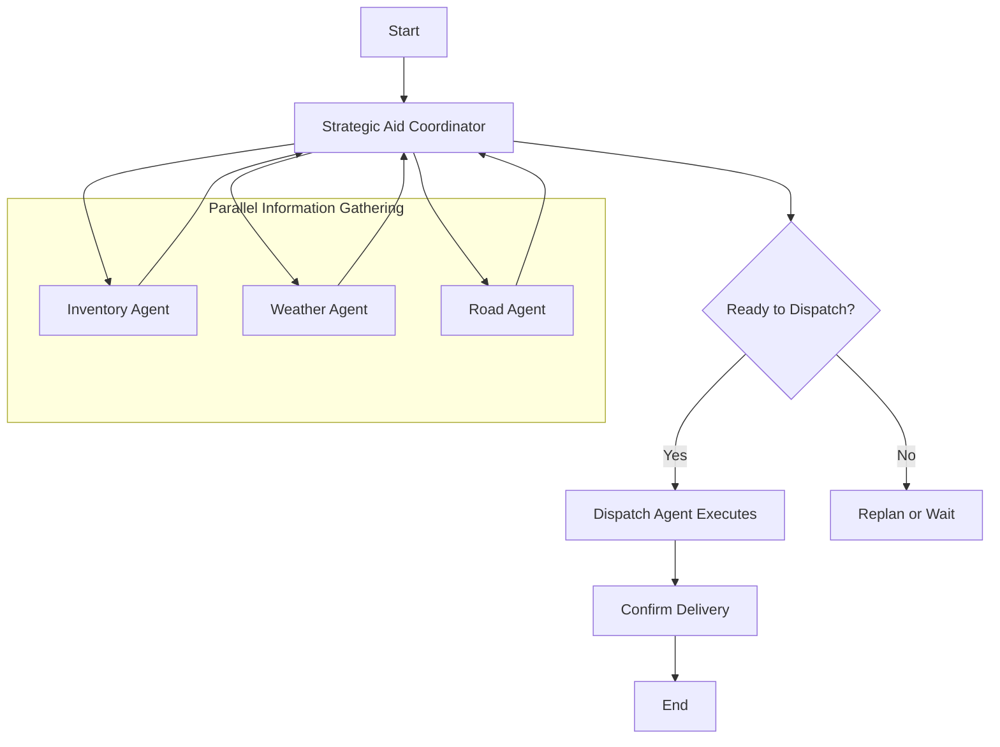

## Diagrama Final (Mermaid)

---

## Observações
- O StrategicAgent coordena a execução paralela dos agentes.
- Os resultados retornam ao coordenador antes da decisão de despacho.
- O fluxo representa um esforço de equipe, não apenas uma sequência linear.flowchart TD
  Start[Start] --> Manage[Manage Aid Request]
  Manage --> Inventory[Check Inventory]
  Manage --> CheckWeather[Check Weather]
  Manage --> CheckRoads[Check Road Conditions]
  Inventory --> // Placeholder for result flow
  Manage --> DispatchDecision{Ready to Dispatch?}
  DispatchDecision -- Yes --> Dispatch[Dispatch Team]
  DispatchDecision -- No --> Replan[Replan or Wait]
  Dispatch --> Confirm[Confirm Delivery]
  Confirm --> End[End]