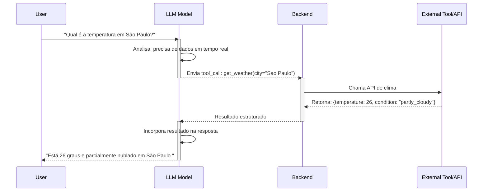
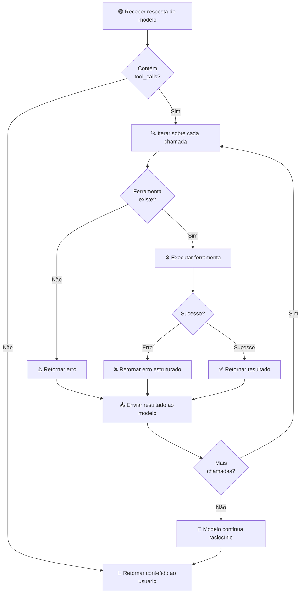

# Estendendo Agentes com Ferramentas

## 🧠 Conceito Fundamental

Modelos de linguagem são excelentes em **raciocínio**, mas limitados em **ação**. Sem ferramentas, um agente pode apenas falar — não agir. **Ferramentas estendem as capacidades do agente além de texto**, permitindo que ele interaja com sistemas reais.

$$\text{Agente Completo} = \text{LLM} + \text{Ferramentas} + \text{Feedback}$$

Pense em ferramentas como um **cinto de utilidades** para o agente. Sem acesso a ferramentas:
- ❌ Não pode verificar dados em tempo real (clima, preços, notícias)
- ❌ Não pode fazer cálculos precisos
- ❌ Não pode recuperar registros empresariais
- ❌ Pode adivinhar ou alucinar

Com ferramentas:
- ✅ Recupera dados precisos e atualizados
- ✅ Executa ações concretas no mundo real
- ✅ Integra-se com APIs, bancos de dados e sistemas internos
- ✅ Automatiza tarefas complexas

---

## 🛠️ Tipos de Ferramentas

| Tipo de Ferramenta | Função Principal | Exemplos |
|---|---|---|
| **APIs de Busca** | Responder perguntas em tempo real | Busca web, notícias, previsão do tempo |
| **Funções Matemáticas** | Garantir precisão em cálculos | Operações aritméticas, álgebra linear, estatística |
| **APIs e Webhooks** | Integrar serviços externos | Slack bots, lookups de CRM, reservas de voos |
| **Bancos de Dados** | Armazenar/recuperar dados estruturados | SQL, NoSQL, data warehouses |
| **Execução de Código** | Transformar, automatizar, processar lógica | Funções Python, scripts, simulações |

---

## 📊 Abordagens: Prompting vs Function Calling

### O Problema com Prompting Tradicional

A primeira tentativa de integração de ferramentas foi **baseada em prompts**:

```
"Se o usuário pergunta sobre cálculos, responda chamando
calculator(x, y). Seu backend vai parsear a string, extrair
os inputs, chamar a função e retornar a resposta."
```

**Problemas:**
- 🚨 Frágil — o modelo pode esquecer o formato ou estragar a estrutura
- 🚨 Impreciso — parsing de strings é propenso a erros
- 🚨 Difícil de escalar — para N ferramentas, N templates diferentes

### A Solução: Function Calling

**Function Calling** é um recurso que permite:
1. ✅ Declarar um catálogo de ferramentas com esquemas formais
2. ✅ O modelo decide **quando** e **qual** ferramenta usar
3. ✅ Retorna um objeto estruturado `tool_call` ou `function_call` em JSON
4. ✅ Seu backend executa a função e retorna o resultado
5. ✅ O modelo continua a conversa naturalmente

**Requisitos de Suporte:**
- 🧠 **Modelo treinado** para reconhecer situações de uso de ferramentas, preencher argumentos e formatar em JSON estruturado
- 🔌 **API que suporte** detectar e processar chamadas de ferramenta, retornando o resultado ao modelo

| Aspecto | Prompting Tradicional | Function Calling |
|---|---|---|
| **Formato** | String livre | JSON estruturado |
| **Confiabilidade** | Baixa (model pode errar formato) | Alta (suporte nativo do modelo) |
| **Escalabilidade** | Difícil (requer templates diferentes) | Fácil (catálogo formal de ferramentas) |
| **Parsing** | Manual (propenso a erros) | Automático (confiável) |
| **Feedback Loop** | Lento (correções textuais) | Rápido (objetos bem definidos) |

---

## ⚙️ Fluxo de Execução com Function Calling

Quando um usuário faz uma pergunta que requer dados externos, o agente executa o seguinte fluxo:



---

## 💡 Implementação de Function Calling

### Definindo Ferramentas (Schema JSON)

```python
# ✅ BOAS PRÁTICAS: Descrições claras e precisas
tools = [
    {
        "name": "get_weather",
        "description": "Recupera a condição climática atual para uma cidade",
        "parameters": {
            "type": "object",
            "properties": {
                "city": {
                    "type": "string",
                    "description": "Nome da cidade (ex: 'São Paulo', 'Rio de Janeiro')"
                },
                "unit": {
                    "type": "string",
                    "enum": ["celsius", "fahrenheit"],
                    "description": "Unidade de temperatura desejada"
                }
            },
            "required": ["city"]
        }
    },
    {
        "name": "calculate",
        "description": "Realiza operações matemáticas simples e complexas",
        "parameters": {
            "type": "object",
            "properties": {
                "expression": {
                    "type": "string",
                    "description": "Expressão matemática a ser avaliada (ex: '2 + 2', '15 * 3')"
                }
            },
            "required": ["expression"]
        }
    }
]
```

### Processando Chamadas de Ferramentas

```python
# ✅ BOAS PRÁTICAS: Loop robusto de ferramenta
def handle_tool_calls(model_response, tools_registry):
    """Processa chamadas de ferramenta do modelo."""

    if not model_response.get("tool_calls"):
        return model_response.get("content")

    for tool_call in model_response["tool_calls"]:
        tool_name = tool_call["name"]
        arguments = tool_call["arguments"]

        # Buscar ferramenta no registro
        if tool_name not in tools_registry:
            result = {"error": f"Ferramenta '{tool_name}' não encontrada"}
        else:
            try:
                # Executar a ferramenta
                result = tools_registry[tool_name](**arguments)
            except Exception as e:
                result = {"error": str(e)}

        # Retornar resultado ao modelo
        yield {
            "tool_name": tool_name,
            "result": result
        }
```

O fluxo de processamento segue este padrão:



### ⚠️ Armadilhas Comuns e Debugging

| Problema | Causa | Solução |
|---|---|---|
| Modelo ignora ferramentas disponíveis | Descrições vagas ou irrelevantes | Escrever descrições precisas, específicas e alinhadas com o caso de uso |
| Argumentos incorretos ou faltando | Parâmetros mal definidos no schema | Validar schema JSON com exemplos; testar com casos edge |
| Ciclo infinito de chamadas | Resultado da ferramenta não satisfaz o modelo | Incluir feedback claro no resultado; adicionar contador de tentativas |
| Latência alta | Chamadas sequenciais de ferramentas | Permitir chamadas paralelas quando possível |

---

## 🎯 Regras de Ouro

1. **Descrições são críticas**: Uma descrição clara de ferramenta é tão importante quanto a implementação. O modelo usa isso para decidir quando usar.

2. **Validação de argumentos**: Sempre validar e sanitizar argumentos antes de passar para funções externas. Desconfie da entrada do modelo.

3. **Feedback estruturado**: Retorne sempre JSON bem-formado, não strings genéricas. O modelo precisa de estrutura para continuar o raciocínio.

4. **Tentativas limitadas**: Implemente um contador de tentativas para evitar loops infinitos. Exemplo: máximo 5 chamadas por conversa.

5. **Tratamento de erros**: Não lance exceções; retorne erros estruturados. O modelo pode tentar recuperação ou informar ao usuário.

> **Futuro: Protocolos Padronizados**
>
> Desenvolvimentos emergentes como **OpenAI Operators**, **Anthropic's Model Context Protocol (MCP)** e **Google's Agent-to-Agent (A2A)** visam padronizar como ferramentas são acessadas e como agentes se comunicam entre sistemas. Isso abrirá a porta para **sistemas multi-agente colaborativos** especializados.

---

## 📚 Resumo Executivo

| Ponto-Chave | Significado |
|---|---|
| 🎯 **O Problema** | LLMs raciocinam bem, mas não agem. Alucinam quando faltam dados. |
| 🛠️ **A Solução** | Ferramentas = capacidade de interagir com o mundo real. |
| ⚙️ **O Mecanismo** | Function Calling = interface confiável entre raciocínio e execução. |
| 📈 **O Futuro** | Protocolos padronizados + agentes colaborativos = sistemas inteligentes complexos. |

---

## 🧪 Exercícios práticos e aprendizados

- **Referências dos exercícios:**
    - [Exercício: Tool Calling (Hands-on)](../exercises/1-tool-calling-exercise.ipynb) — implementação de uma classe `Agent`, ciclo de vida das `tool_calls` e exemplos de ferramentas (`calculate`, `get_games`).
    - [Demo: Using Tools (Fluxo)](../exercises/1-tool-calling-demo.ipynb) — fluxo completo de uma chamada de ferramenta (`get_weather`), extração de `tool_call_id`, execução e retorno ao modelo.

- **Aprendizados principais extraídos dos exercícios:**
    - **Responsabilidades do agente:** inicializar com `role`, `instructions` e um registro de `tools`; processar mensagens, decidir quando chamar ferramentas e incorporar respostas de ferramentas ao contexto.
    - **Fluxo de mensagens:** o modelo emite um `tool_call` (JSON) → backend executa a função → cria-se um `ToolMessage` com `tool_call_id` e `name` → reenvia-se ao modelo → modelo finaliza a resposta.
    - **Estrutura das ferramentas:** ferramentas devem ter descrições claras, tipos/assinaturas bem definidas e retornar dados estruturados (não apenas strings). Exemplos: `get_weather(city: str) -> dict`, `calculate(expression: str) -> float`.
    - **Tratamento de `tool_call_id`:** preservar e propagar o identificador da chamada (`tool_call_id`) ao criar o `ToolMessage` para que o modelo possa correlacionar resultados com a chamada original.
    - **Loop robusto de execução:** iterar sobre `tool_calls` até que o modelo não solicite mais chamadas; validar existência da ferramenta e capturar/expor erros de forma estruturada para que o modelo possa reagir.
    - **Validação e segurança:** nunca executar entradas não validadas (ex.: evitar `eval` em produção); sanitizar argumentos antes de executar; limitar tentativas para evitar loops infinitos.
    - **Design de instruções:** instruções do sistema devem deixar explícito quando usar ferramentas e quais precondições (ex.: "usar `get_games` antes de calcular estatísticas").
    - **Debug e observabilidade:** registrar mensagens trocadas (System/User/Tool/Model) e inspecionar `tool_calls`/`tool_call_id` para depurar falhas na integração.