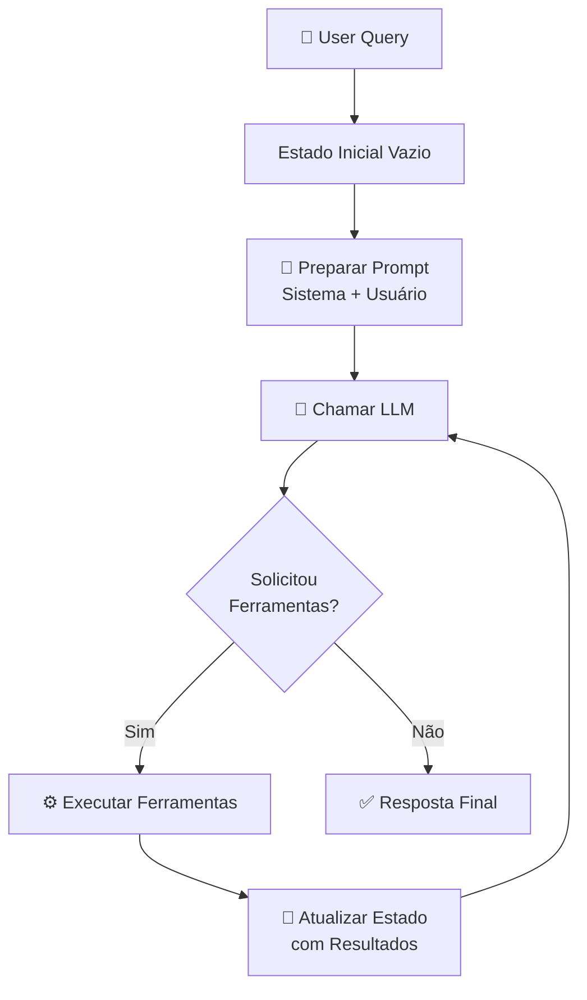

# Gerenciamento de Estado em Agentes

> LLMs são apátridas por padrão — cada prompt começa do zero. Agentes precisam de **estado** para executar tarefas complexas e encadeadas.

## 🧠 Conceito Fundamental

$$\text{Agente Eficaz} = \text{LLM} + \text{Ferramentas} + \text{Estado}$$

**Estado de agente** = tudo o que o agente precisa rastrear durante a execução de uma tarefa.

---

## ⚖️ Sistemas Apátridas vs. Stateful

| Dimensão | Apátrida (Stateless) | Stateful |
|---|---|---|
| 💡 Memória entre passos | Nenhuma | Mantém contexto acumulado |
| 🔄 Exemplo típico | LLM respondendo prompt único | Checkout com carrinho de compras |
| 📌 Limitação | Sem contexto de passos anteriores | Precisa gerenciar e limpar o estado |
| 🤖 Quando usar | Consultas únicas e independentes | Tarefas complexas multi-passos |

> **Analogia:** Um checkout online mantém itens no carrinho, calcula o total e processa o pagamento — sem estado, cada página seria uma transação isolada e o carrinho estaria sempre vazio.

---

## 🧩 Componentes do Estado do Agente

| Componente | Tipo | Descrição |
|---|---|---|
| `query` | `str` | Consulta original do usuário |
| `instructions` | `str` | Mensagem de sistema (persona, regras) |
| `messages` | `list[dict]` | Histórico completo da conversa |
| `tool_calls` | `list[dict]` | Chamadas de ferramentas pendentes de execução |
| `results` | `list[dict]` | Resultados intermediários de ferramentas |

> **Estado Efêmero:** O estado existe apenas durante a execução da tarefa. Quando a tarefa termina, o estado é descartado — funciona como **memória de trabalho**, não como memória de longo prazo.

---

## ⚙️ State Machines: O Padrão para Gerenciar Estado

Uma **máquina de estados** é um sistema que transita entre passos bem definidos, atualizando variáveis internas a cada transição.

$$\text{Estado}_{n+1} = f(\text{Estado}_n, \text{Passo}_n)$$

Cada passo **recebe** um estado e **retorna** uma versão atualizada — nunca modifica o estado in-place.

### Passos Típicos em um Agente

| Passo | Responsabilidade |
|---|---|
| **1. Preparação** | Combina instrução de sistema + consulta do usuário em `messages` |
| **2. Chamada ao LLM** | Envia `messages` ao modelo e obtém resposta |
| **3. Verificação** | O modelo solicitou chamadas de ferramentas? |
| **4. Execução de Ferramentas** | Executa as ferramentas e adiciona resultados ao estado |
| **5. Decisão** | Continua o loop (se houver `tool_calls`) ou finaliza |

---

## 🔄 Loop de Execução do Agente



---

## 📐 Definindo o Schema de Estado com TypedDict

```python
from typing import TypedDict

class AgentState(TypedDict):
    query: str             # Consulta original do usuário
    instructions: str      # Mensagem de sistema
    messages: list[dict]   # Histórico da conversa
    tool_calls: list[dict] # Ferramentas pendentes de execução
```

Cada função da máquina de estados aceita e retorna um `AgentState` — garantindo fluxo de dados consistente entre os passos.

```python
def prepare_messages(state: AgentState) -> AgentState:
    """Prepara o histórico com instrução de sistema e consulta do usuário."""
    system = {"role": "system", "content": state["instructions"]}
    user = {"role": "user", "content": state["query"]}
    return {**state, "messages": [system, user]}

def call_llm(state: AgentState, llm_client) -> AgentState:
    """Chama o LLM e atualiza o estado com a resposta e tool_calls."""
    response = llm_client.complete(state["messages"])
    updated_messages = state["messages"] + [response.message]
    return {
        **state,
        "messages": updated_messages,
        "tool_calls": response.tool_calls or [],
    }
```

---

## 🔀 Transições Condicionais

A transição entre passos é **dinâmica**: o próximo passo depende do conteúdo do estado atual.

```python
def route_after_llm(state: AgentState) -> str:
    """Decide o próximo passo com base no estado atual."""
    if state["tool_calls"]:
        return "execute_tools"  # O modelo quer usar ferramentas
    return "end"                # Resposta final pronta

def execute_tools(state: AgentState, tools_registry: dict) -> AgentState:
    """Executa ferramentas pendentes e atualiza o estado com os resultados."""
    tool_results = []
    for call in state["tool_calls"]:
        tool_fn = tools_registry.get(call["name"])
        if tool_fn:
            result = tool_fn(**call["args"])
        else:
            result = {"error": f"Ferramenta '{call['name']}' não encontrada"}
        tool_results.append({
            "role": "tool",
            "content": str(result),
            "tool_call_id": call["id"],
        })
    return {
        **state,
        "messages": state["messages"] + tool_results,
        "tool_calls": [],  # Limpar após execução para evitar loops
    }
```

---

## ⚠️ Armadilhas Comuns

| Armadilha | Causa | Solução |
|---|---|---|
| **Estado mutável in-place** | Modificar dicts/listas diretamente entre passos | Sempre retornar novo dict com `{**state, ...}` |
| **Acúmulo infinito de mensagens** | `messages` crescem sem limite em loops longos | Implementar janela deslizante ou resumo periódico |
| **`tool_calls` nunca limpos** | Ferramentas ficam em loop infinito | Limpar `tool_calls` com `[]` após cada execução |
| **Confundir estado efêmero com memória** | Esperar persistência além da tarefa | Usar banco de dados para memória de longo prazo |

---

## 📚 Resumo Executivo

$$\text{Estado Efêmero} = \text{Memória de Trabalho da Tarefa Atual}$$

| Ponto-Chave | Significado |
|---|---|
| 🔇 **LLMs são apátridas** | Cada prompt começa do zero, sem contexto anterior |
| 📦 **Estado = contexto de execução** | `query`, `instructions`, `messages`, `tool_calls` |
| 🔄 **State machine = previsibilidade** | Passos modulares com entradas e saídas bem definidas |
| ⏳ **Estado efêmero** | Existe apenas durante a tarefa; não persiste automaticamente |
| 🔀 **Transições dinâmicas** | O agente decide seu próprio próximo passo com base no estado |

---

[← Tópico Anterior: Structured Outputs: Tornando Respostas de IA Acionáveis](02-structured-outputs.md) | [Próximo Tópico: Módulo 3 — Índice →](README.md)
