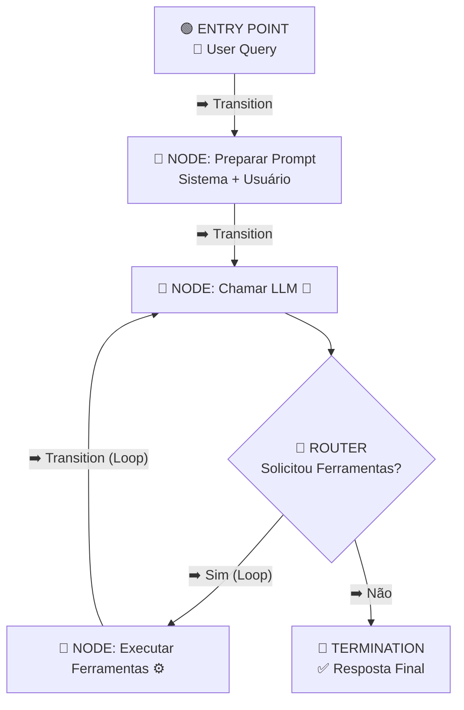
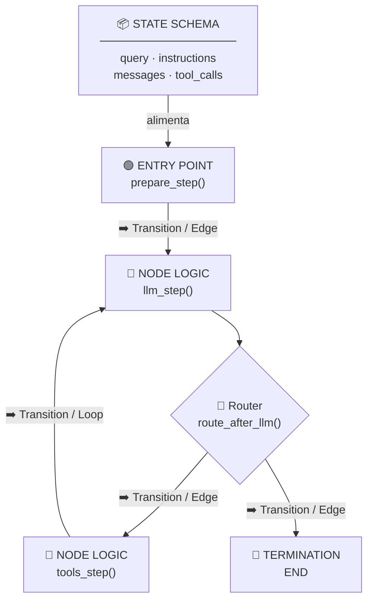

# Gerenciamento de Estado em Agentes

> LLMs são apátridas por padrão — cada prompt começa do zero. Agentes precisam de **estado** para executar tarefas complexas e encadeadas.

## 🧠 Conceito Fundamental

$$\text{Agente Eficaz} = \text{LLM} + \text{Ferramentas} + \text{Estado}$$

**Estado de agente** = tudo o que o agente precisa rastrear durante a execução de uma tarefa.

---

## ⚖️ Sistemas Apátridas vs. Stateful

| Dimensão | Apátrida (Stateless) | Stateful |
|---|---|---|
| 💡 Memória entre passos | Nenhuma | Mantém contexto acumulado |
| 🔄 Exemplo típico | LLM respondendo prompt único | Checkout com carrinho de compras |
| 📌 Limitação | Sem contexto de passos anteriores | Precisa gerenciar e limpar o estado |
| 🤖 Quando usar | Consultas únicas e independentes | Tarefas complexas multi-passos |

> **Analogia:** Um checkout online mantém itens no carrinho, calcula o total e processa o pagamento — sem estado, cada página seria uma transação isolada e o carrinho estaria sempre vazio.

---

## 🧩 Componentes do Estado do Agente

| Componente | Tipo | Descrição |
|---|---|---|
| `query` | `str` | Consulta original do usuário |
| `instructions` | `str` | Mensagem de sistema (persona, regras) |
| `messages` | `list[dict]` | Histórico completo da conversa |
| `tool_calls` | `list[dict]` | Chamadas de ferramentas pendentes de execução |
| `results` | `list[dict]` | Resultados intermediários de ferramentas |

> **Estado Efêmero:** O estado existe apenas durante a execução da tarefa. Quando a tarefa termina, o estado é descartado — funciona como **memória de trabalho**, não como memória de longo prazo.

---

## ⚙️ State Machines: O Padrão para Gerenciar Estado

Uma **máquina de estados** é um sistema que transita entre passos bem definidos, atualizando variáveis internas a cada transição.

$$\text{Estado}_{n+1} = f(\text{Estado}_n, \text{Passo}_n)$$

Cada passo **recebe** um estado e **retorna** uma versão atualizada — nunca modifica o estado in-place.

### 📖 Terminologia da State Machine

| Termo | Papel na Arquitetura |
|---|---|
| 🟢 **Entry Point** | O nó inicial a partir do qual a máquina começa as operações |
| 📦 **State Schema** | Abordagem estruturada que define os atributos do estado compartilhado entre todos os nós |
| 🔷 **Step / Node Logic** | Função que recebe o estado atual e retorna um novo estado com base na lógica do nó |
| ➡️ **Transition / Edge** | Define como a execução se move de um passo para o próximo — pode ser direta ou condicional |
| 🔴 **Termination** | Marca o fim do workflow, sinalizando a conclusão das operações |

### Passos Típicos em um Agente

| Passo | Responsabilidade |
|---|---|
| **1. Preparação** | Combina instrução de sistema + consulta do usuário em `messages` |
| **2. Chamada ao LLM** | Envia `messages` ao modelo e obtém resposta |
| **3. Verificação** | O modelo solicitou chamadas de ferramentas? |
| **4. Execução de Ferramentas** | Executa as ferramentas e adiciona resultados ao estado |
| **5. Decisão** | Continua o loop (se houver `tool_calls`) ou finaliza |

---

## 🔄 Loop de Execução do Agente



---

## 📐 Definindo o Schema de Estado com TypedDict

```python
from typing import TypedDict

class AgentState(TypedDict):
    query: str             # Consulta original do usuário
    instructions: str      # Mensagem de sistema
    messages: list[dict]   # Histórico da conversa
    tool_calls: list[dict] # Ferramentas pendentes de execução
```

Cada função da máquina de estados aceita e retorna um `AgentState` — garantindo fluxo de dados consistente entre os passos.

```python
def prepare_messages(state: AgentState) -> AgentState:
    """Prepara o histórico com instrução de sistema e consulta do usuário."""
    system = {"role": "system", "content": state["instructions"]}
    user = {"role": "user", "content": state["query"]}
    return {**state, "messages": [system, user]}

def call_llm(state: AgentState, llm_client) -> AgentState:
    """Chama o LLM e atualiza o estado com a resposta e tool_calls."""
    response = llm_client.complete(state["messages"])
    updated_messages = state["messages"] + [response.message]
    return {
        **state,
        "messages": updated_messages,
        "tool_calls": response.tool_calls or [],
    }
```

---

## 🔀 Transições Condicionais

A transição entre passos é **dinâmica**: o próximo passo depende do conteúdo do estado atual.

```python
def route_after_llm(state: AgentState) -> str:
    """Decide o próximo passo com base no estado atual."""
    if state["tool_calls"]:
        return "execute_tools"  # O modelo quer usar ferramentas
    return "end"                # Resposta final pronta

def execute_tools(state: AgentState, tools_registry: dict) -> AgentState:
    """Executa ferramentas pendentes e atualiza o estado com os resultados."""
    tool_results = []
    for call in state["tool_calls"]:
        tool_fn = tools_registry.get(call["name"])
        if tool_fn:
            result = tool_fn(**call["args"])
        else:
            result = {"error": f"Ferramenta '{call['name']}' não encontrada"}
        tool_results.append({
            "role": "tool",
            "content": str(result),
            "tool_call_id": call["id"],
        })
    return {
        **state,
        "messages": state["messages"] + tool_results,
        "tool_calls": [],  # Limpar após execução para evitar loops
    }
```

### Técnicas Avançadas: Routing e Loops

**Routing** e **Loops** são as duas técnicas que elevam a flexibilidade de uma state machine básica:

| Técnica | O que faz | Quando usar |
|---|---|---|
| **Routing** | Uma função examina o estado e redireciona para um de vários nós possíveis | Pós-LLM: ir para ferramentas, validação, ou terminar |
| **Loop** | Uma transição aponta de volta para um nó anterior | Ciclos LLM → ferramentas → LLM até a resposta final |

```python
# Routing: múltiplos destinos possíveis a partir de um nó
def route_step(state: AgentState) -> str:
    if state["tool_calls"]:
        return "execute_tools"
    if state.get("needs_validation"):
        return "validate"
    return "end"

# Loop: retorno explícito para reiniciar o ciclo
# tools → llm (nova iteração com resultados incorporados)
workflow.add_edge("execute_tools", "call_llm")
workflow.add_conditional_edges("call_llm", route_step, {
    "execute_tools": "execute_tools",
    "validate": "validate",
    "end": END,
})
```

> **Observar transições de estado** durante a execução é essencial para debugging: cada nó registra o que recebeu e o que retornou, tornando o fluxo de dados rastreável e testável.

---

## 🏗️ Construindo uma State Machine em Python

O processo segue cinco etapas bem definidas — da declaração do schema até a execução e observação:



### 1️⃣ Definir o State Schema

Declare os atributos compartilhados entre todos os nós. Esse schema é o contrato que garante consistência:

```python
from typing import TypedDict

class AgentState(TypedDict):
    query: str
    instructions: str
    messages: list[dict]
    tool_calls: list[dict]
```

### 2️⃣ Definir a Lógica dos Nós (Step Functions)

Cada nó é uma função pura — sem efeitos colaterais externos ao estado:

```python
def prepare_step(state: AgentState) -> AgentState:
    """Entry Point: inicializa o histórico de mensagens."""
    ...

def llm_step(state: AgentState) -> AgentState:
    """Node: chama o LLM e captura tool_calls."""
    ...

def tools_step(state: AgentState) -> AgentState:
    """Node: executa ferramentas e incorpora resultados."""
    ...
```

### 3️⃣ Conectar os Nós (Definir Transições/Arestas)

As arestas definem o fluxo entre nós — diretas ou condicionais:

```python
# Transição direta (Edge)
workflow.add_edge("prepare", "call_llm")

# Transição condicional (Router)
workflow.add_conditional_edges(
    "call_llm",
    route_after_llm,                     # função de roteamento
    {"execute_tools": "tools", "end": END},  # mapa de destinos
)

# Loop: tools retorna ao LLM para nova iteração
workflow.add_edge("tools", "call_llm")
```

### 4️⃣ Definir Entry Point e Termination

```python
workflow.set_entry_point("prepare")  # 🟢 Nó inicial
# END é importado do framework e sinaliza 🔴 Termination
```

### 5️⃣ Executar e Observar Transições

```python
agent = workflow.compile()

initial_state: AgentState = {
    "query": "Qual é a temperatura em São Paulo?",
    "instructions": "Você é um assistente útil.",
    "messages": [],
    "tool_calls": [],
}

final_state = agent.invoke(initial_state)
# Cada transição pode ser inspecionada: o que entrou e o que saiu de cada nó
```

---

## ⚠️ Armadilhas Comuns

| Armadilha | Causa | Solução |
|---|---|---|
| **Estado mutável in-place** | Modificar dicts/listas diretamente entre passos | Sempre retornar novo dict com `{**state, ...}` |
| **Acúmulo infinito de mensagens** | `messages` crescem sem limite em loops longos | Implementar janela deslizante ou resumo periódico |
| **`tool_calls` nunca limpos** | Ferramentas ficam em loop infinito | Limpar `tool_calls` com `[]` após cada execução |
| **Confundir estado efêmero com memória** | Esperar persistência além da tarefa | Usar banco de dados para memória de longo prazo |

---

## 📚 Resumo Executivo

$$\text{Estado Efêmero} = \text{Memória de Trabalho da Tarefa Atual}$$

| Ponto-Chave | Significado |
|---|---|
| 🔇 **LLMs são apátridas** | Cada prompt começa do zero, sem contexto anterior |
| 📦 **Estado = contexto de execução** | `query`, `instructions`, `messages`, `tool_calls` |
| 🔄 **State machine = previsibilidade** | Passos modulares com entradas e saídas bem definidas |
| ⏳ **Estado efêmero** | Existe apenas durante a tarefa; não persiste automaticamente |
| 🔀 **Transições dinâmicas** | O agente decide seu próprio próximo passo com base no estado |

---

[← Tópico Anterior: Structured Outputs: Tornando Respostas de IA Acionáveis](02-structured-outputs.md) | [Próximo Tópico: Short-Term Memory em Agentes →](04-short-term-memory.md)
