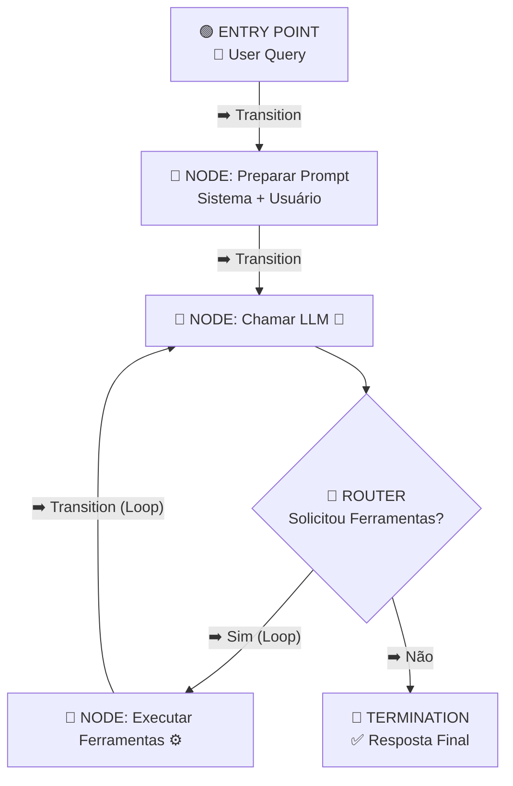
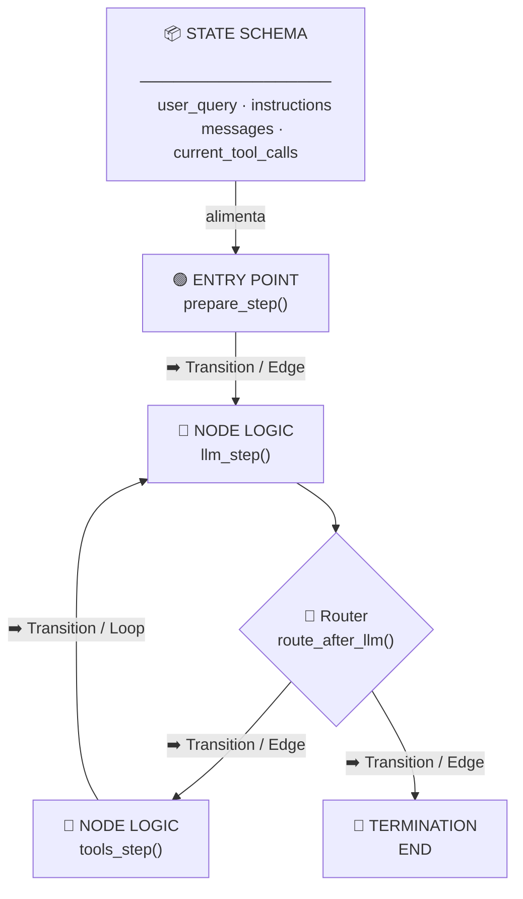

# Gerenciamento de Estado em Agentes

> LLMs são apátridas por padrão — cada prompt começa do zero. Agentes precisam de **estado** para executar tarefas complexas e encadeadas.

## 🧠 Conceito Fundamental

$$\text{Agente Eficaz} = \text{LLM} + \text{Ferramentas} + \text{Estado}$$

**Estado de agente** = tudo o que o agente precisa rastrear durante a execução de uma tarefa.

---

## ⚖️ Sistemas Apátridas vs. Stateful

| Dimensão | Apátrida (Stateless) | Stateful |
|---|---|---|
| 💡 Memória entre passos | Nenhuma | Mantém contexto acumulado |
| 🔄 Exemplo típico | LLM respondendo prompt único | Checkout com carrinho de compras |
| 📌 Limitação | Sem contexto de passos anteriores | Precisa gerenciar e limpar o estado |
| 🤖 Quando usar | Consultas únicas e independentes | Tarefas complexas multi-passos |

> **Analogia:** Um checkout online mantém itens no carrinho, calcula o total e processa o pagamento — sem estado, cada página seria uma transação isolada e o carrinho estaria sempre vazio.

---

## 🧩 Componentes do Estado do Agente

| Componente | Tipo | Descrição |
|---|---|---|
| `user_query` | `str` | Consulta original do usuário |
| `instructions` | `str` | Mensagem de sistema (persona, regras) |
| `messages` | `list[dict]` | Histórico completo da conversa |
| `current_tool_calls` | `list[dict]` | Chamadas de ferramentas pendentes de execução |

> **Estado Efêmero:** O estado existe apenas durante a execução da tarefa. Quando a tarefa termina, o estado é descartado — funciona como **memória de trabalho**, não como memória de longo prazo.

---

## ⚙️ State Machines: O Padrão para Gerenciar Estado

Uma **máquina de estados** é um sistema que transita entre passos bem definidos, atualizando variáveis internas a cada transição.

$$\text{Estado}_{n+1} = f(\text{Estado}_n, \text{Passo}_n)$$

Cada passo **recebe** um estado e **retorna** uma versão atualizada — nunca modifica o estado in-place.

### 📖 Terminologia da State Machine

| Termo | Papel na Arquitetura |
|---|---|
| 🟢 **Entry Point** | O nó inicial a partir do qual a máquina começa as operações |
| 📦 **State Schema** | Abordagem estruturada que define os atributos do estado compartilhado entre todos os nós |
| 🔷 **Step / Node Logic** | Função que recebe o estado atual e retorna um novo estado com base na lógica do nó |
| ➡️ **Transition / Edge** | Define como a execução se move de um passo para o próximo — pode ser direta ou condicional |
| 🔴 **Termination** | Marca o fim do workflow, sinalizando a conclusão das operações |

### Passos Típicos em um Agente

| Passo | Responsabilidade |
|---|---|
| **1. Preparação** | Combina instrução de sistema + consulta do usuário em `messages` |
| **2. Chamada ao LLM** | Envia `messages` ao modelo e obtém resposta |
| **3. Verificação** | O modelo solicitou chamadas de ferramentas? |
| **4. Execução de Ferramentas** | Executa as ferramentas e adiciona resultados ao estado |
| **5. Decisão** | Continua o loop (se houver `tool_calls`) ou finaliza |

---

## 🔄 Loop de Execução do Agente



---

## 📐 Definindo o Schema de Estado com TypedDict

```python
from typing import TypedDict

class AgentState(TypedDict):
    user_query: str             # Consulta original do usuário
    instructions: str           # Mensagem de sistema (persona, regras)
    messages: list              # Histórico completo da conversa
    current_tool_calls: list    # Chamadas de ferramentas pendentes de execução
```

Cada função da máquina de estados aceita e retorna um `AgentState` — garantindo fluxo de dados consistente entre os passos.

```python
from lib.messages import SystemMessage, UserMessage, AIMessage

def prepare_messages_step(state: AgentState) -> AgentState:
    """Entry Point: inicializa o histórico de mensagens."""
    return {
        "messages": [
            SystemMessage(content=state["instructions"]),
            UserMessage(content=state["user_query"]),
        ]
    }

def llm_step(state: AgentState) -> AgentState:
    """Node: chama o LLM e captura current_tool_calls."""
    from lib.llm import LLM
    llm = LLM(model="gpt-4o-mini", tools=tools)
    response = llm.invoke(state["messages"])
    ai_message = AIMessage(content=response.content, tool_calls=response.tool_calls)
    return {
        "messages": state["messages"] + [ai_message],
        "current_tool_calls": response.tool_calls or None,
    }
```

---

## 🔀 Transições Condicionais

A transição entre passos é **dinâmica**: o próximo passo depende do conteúdo do estado atual.

```python
def check_tool_calls(state: AgentState):
    """Router: decide o próximo Step com base no estado atual."""
    if state.get("current_tool_calls"):
        return tool_executor   # Step instance — o motor resolve para step_id
    return termination         # Sentinel Termination

import json
from lib.messages import ToolMessage

def tool_step(state: AgentState) -> AgentState:
    """Node: executa ferramentas pendentes e atualiza o estado com os resultados."""
    tool_messages = []
    for call in state["current_tool_calls"] or []:
        matched = next((t for t in tools if t.name == call.function.name), None)
        if matched:
            result = matched(**json.loads(call.function.arguments))
            tool_messages.append(ToolMessage(
                content=json.dumps(result),
                tool_call_id=call.id,
                name=call.function.name
            ))
    return {
        "messages": state["messages"] + tool_messages,
        "current_tool_calls": None,   # Limpar após execução para evitar loops
    }
```

### Técnicas Avançadas: Routing e Loops

**Routing** e **Loops** são as duas técnicas que elevam a flexibilidade de uma state machine básica:

| Técnica | O que faz | Quando usar |
|---|---|---|
| **Routing** | Uma função examina o estado e redireciona para um de vários nós possíveis | Pós-LLM: ir para ferramentas, validação, ou terminar |
| **Loop** | Uma transição aponta de volta para um nó anterior | Ciclos LLM → ferramentas → LLM até a resposta final |

```python
# Routing: função examina o estado e retorna o próximo Step
def check_tool_calls(state: AgentState):
    if state.get("current_tool_calls"):
        return tool_executor
    return termination

# Transição com roteamento condicional
workflow.connect(
    source=llm_processor,
    targets=[tool_executor, termination],
    condition=check_tool_calls
)

# Loop: tool_executor retorna ao llm_processor para nova iteração
workflow.connect(source=tool_executor, targets=llm_processor)
```

> **Observar transições de estado** durante a execução é essencial para debugging: cada nó registra o que recebeu e o que retornou, tornando o fluxo de dados rastreável e testável.

---

## 🏗️ Construindo uma State Machine em Python

O processo segue cinco etapas bem definidas — da declaração do schema até a execução e observação:



### 1️⃣ Definir o State Schema

Declare os atributos compartilhados entre todos os nós. Esse schema é o contrato que garante consistência:

```python
from typing import TypedDict

class AgentState(TypedDict):
    user_query: str
    instructions: str
    messages: list
    current_tool_calls: list
```

### 2️⃣ Envolver a Lógica nos Steps

Cada nó é uma função pura — sem efeitos colaterais externos ao estado:

```python
from lib.state_machine import Step, EntryPoint, Termination

entry = EntryPoint[AgentState]()
message_prep = Step[AgentState]("message_prep", prepare_messages_step)
llm_processor = Step[AgentState]("llm_processor", llm_step)
tool_executor = Step[AgentState]("tool_executor", tool_step)
termination = Termination[AgentState]()
```

### 3️⃣ Conectar os Nós (Definir Transições/Arestas)

As arestas definem o fluxo entre nós — diretas ou condicionais:

```python
from lib.state_machine import StateMachine

workflow = StateMachine(AgentState)
workflow.add_steps([entry, message_prep, llm_processor, tool_executor, termination])

# Transições diretas
workflow.connect(entry, message_prep)
workflow.connect(message_prep, llm_processor)

# Transição condicional: roteamento pós-LLM
workflow.connect(
    source=llm_processor,
    targets=[tool_executor, termination],
    condition=check_tool_calls
)

# Loop: após executar tools, volta ao LLM para nova iteração
workflow.connect(source=tool_executor, targets=llm_processor)
```

### 4️⃣ Definir Entry Point e Termination

`EntryPoint` e `Termination` são steps sentinela — não contêm lógica de negócio. A `StateMachine` inicia a execução em `EntryPoint` e para automaticamente ao atingir `Termination`.

### 5️⃣ Executar e Observar Transições

```python
initial_state: AgentState = {
    "user_query": "Qual é o melhor jogo do dataset?",
    "instructions": "Você é um analista de games. Use get_games para buscar dados.",
    "messages": [],
    "current_tool_calls": None,
}

run_object = workflow.run(initial_state)

# run_object é um objeto Run — contém Snapshots de cada transição
final_state = run_object.get_final_state()
print(final_state["messages"])

# Para inspecionar cada transição individualmente:
for snapshot in run_object.snapshots:
    print(snapshot)
```

`workflow.run()` retorna um objeto `Run` que contém `Snapshot`s de cada passo executado — habilitando auditoria completa do fluxo. `run_object.get_final_state()` é o atalho para o estado do último snapshot.

---

## ⚠️ Armadilhas Comuns

| Armadilha | Causa | Solução |
|---|---|---|
| **Estado mutável in-place** | Modificar dicts/listas diretamente entre passos | Sempre retornar novo dict com `{**state, ...}` |
| **Acúmulo infinito de mensagens** | `messages` crescem sem limite em loops longos | Implementar janela deslizante ou resumo periódico |
| **`tool_calls` nunca limpos** | Ferramentas ficam em loop infinito | Limpar `tool_calls` com `[]` após cada execução |
| **Confundir estado efêmero com memória** | Esperar persistência além da tarefa | Usar banco de dados para memória de longo prazo |

---

## 📚 Resumo Executivo

$$\text{Estado Efêmero} = \text{Memória de Trabalho da Tarefa Atual}$$

| Ponto-Chave | Significado |
|---|---|
| 🔇 **LLMs são apátridas** | Cada prompt começa do zero, sem contexto anterior |
| 📦 **Estado = contexto de execução** | `query`, `instructions`, `messages`, `tool_calls` |
| 🔄 **State machine = previsibilidade** | Passos modulares com entradas e saídas bem definidas |
| ⏳ **Estado efêmero** | Existe apenas durante a tarefa; não persiste automaticamente |
| 🔀 **Transições dinâmicas** | O agente decide seu próprio próximo passo com base no estado |

---

## 🧪 Exercícios Práticos

- 📓 [State Machine — Demo](../exercises/3-state-machine-demo.ipynb) — demonstração completa com `StateMachine`, `Step`, `EntryPoint`, `Termination`, roteamento condicional e loop
- 📓 [State Machine — Exercício](../exercises/3-state-machine-exercise.ipynb) — implemente `AgentState`, funções de passo e máquina de estados usando `lib.state_machine`

---

[← Tópico Anterior: Structured Outputs: Tornando Respostas de IA Acionáveis](02-structured-outputs.md) | [Próximo Tópico: Short-Term Memory em Agentes →](04-short-term-memory.md)
