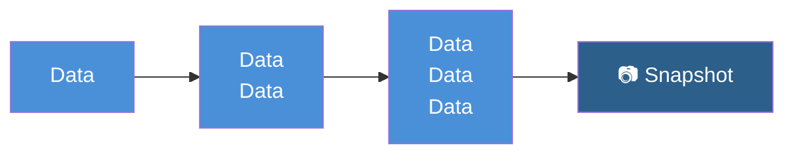
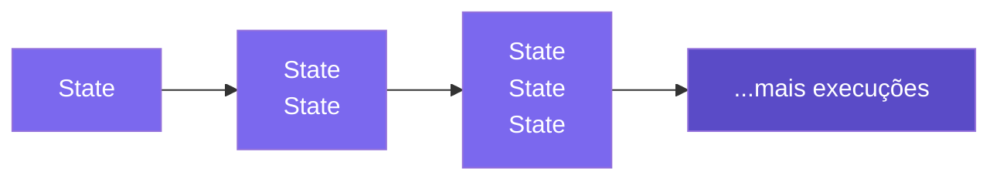
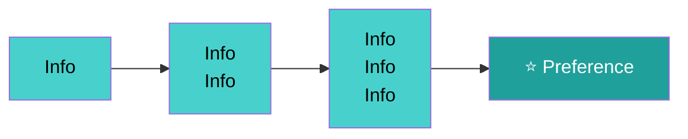

# Short-Term Memory em Agentes

> LLMs são apátridas por natureza — sem contexto explícito, cada prompt começa do zero. A **memória de curto prazo** simula continuidade dentro de uma sessão, mantendo o agente coerente ao longo de múltiplas interações.

## 🧠 Conceito Fundamental

$$\text{Memória} = \text{Contexto Simulado} = \text{Histórico Injetado no Prompt}$$

Agentes não "lembram" de verdade — o sistema **constrói a história** e a injeta em cada novo prompt, criando a ilusão de continuidade.

---

## 🗂️ Taxonomia de Memória em Agentes

| Tipo | Escopo | Persiste? | Identificador |
|---|---|---|---|
| **Estado** (`State`) | Uma execução (`run`) | Não — descartado ao fim do `run` | `run_id` |
| **Memória de Curto Prazo** | Uma sessão (`session`) | Não — descartado ao fim da sessão | `session_id` |
| **Memória de Longo Prazo** | Múltiplas sessões | Sim — armazenado em BD/vector store | `user_id` |

> **Atenção:** A distinção não é apenas temporal — é de **escopo e propósito**. Estado é memória de trabalho da tarefa atual; memória de curto prazo é continuidade da conversa; memória de longo prazo é personalização e aprendizado acumulado.

---

## ⚡ Efêmero vs. Durável

| Dimensão | Efêmero (In-application) | Durável (Persistido) |
|---|---|---|
| **Onde vive** | Memória da aplicação (RAM) | Banco de dados / vector store |
| **Quando expira** | Fim da sessão | Nunca (política de retenção) |
| **Caso de uso** | Continuidade da conversa atual | Personalização entre sessões |
| **Complexidade** | Baixa | Alta |

---

## 📊 Visualizando os Três Níveis

### Estado: Contexto × Transições (`run_id`)



Cada transição acumula mais dados. O **Snapshot** é o estado completo ao final do `run`.

### Memória de Curto Prazo: Contexto × Execuções (`session_id`)



Cada execução dentro da sessão empilha mais estados. O agente "lembra" das execuções anteriores da mesma sessão.

### Memória de Longo Prazo: Contexto × Sessões (`user_id`)



Ao longo de sessões distintas, o sistema extrai **preferências** e fatos relevantes do usuário.

---

## 🔧 Estratégias de Memória de Curto Prazo

| Estratégia | Como funciona | Vantagem | Desvantagem |
|---|---|---|---|
| **Histórico Completo** | Injeta todas as mensagens anteriores no prompt | Preserva todo o contexto | Alto custo de tokens; pode exceder a janela |
| **Janela Deslizante** | Injeta apenas as N mensagens mais recentes | Econômico em tokens | Pode perder contexto antigo relevante |
| **Sumarização** | Comprime mensagens antigas em um resumo | Equilibrado | Exige boa qualidade de sumarização |

---

## 💻 Implementando as Estratégias em Python

### Histórico Completo

```python
from typing import TypedDict

class SessionState(TypedDict):
    session_id: str
    messages: list[dict]

def add_message(state: SessionState, role: str, content: str) -> SessionState:
    """Adiciona mensagem ao histórico completo da sessão."""
    new_message = {"role": role, "content": content}
    return {**state, "messages": state["messages"] + [new_message]}

def build_prompt_full_history(state: SessionState) -> list[dict]:
    """Retorna todo o histórico para injeção no prompt."""
    return state["messages"]
```

### Janela Deslizante

```python
def build_prompt_sliding_window(
    state: SessionState,
    window_size: int = 10
) -> list[dict]:
    """Retorna apenas as últimas N mensagens da sessão."""
    return state["messages"][-window_size:]
```

### Sumarização

```python
def summarize_history(
    messages: list[dict],
    llm_client,
    max_messages: int = 20
) -> list[dict]:
    """
    Quando o histórico excede max_messages, resume as mensagens mais antigas
    e mantém apenas as recentes completas.
    """
    if len(messages) <= max_messages:
        return messages

    older = messages[:-max_messages]
    recent = messages[-max_messages:]

    summary_prompt = [
        {"role": "system", "content": "Resuma a conversa anterior de forma concisa."},
        *older
    ]
    summary = llm_client.complete(summary_prompt)

    return [
        {"role": "assistant", "content": f"[Resumo da conversa anterior]: {summary}"},
        *recent
    ]
```

---

## 🆚 Estado vs. Memória de Sessão

| Aspecto | Estado (`AgentState`) | Memória de Sessão |
|---|---|---|
| **Escopo** | Uma execução (`run`) | Uma sessão (`session`) |
| **Conteúdo** | Variáveis de execução (`tool_calls`, `messages`) | Histórico de múltiplas execuções |
| **Propósito** | Mover o agente entre passos | Manter continuidade da conversa |
| **Identificador** | `run_id` | `session_id` |
| **Exemplo** | Ferramentas pendentes de execução | O que o usuário perguntou há 3 mensagens |

> **Dica:** Você pode usar memória de sessão para **acumular estados** de diferentes execuções, agrupando-os pelo mesmo `session_id`.

---

## ⚠️ Armadilhas Comuns

| Armadilha | Causa | Solução |
|---|---|---|
| **Exceder a janela de contexto** | Histórico cresce sem controle | Usar janela deslizante ou sumarização |
| **Confundir estado com sessão** | Misturar `run_id` e `session_id` | Separar claramente os identificadores |
| **Sumarização de baixa qualidade** | Usar modelo fraco para resumir | Usar o mesmo modelo ou um especializado |
| **Custo inesperado** | Histórico longo = muitos tokens | Monitorar tamanho do contexto em produção |

---

## 📚 Resumo Executivo

$$\text{Short-Term Memory} = \text{Histórico da Sessão Injetado no Prompt}$$

| Ponto-Chave | Significado |
|---|---|
| 🎭 **Memória é simulada** | O agente não lembra — o sistema injeta o histórico |
| 📦 **Três escopos** | Estado (run) → Sessão (session) → Longo prazo (user) |
| 🔧 **Três estratégias** | Histórico completo → Janela deslizante → Sumarização |
| 💰 **Trade-off central** | Mais contexto = mais custo e latência |
| 🔑 **session_id** | Agrupa execuções da mesma sessão para criar memória de curto prazo |

---

## 🧪 Exercícios Práticos

- 📓 [Short-Term Memory — Demo](../exercises/4-short-term-memory-demo.ipynb) — demonstração completa com `ShortTermMemory`, múltiplas sessões e personas (comentarista de futebol, GPS de navegação)
- 📓 [Short-Term Memory — Exercício](../exercises/4-short-term-memory-exercise.ipynb) — implemente seu próprio `ChatBot` com suporte a múltiplas sessões e gerenciamento de ciclo de vida

---

[← Tópico Anterior: Gerenciamento de Estado em Agentes](03-agent-state-management.md) | [Próximo Tópico: Módulo 3 — Índice →](README.md)
