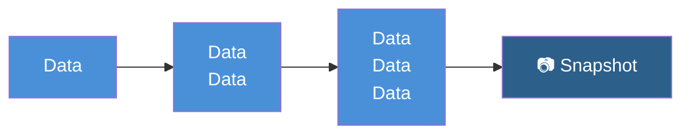
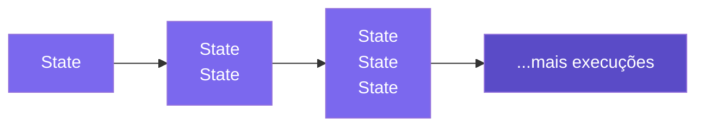
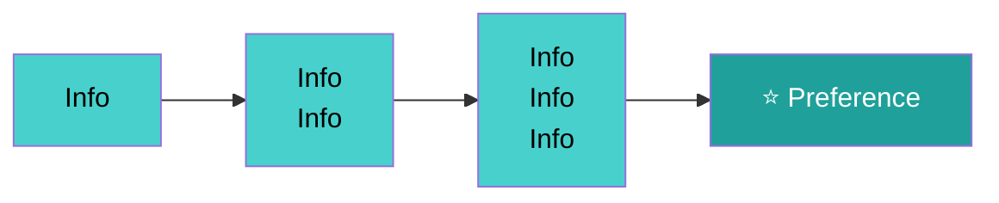

# Short-Term Memory em Agentes

> LLMs são apátridas por natureza — sem contexto explícito, cada prompt começa do zero. A **memória de curto prazo** simula continuidade dentro de uma sessão, mantendo o agente coerente ao longo de múltiplas interações.

## 🧠 Conceito Fundamental

$$\text{Memória} = \text{Contexto Simulado} = \text{Histórico Injetado no Prompt}$$

Agentes não "lembram" de verdade — o sistema **constrói a história** e a injeta em cada novo prompt, criando a ilusão de continuidade.

---

## 🗂️ Taxonomia de Memória em Agentes

| Tipo | Escopo | Persiste? | Identificador |
|---|---|---|---|
| **Estado** (`State`) | Uma execução (`run`) | Não — descartado ao fim do `run` | `run_id` |
| **Memória de Curto Prazo** | Uma sessão (`session`) | Não — descartado ao fim da sessão | `session_id` |
| **Memória de Longo Prazo** | Múltiplas sessões | Sim — armazenado em BD/vector store | `user_id` |

> **Atenção:** A distinção não é apenas temporal — é de **escopo e propósito**. Estado é memória de trabalho da tarefa atual; memória de curto prazo é continuidade da conversa; memória de longo prazo é personalização e aprendizado acumulado.

---

## ⚡ Efêmero vs. Durável

| Dimensão | Efêmero (In-application) | Durável (Persistido) |
|---|---|---|
| **Onde vive** | Memória da aplicação (RAM) | Banco de dados / vector store |
| **Quando expira** | Fim da sessão | Nunca (política de retenção) |
| **Caso de uso** | Continuidade da conversa atual | Personalização entre sessões |
| **Complexidade** | Baixa | Alta |

---

## 📊 Visualizando os Três Níveis

### Estado: Contexto × Transições (`run_id`)



Cada transição acumula mais dados. O **Snapshot** é o estado completo ao final do `run`.

### Memória de Curto Prazo: Contexto × Execuções (`session_id`)



Cada execução dentro da sessão empilha mais estados. O agente "lembra" das execuções anteriores da mesma sessão.

### Memória de Longo Prazo: Contexto × Sessões (`user_id`)



Ao longo de sessões distintas, o sistema extrai **preferências** e fatos relevantes do usuário.

---

## 🔧 Estratégias de Memória de Curto Prazo

| Estratégia | Como funciona | Vantagem | Desvantagem |
|---|---|---|---|
| **Histórico Completo** | Injeta todas as mensagens anteriores no prompt | Preserva todo o contexto | Alto custo de tokens; pode exceder a janela |
| **Janela Deslizante** | Injeta apenas as N mensagens mais recentes | Econômico em tokens | Pode perder contexto antigo relevante |
| **Sumarização** | Comprime mensagens antigas em um resumo | Equilibrado | Exige boa qualidade de sumarização |

---

## 💻 Implementando Memória com `ShortTermMemory`

### Estado estendido com `session_id`

Para suportar memória de sessão, o `AgentState` inclui um campo `session_id` que conecta cada execução à sua sessão na memória:

```python
from typing import TypedDict, List, Optional
from lib.tooling import ToolCall

class AgentState(TypedDict):
    user_query: str
    instructions: str
    messages: List[dict]
    current_tool_calls: Optional[List[ToolCall]]
    comparison: Optional[str]
    session_id: str   # Identificador da sessão — agrupa execuções na memória
```

### API de `ShortTermMemory`

A classe `ShortTermMemory` de `lib.memory` armazena objetos `Run` organizados por `session_id`:

```python
from lib.memory import ShortTermMemory
from lib.state_machine import Run

memory = ShortTermMemory()

# Criar sessão para um usuário
memory.create_session("user_42")

# Adicionar um Run ao final da sessão após cada execução
run_object: Run = workflow.run(initial_state)
memory.add(run_object, session_id="user_42")

# Recuperar o último Run para extrair o histórico de mensagens
last_run: Run = memory.get_last_object("user_42")
if last_run:
    previous_messages = last_run.get_final_state()["messages"]

# Resetar a sessão (apaga o histórico)
memory.reset("user_42")
```

`ShortTermMemory` armazena objetos `Run` — não mensagens diretamente. Chamar `get_final_state()["messages"]` no último `Run` extrai o histórico completo da conversa anterior, que é então injetado como `previous_messages` na próxima execução.

### Padrão `MemoryAgent`

O `MemoryAgent` combina a máquina de estados com `ShortTermMemory` para criar continuidade entre execuções:

```python
class MemoryAgent:
    """Agente com memória de curto prazo por sessão."""

    def __init__(self, instructions: str, tools: list = None):
        self.instructions = instructions
        self.tools = tools or []
        self.memory = ShortTermMemory()
        self.workflow = self._create_state_machine()

    def invoke(self, query: str, session_id: str = "default") -> Run:
        # Criar sessão se ainda não existir
        self.memory.create_session(session_id)

        # Recuperar histórico de mensagens da sessão anterior
        previous_messages = []
        last_run: Run = self.memory.get_last_object(session_id)
        if last_run:
            last_state = last_run.get_final_state()
            if last_state:
                previous_messages = last_state["messages"]

        initial_state: AgentState = {
            "user_query": query,
            "instructions": self.instructions,
            "messages": previous_messages,   # Injeta histórico no prompt
            "current_tool_calls": None,
            "session_id": session_id,
        }

        run_object = self.workflow.run(initial_state)
        self.memory.add(run_object, session_id)   # Persiste o Run na memória
        return run_object
```

O agente não mantém estado interno entre chamadas — reconstrói o contexto a partir da memória a cada `invoke`. O `previous_messages` do último `Run` torna-se o ponto de partida do campo `messages` na próxima execução, implementando a estratégia de **Histórico Completo**.

### As três estratégias em código

```python
# Histórico Completo — todas as mensagens anteriores
last_state = last_run.get_final_state()
previous_messages = last_state["messages"] if last_state else []

# Janela Deslizante — apenas as N mensagens mais recentes
previous_messages = last_state["messages"][-10:] if last_state else []

# Sumarização — ver exercício 4 para implementação completa
```

---

## 🆚 Estado vs. Memória de Sessão

| Aspecto | Estado (`AgentState`) | Memória de Sessão |
|---|---|---|
| **Escopo** | Uma execução (`run`) | Uma sessão (`session`) |
| **Conteúdo** | `user_query`, `instructions`, `messages`, `current_tool_calls` | Histórico de objetos Run por session_id |
| **Propósito** | Mover o agente entre passos | Manter continuidade da conversa |
| **Identificador** | `run_id` | `session_id` |
| **Exemplo** | Ferramentas pendentes no passo atual | O que o usuário perguntou há 3 mensagens |

> **Dica:** Você pode usar memória de sessão para **acumular estados** de diferentes execuções, agrupando-os pelo mesmo `session_id`.

---

## ⚠️ Armadilhas Comuns

| Armadilha | Causa | Solução |
|---|---|---|
| **Exceder a janela de contexto** | Histórico cresce sem controle | Usar janela deslizante ou sumarização |
| **Confundir estado com sessão** | Misturar `run_id` e `session_id` | Separar claramente os identificadores |
| **Sumarização de baixa qualidade** | Usar modelo fraco para resumir | Usar o mesmo modelo ou um especializado |
| **Custo inesperado** | Histórico longo = muitos tokens | Monitorar tamanho do contexto em produção |

---

## 📚 Resumo Executivo

$$\text{Short-Term Memory} = \text{Histórico da Sessão Injetado no Prompt}$$

| Ponto-Chave | Significado |
|---|---|
| 🎭 **Memória é simulada** | O agente não lembra — o sistema injeta o histórico |
| 📦 **Três escopos** | Estado (run) → Sessão (session) → Longo prazo (user) |
| 🔧 **Três estratégias** | Histórico completo → Janela deslizante → Sumarização |
| 💰 **Trade-off central** | Mais contexto = mais custo e latência |
| 🔑 **session_id** | Agrupa execuções da mesma sessão para criar memória de curto prazo |

---

## 🧪 Exercícios Práticos

- 📓 [Short-Term Memory — Demo](../exercises/04-short-term-memory-demo.ipynb) — demonstração completa com `ShortTermMemory`, múltiplas sessões e personas (comentarista de futebol, GPS de navegação)
- 📓 [Short-Term Memory — Exercício](../exercises/04-short-term-memory-exercise.ipynb) — implemente seu próprio `ChatBot` com suporte a múltiplas sessões e gerenciamento de ciclo de vida

---

[← Tópico Anterior: Gerenciamento de Estado em Agentes](03-agent-state-management.md) | [Próximo Tópico: Ferramentas Externas e APIs →](05-external-apis-and-tools.md)
