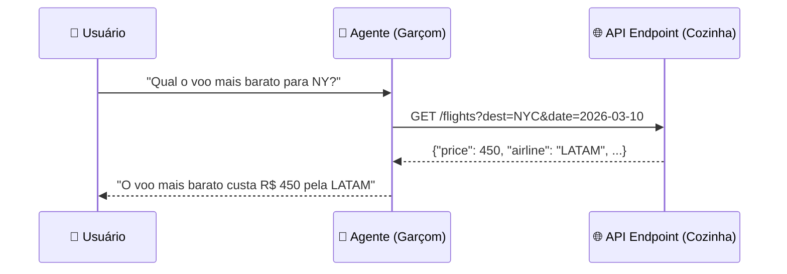
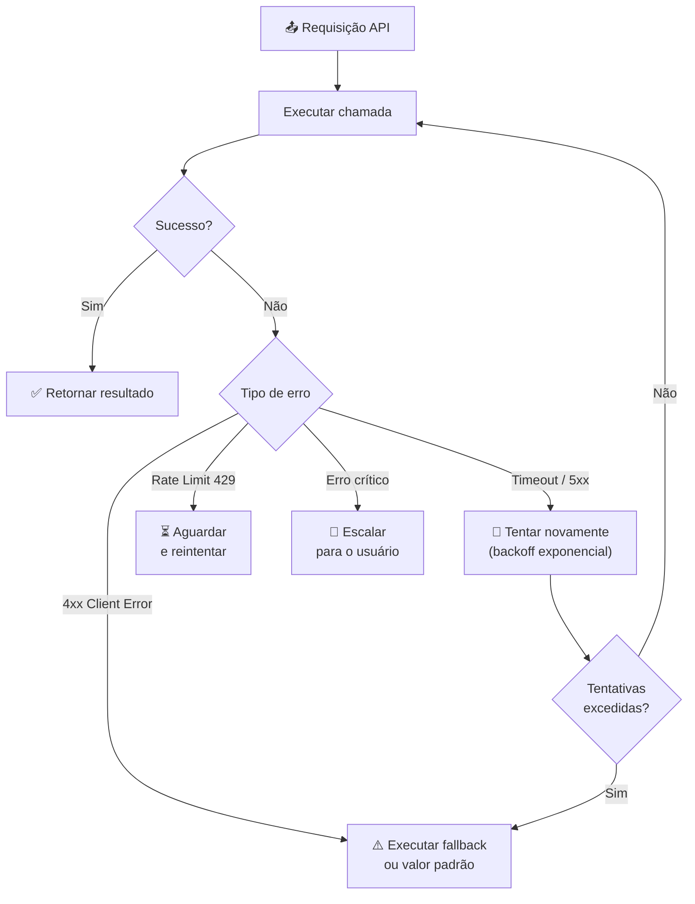
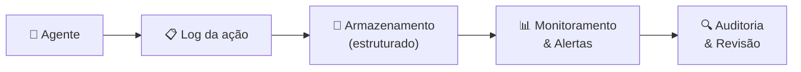
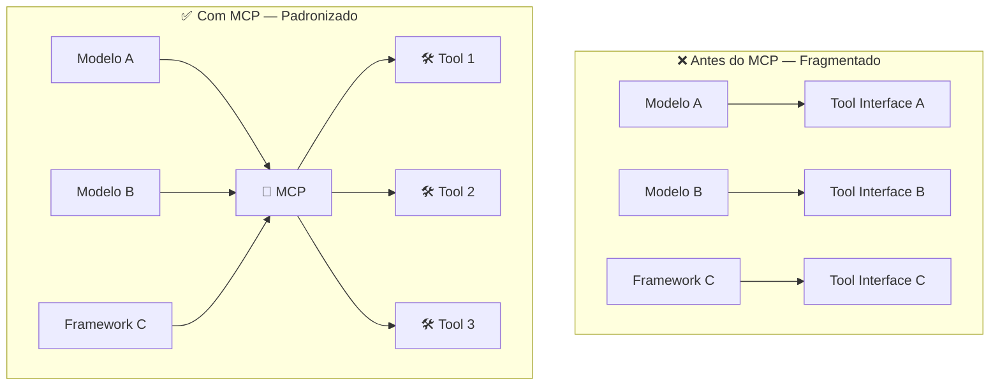

Ferramentas Externas e APIs em Agentes de IA

> Agentes tornam-se verdadeiramente úteis quando param de apenas raciocinar e começam a agir — reservando voos, buscando preços de ações, enviando alertas. Esse salto acontece por meio de APIs externas.

## 🔌 Conceito Fundamental

$$\text{Agente Útil} = \text{Raciocínio LLM} + \text{APIs Externas} + \text{Resiliência}$$

Um LLM isolado responde apenas com conhecimento de treinamento. APIs externas fornecem dados ao vivo e capacidade de ação — transformando o agente de um respondedor passivo em um participante ativo do mundo real.

---

## 🍽️ O que são APIs

**API** (*Application Programming Interface*) é um contrato estruturado para que dois sistemas de software se comuniquem.

### Analogia do Restaurante



O agente **formata** a requisição, envia ao endpoint, e entrega a resposta processada ao usuário.

### Como APIs funcionam na prática

A maioria usa **HTTP/REST**:

| Componente | Descrição | Exemplo |
|---|---|---|
| **Endpoint** | URL de destino | `https://api.weather.io/v1/current` |
| **Método** | Verbo HTTP | `GET`, `POST`, `DELETE` |
| **Parâmetros** | Dados da requisição | `?city=Sao+Paulo` |
| **Headers** | Metadados e auth | `Authorization: Bearer <token>` |
| **Resposta** | Dados retornados | JSON com campos estruturados |

---

## ⏱️ Dados em Tempo Real — Benefícios e Trade-offs

Ao contrário do conhecimento de treinamento, APIs retornam dados **dinâmicos**. O mesmo request pode produzir respostas diferentes dependendo do momento.

$$\text{Dado em Tempo Real} \Rightarrow \text{Variabilidade de Saída} \Rightarrow \text{Não-determinismo}$$

| Dimensão | Benefício | Trade-off |
|---|---|---|
| **Atualidade** | Dados do momento presente | Testes tornam-se instáveis |
| **Personalização** | Responde ao contexto real do usuário | Outputs mudam entre execuções |
| **Automação** | Agente age com base em fatos reais | Monitoramento adicional necessário |
| **Precisão** | Evita alucinação por dados desatualizados | Dependência de disponibilidade externa |

> **Regra de ouro:** Use dados em tempo real quando a atualidade é essencial. Use dados de treinamento quando a consistência é mais importante que a precisão atual.

---

## 🔑 Autenticação — API Key vs OAuth

A maioria das APIs exige credenciais. A escolha entre mecanismos depende do escopo de acesso.

| Dimensão | 🗝️ API Key | 🔐 OAuth 2.0 |
|---|---|---|
| **O que é** | String estática incluída na requisição | Fluxo de autorização com token temporário |
| **Complexidade** | Baixa — apenas inserir no header | Alta — redirecionamento, troca de tokens |
| **Acesso** | Dados do sistema/serviço | Dados específicos do usuário |
| **Escopo** | Global (ou limitado por permissão) | Granular (calendário, e-mail, etc.) |
| **Renovação** | Manual (chave não expira por padrão) | Automática (refresh token) |
| **Casos de uso** | APIs públicas, dados de mercado, clima | Gmail, Google Calendar, Slack por usuário |
| **Exemplo de uso** | `headers = {"X-API-Key": key}` | `Authorization: Bearer <access_token>` |

```python
import httpx
from typing import Optional


def make_authenticated_request(
    url: str,
    api_key: Optional[str] = None,
    bearer_token: Optional[str] = None,
    params: Optional[dict] = None,
) -> dict:
    """
    Executa requisição autenticada com suporte a API Key ou Bearer Token (OAuth).

    Args:
        url: Endpoint de destino.
        api_key: Chave de API estática (API Key auth).
        bearer_token: Token de acesso OAuth.
        params: Parâmetros de query string.

    Returns:
        Resposta da API como dicionário.
    """
    headers: dict[str, str] = {}

    if api_key:
        headers["X-API-Key"] = api_key
    elif bearer_token:
        headers["Authorization"] = f"Bearer {bearer_token}"

    response = httpx.get(url, headers=headers, params=params or {})
    response.raise_for_status()
    return response.json()
```

---

## 🛡️ Tratamento de Falhas — Estratégias e Código Python

APIs falham. Timeouts, rate limits, respostas malformadas — o agente deve **antecipar e lidar** com cada cenário.



### Implementação: Classe Resiliente para Chamadas de API

```python
import time
import logging
from typing import Any, Callable, Optional
from dataclasses import dataclass, field


logger = logging.getLogger(__name__)


@dataclass
class RetryConfig:
    """Configuração de política de retry."""
    max_attempts: int = 3
    base_delay_seconds: float = 1.0
    backoff_multiplier: float = 2.0
    retryable_status_codes: list[int] = field(
        default_factory=lambda: [429, 500, 502, 503, 504]
    )


class APICallError(Exception):
    """Erro lançado quando todas as tentativas de retry falharam."""
    pass


class ResilientAPIClient:
    """
    Cliente genérico para chamadas de API externas com retry,
    fallback e escalação.
    """

    def __init__(self, config: Optional[RetryConfig] = None) -> None:
        self.config = config or RetryConfig()

    def call_with_retry(
        self,
        api_fn: Callable[[], Any],
        fallback_fn: Optional[Callable[[], Any]] = None,
        operation_name: str = "api_call",
    ) -> Any:
        """
        Executa api_fn com retry exponencial.
        Se todas as tentativas falharem, executa fallback_fn (se fornecido).
        Caso contrário, lança APICallError.

        Args:
            api_fn: Função que realiza a chamada de API.
            fallback_fn: Função alternativa chamada em caso de falha total.
            operation_name: Identificador para logs.

        Returns:
            Resultado de api_fn ou fallback_fn.

        Raises:
            APICallError: Quando não há fallback e todas as tentativas falham.
        """
        last_exception: Optional[Exception] = None

        for attempt in range(1, self.config.max_attempts + 1):
            try:
                logger.info(
                    "Tentativa %d/%d: %s",
                    attempt,
                    self.config.max_attempts,
                    operation_name,
                )
                result = api_fn()
                logger.info("Sucesso em %s (tentativa %d)", operation_name, attempt)
                return result

            except Exception as exc:
                last_exception = exc
                logger.warning(
                    "Falha na tentativa %d de %s: %s",
                    attempt,
                    operation_name,
                    exc,
                )

                if attempt < self.config.max_attempts:
                    delay = self.config.base_delay_seconds * (
                        self.config.backoff_multiplier ** (attempt - 1)
                    )
                    logger.info("Aguardando %.1fs antes da próxima tentativa...", delay)
                    time.sleep(delay)

        # Todas as tentativas falharam
        if fallback_fn is not None:
            logger.warning(
                "Todas as tentativas de %s falharam. Executando fallback.",
                operation_name,
            )
            return fallback_fn()

        raise APICallError(
            f"Operação '{operation_name}' falhou após {self.config.max_attempts} tentativas."
        ) from last_exception
```

### Padrões de Uso

| Estratégia | Quando aplicar | Comportamento |
|---|---|---|
| **Retry com backoff** | Erros temporários (5xx, timeout) | Espera crescente entre tentativas |
| **Fallback** | Serviço degradado ou indisponível | Retorna dado padrão ou cache |
| **Escalação** | Erro crítico sem alternativa | Notifica usuário ou sistema de alerta |
| **Circuit Breaker** | Alta taxa de falhas sustentada | Para de chamar a API por um período |

---

## 🔭 Observabilidade e Segurança

Quando o agente interage com sistemas reais, cada ação tem consequências. Observabilidade não é opcional.



### Checklist de Observabilidade e Segurança

| Categoria | Prática | Por quê |
|---|---|---|
| **Logging** | Registrar endpoint, método, status e latência | Rastreabilidade e debugging |
| **Controle de acesso** | Limitar escopos ao mínimo necessário | Reduzir superfície de ataque |
| **Secrets** | Armazenar credenciais em variáveis de ambiente | Evitar vazamento em código/logs |
| **Validação de resposta** | Verificar schema antes de processar | Evitar execuções com dados corrompidos |
| **Rate limiting** | Respeitar limites e usar backoff | Evitar bloqueio e custos inesperados |
| **Idempotência** | Verificar antes de criar/deletar | Evitar ações duplicadas irreversíveis |

```python
import os
import logging
import time
from contextlib import contextmanager
from typing import Generator


logger = logging.getLogger(__name__)


@contextmanager
def observe_api_call(operation: str, endpoint: str) -> Generator[None, None, None]:
    """
    Context manager para observabilidade de chamadas de API.
    Registra início, fim, latência e status da operação.
    """
    start_time = time.monotonic()
    logger.info("START | op=%s | endpoint=%s", operation, endpoint)

    try:
        yield
        elapsed = time.monotonic() - start_time
        logger.info(
            "SUCCESS | op=%s | endpoint=%s | latency_ms=%.1f",
            operation,
            endpoint,
            elapsed * 1000,
        )
    except Exception as exc:
        elapsed = time.monotonic() - start_time
        logger.error(
            "FAILURE | op=%s | endpoint=%s | latency_ms=%.1f | error=%s",
            operation,
            endpoint,
            elapsed * 1000,
            exc,
        )
        raise


# Uso:
# with observe_api_call("fetch_weather", "https://api.weather.io/v1/current"):
#     result = client.get_weather(city="São Paulo")
```

---

## 🔌 Model Context Protocol (MCP)

MCP é o padrão emergente que padroniza como agentes de IA invocam ferramentas externas — independentemente do modelo ou framework.

$$\text{MCP} = \text{USB-C para Agentes de IA}$$

### Motivação

Antes do MCP, cada modelo e framework definia sua própria interface de ferramentas. Isso criava ecossistemas fragmentados: integrar um agente com um novo provedor exigia reescrever toda a camada de ferramentas.



### Componentes do MCP

| Componente | Responsabilidade |
|---|---|
| **Tool Definition** | Schema padronizado para declarar ferramentas disponíveis |
| **Tool Call** | Formato padrão para o modelo expressar intenção de usar uma ferramenta |
| **Tool Result** | Formato padrão para retornar resultados ao modelo |
| **Transport Layer** | Canal de comunicação entre modelo e executor de ferramentas |

### Transporte: SSE → Streamable HTTP

| Aspecto | SSE (depreciado) | Streamable HTTP (atual) |
|---|---|---|
| **Especificação** | Versões anteriores a março/2025 | Especificação de março/2025+ |
| **Flexibilidade** | Limitada (unidirecional) | Alta (bidirecional, multimodal) |
| **Adoção** | Legado | Recomendado para novas implementações |
| **Conteúdo** | Texto | Texto, imagens, binários |

### Por que MCP importa para você

| Benefício | Significado Prático |
|---|---|
| **Interoperabilidade** | Um servidor MCP funciona com qualquer modelo compatível |
| **Composabilidade** | Ferramentas combinam-se em pipelines sem glue code |
| **Monitorabilidade** | Ponto único de observabilidade para todas as chamadas |
| **Governança** | Controle centralizado de o que o agente pode fazer |

> **Quem desenvolveu:** Proposto e mantido pela Anthropic como padrão aberto. Já suportado pelos modelos Claude e adotado por frameworks como LangChain e LangGraph.

### Exemplo conceitual de servidor MCP

```python
from typing import Any


def define_tool_schema(
    name: str,
    description: str,
    parameters: dict[str, Any],
) -> dict[str, Any]:
    """
    Define o schema de uma ferramenta no formato compatível com MCP.

    Args:
        name: Identificador único da ferramenta.
        description: Descrição clara do que a ferramenta faz.
        parameters: Schema JSON dos parâmetros aceitos.

    Returns:
        Schema da ferramenta pronto para registro no servidor MCP.
    """
    return {
        "name": name,
        "description": description,
        "inputSchema": {
            "type": "object",
            "properties": parameters,
            "required": list(parameters.keys()),
        },
    }


def handle_tool_call(
    tool_name: str,
    arguments: dict[str, Any],
    tool_registry: dict[str, Any],
) -> dict[str, Any]:
    """
    Roteia uma chamada de ferramenta para o executor correto.

    Args:
        tool_name: Nome da ferramenta a executar.
        arguments: Argumentos fornecidos pelo modelo.
        tool_registry: Mapeamento nome → função executora.

    Returns:
        Resultado da execução no formato MCP.
    """
    if tool_name not in tool_registry:
        return {"error": f"Ferramenta '{tool_name}' não encontrada."}

    executor = tool_registry[tool_name]
    result = executor(**arguments)

    return {"content": [{"type": "text", "text": str(result)}]}
```

---

## 📚 Resumo Executivo

$$\text{Agente Real} = \text{Raciocínio} + \text{APIs} + \text{Resiliência} + \text{Observabilidade}$$

| Ponto-Chave | Significado |
|---|---|
| 🌐 **APIs são a ponte** | Conectam o raciocínio do agente ao mundo real |
| ⏱️ **Tempo real = variabilidade** | Outputs mudam — projete para isso |
| 🗝️ **API Key para sistemas** | OAuth para dados de usuários específicos |
| 🔁 **Retry com backoff** | Estratégia padrão para erros temporários |
| ⚠️ **Fallback é obrigatório** | Agentes resilientes não travam — degradam graciosamente |
| 🔭 **Logue tudo** | Ações no mundo real exigem rastreabilidade |
| 🔐 **Mínimo de privilégio** | O agente só acessa o que precisa |
| 🔌 **MCP padroniza** | Ferramentas interoperáveis entre modelos e frameworks |

---

[← Tópico Anterior: Short-Term Memory em Agentes](04-short-term-memory.md) | [Próximo Tópico: Agentes de Busca na Web →](06-web-search-agents.md)
