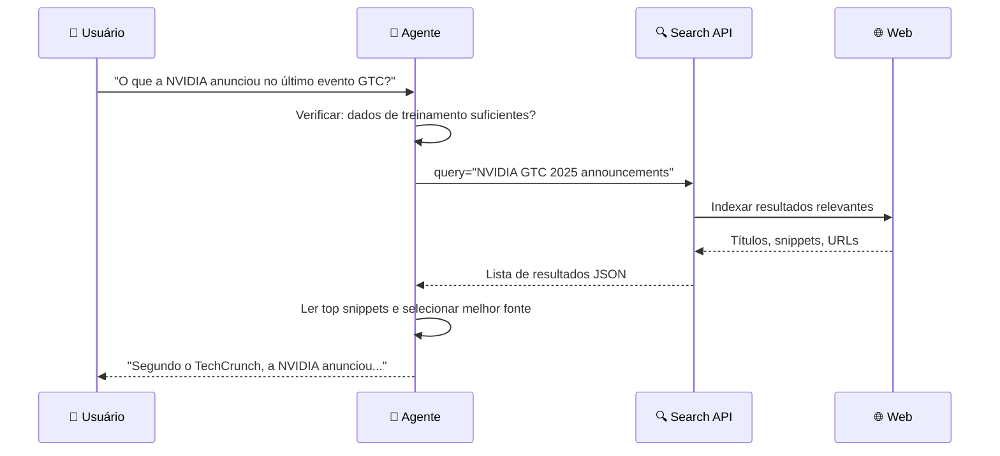
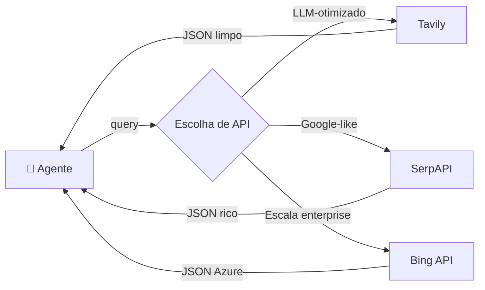
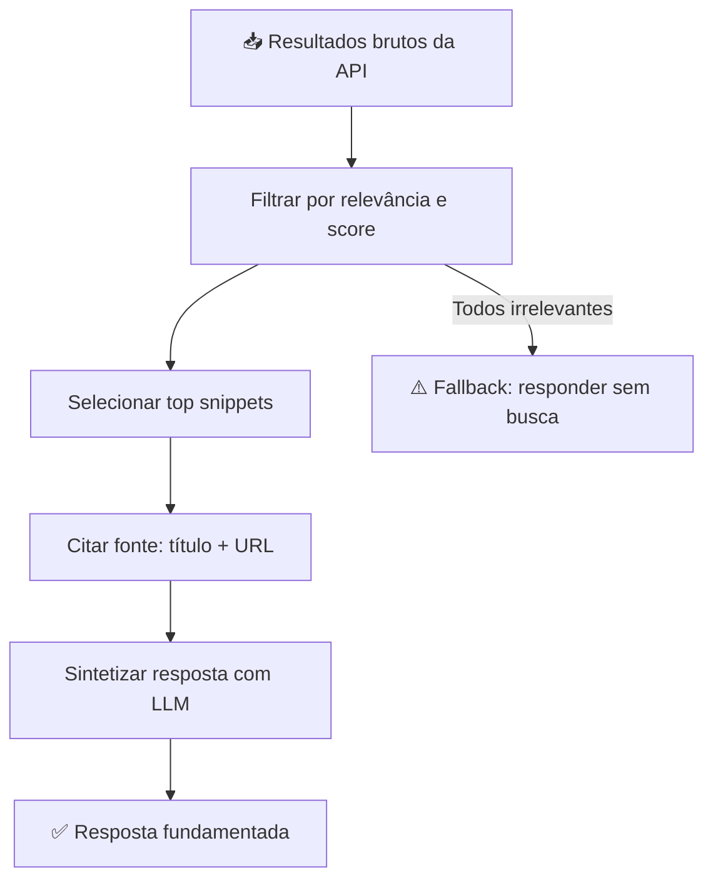
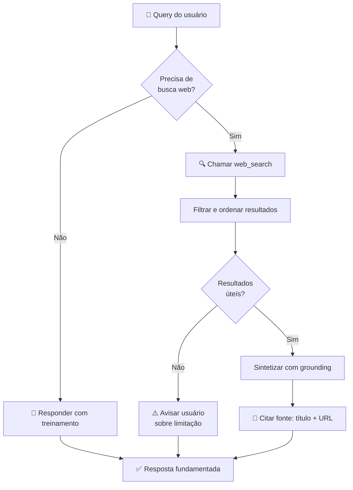

# Agentes de Busca na Web

> Nem tudo que o agente precisa saber vive em uma API estruturada. Rumores de lançamento, artigos recentes, discussões em fóruns — esse conteúdo existe na web, bagunçado, não estruturado e em constante mudança. Agentes de busca na web navegam esse território e transformam resultados brutos em respostas confiáveis.

## 🔍 Conceito Fundamental

$$\text{Agente Pesquisador} = \text{Raciocínio LLM} + \text{Busca Web} + \text{Grounding}$$

LLMs isolados respondem com conhecimento de treinamento — potencialmente desatualizado. A busca web fornece **informação em tempo real**, permitindo que o agente responda a perguntas que nenhuma API estruturada cobre.

---

## 🆚 Busca Web vs. Navegação Web

É fundamental distinguir os dois conceitos antes de implementar:

| Dimensão | 🔍 Busca Web (*Web Search*) | 🖱️ Navegação Web (*Web Browsing*) |
|---|---|---|
| **O que faz** | Envia query a uma API de busca e recebe lista de resultados | Visita URLs, clica em botões, extrai dados de páginas |
| **Complexidade** | Baixa — uma chamada HTTP, resposta JSON | Alta — renderização, JavaScript, interação dinâmica |
| **Conteúdo retornado** | Título, snippet, URL, metadados | Conteúdo completo da página |
| **Velocidade** | Rápida e confiável | Lenta e frágil |
| **Caso de uso** | Visão geral e alta relevância | Extração profunda de dados específicos |
| **Escopo deste módulo** | ✅ Coberto | ❌ Fora do escopo |

> **Regra prática:** Use busca web quando precisar de informação de alto nível e atual. Use navegação quando precisar do conteúdo completo de uma página específica.

---

## 🌐 Por que usar Busca Web?



Sem busca web, o agente recorre ao treinamento — que pode estar desatualizado por meses ou anos. Com ela, o agente **pesquisa como um humano**: abre um buscador, lê os primeiros resultados e sintetiza a resposta.

---

## 🎯 Grounding — Ancorar Respostas em Evidências

**Grounding** é o processo de vincular as saídas do modelo a fontes verificáveis e externas.

$$\text{Resposta sem Grounding} = \text{Raciocínio} \pm \text{Alucinação}$$

$$\text{Resposta com Grounding} = \text{Evidência Verificável} + \text{Síntese LLM}$$

| Dimensão | ❌ Sem Grounding | ✅ Com Grounding |
|---|---|---|
| **Fonte** | Dados de treinamento (estáticos) | Conteúdo ao vivo da web |
| **Confiança** | Alta — mas pode estar errado | Verificável — pode checar a fonte |
| **Alucinação** | Comum, especialmente em eventos recentes | Reduzida — ancorada em evidência |
| **Rastreabilidade** | Nenhuma | URL da fonte citada |
| **Atualidade** | Limitada ao cutoff do modelo | Tempo real |

> **Exemplo de resposta com grounding:**
> *"Segundo o TechCrunch (techcrunch.com/2025/03/18/nvidia-gtc), a NVIDIA anunciou o superchip Blackwell Ultra com 1,4 exaflops de desempenho em IA."*

---

## 🛠️ APIs de Busca — Comparativo

Várias APIs permitem integrar busca web em agentes. Todas entregam resultados em JSON, mas diferem em foco e complexidade.

| API | 🌍 Foco | 🤖 LLM-Friendly | 💰 Modelo | 📦 Extras |
|---|---|---|---|---|
| **SerpAPI** | Emula Google Search | Moderado | Pago por query | Imagens, mapas, compras, notícias |
| **Tavily** | LLM-otimizado | Alto — respostas limpas | Freemium | Score de relevância por resultado |
| **Bing Search API** | Escala Microsoft | Moderado | Pago (Azure) | Notícias, imagens, vídeos, entidades |



---

## ⚙️ Integração: Ferramenta de Busca Genérica

```python
import os
import httpx
from typing import Any


def web_search(
    query: str,
    num_results: int = 5,
    api_key: str | None = None,
) -> list[dict[str, Any]]:
    """
    Realiza busca web via Tavily e retorna lista de resultados estruturados.

    Args:
        query: Pergunta ou termo de busca.
        num_results: Número máximo de resultados a retornar.
        api_key: Chave da API Tavily. Se None, usa TAVILY_API_KEY do ambiente.

    Returns:
        Lista de dicionários com title, url, content e score.

    Raises:
        httpx.HTTPStatusError: Se a chamada à API falhar.
    """
    key = api_key or os.getenv("TAVILY_API_KEY", "")
    endpoint = "https://api.tavily.com/search"

    payload = {
        "api_key": key,
        "query": query,
        "max_results": num_results,
        "search_depth": "basic",
    }

    response = httpx.post(endpoint, json=payload, timeout=10.0)
    response.raise_for_status()

    results = response.json().get("results", [])
    return [
        {
            "title": r.get("title", ""),
            "url": r.get("url", ""),
            "content": r.get("content", ""),
            "score": r.get("score", 0.0),
        }
        for r in results
    ]
```

---

## 🧠 Interpretando Resultados — Pipeline do Agente

Receber os resultados é apenas o primeiro passo. O agente precisa processá-los:



### Estratégias de seleção de resultados

| Estratégia | Quando usar | Como |
|---|---|---|
| **Top-N por score** | API retorna score de relevância (ex: Tavily) | Ordenar por `score` desc, pegar os N primeiros |
| **Filtro por data** | Pergunta sensível ao tempo | Descartar resultados sem data ou com data antiga |
| **Votação por snippet** | Múltiplas perspectivas | Verificar se snippets concordam antes de sintetizar |
| **Fallback estático** | Busca sem resultados úteis | Responder com conhecimento do modelo + aviso |

---

## 🎨 Engenharia de Prompt para Grounding

O prompt do agente define como ele usa os resultados. Um bom prompt instrui:

```python
SYSTEM_PROMPT = """Você é um assistente de pesquisa. Quando usar a ferramenta de busca web:

1. Use apenas informações presentes nos resultados retornados.
2. Sempre cite a fonte: mencione o título e a URL.
3. Se os resultados forem insuficientes ou desatualizados, informe o usuário.
4. Prefira fontes recentes. Desconfie de artigos sem data clara.
5. Nunca invente informações que não estejam nos snippets.
"""
```

### Comparativo: Prompt sem vs. com instrução de grounding

| Aspecto | ❌ Sem instrução | ✅ Com instrução |
|---|---|---|
| **Uso da fonte** | Pode ignorar URLs | Cita explicitamente |
| **Confiança** | Alta mesmo sem evidência | Calibrada ao que encontrou |
| **Resposta a gaps** | Inventa | Avisa o usuário |
| **Rastreabilidade** | Nenhuma | URL + título na resposta |

---

## ⚠️ Armadilhas e Ruído — Desafios da Web

A web não é um dataset curado. A busca introduz **ruído** no raciocínio do agente.

| Problema | Exemplo | Mitigação |
|---|---|---|
| **Clickbait** | Título exagerado que não condiz com o conteúdo | Ler snippet, não só o título |
| **Desinformação** | Notícia falsa ou satírica bem ranqueada | Corroborar com múltiplas fontes |
| **Desatualização** | Artigo antigo aparece no topo | Filtrar por data; preferir fontes recentes |
| **Ambiguidade** | Query vaga retorna resultados irrelevantes | Refinar query com contexto da conversa |
| **Ausência de resultados** | Evento muito recente ainda não indexado | Fallback explícito para o usuário |

> **Princípio do builder:** Você é responsável por definir quais fontes confiar, quantos resultados considerar e quando ignorar a busca em favor de uma resposta estática.

---

## 🔄 Fluxo Completo — Agente com Web Search



---

## 📚 Resumo Executivo

$$\text{Agente Pesquisador} = \text{LLM} + \text{Search API} + \text{Grounding} + \text{Filtros de Qualidade}$$

| Ponto-Chave | Significado |
|---|---|
| 🔍 **Busca ≠ Navegação** | Busca retorna lista JSON; navegação visita páginas — escopo diferente |
| 🎯 **Grounding reduz alucinação** | Ancorar respostas em fontes reais aumenta confiabilidade |
| 🛠️ **Tavily, SerpAPI, Bing** | Cada API tem foco e trade-offs diferentes |
| 🧠 **Prompt determina como** | Instruções de citação e cautela moldam o comportamento de grounding |
| ⚠️ **Web tem ruído** | Clickbait, desinformação e dados desatualizados exigem filtros |
| 🔄 **Fallback é essencial** | Quando resultados são ruins, o agente deve avisar, não inventar |

---

## 🧪 Exercícios Práticos

> Não há exercício dedicado exclusivamente a web search neste módulo ainda. O exercício de APIs externas (`05`) cobre a mecânica de integração com serviços web (PokeAPI, OpenWeatherMap) — base para implementar web search.

- 📓 [External APIs Exercise](../exercises/05-external-apis-exercise.ipynb) — construção de agente com ferramentas que acessam APIs HTTP externas; base técnica para web search
- 📓 [External APIs Demo](../exercises/05-external-apis-demo.ipynb) — demonstração guiada de integração com APIs externas

---

[← Tópico Anterior: Ferramentas Externas e APIs](05-external-apis-and-tools.md) | [Próximo Tópico: Interagindo com Bancos de Dados →](07-interacting-with-databases.md)
