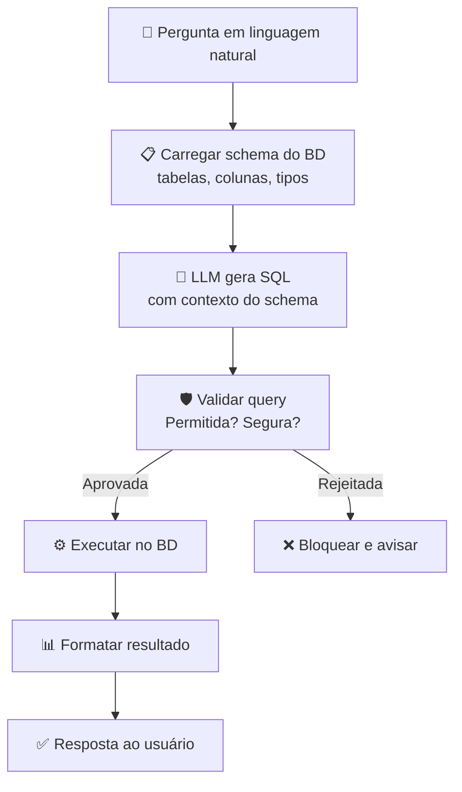
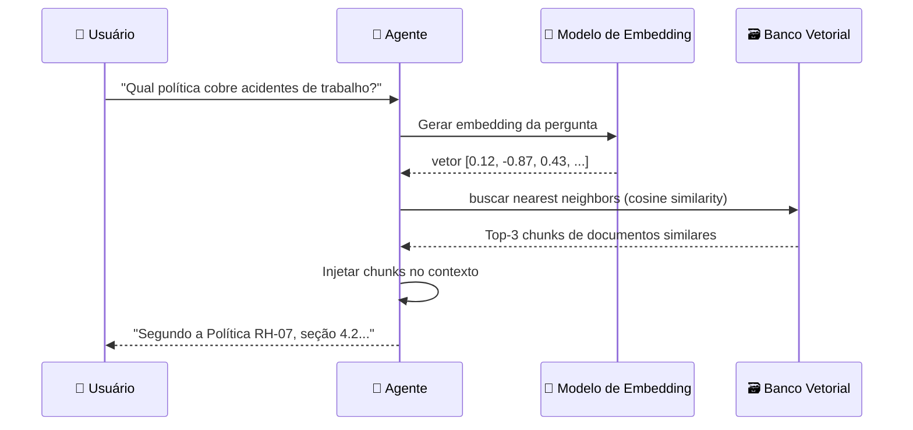
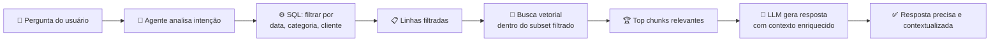

# Interagindo com Bancos de Dados

> Nem toda resposta vive em fontes públicas. As informações mais valiosas estão protegidas por login, dentro de sistemas internos ou nas tabelas de bancos de dados da sua empresa. Agentes que lêem e escrevem em dados estruturados deixam de ser assistentes de texto e passam a ser executores de trabalho real.

## 🔍 Conceito Fundamental

$$\text{Agente com BD} = \text{Raciocínio LLM} + \text{Query Estruturada} + \text{Guardrails de Segurança}$$

LLMs isolados operam sobre conhecimento de treinamento. Conectados a bancos de dados, operam sobre **dados reais da organização** — tickets, clientes, transações, inventário — com capacidade de leitura *e* escrita.

---

## 🗄️ Tipos de Bancos de Dados

| Tipo | Exemplos | Modelo de Dados | Melhor Caso de Uso |
|---|---|---|---|
| **Relacional** | PostgreSQL, MySQL, SQLite | Tabelas com schema rígido | Registros de clientes, transações, tickets |
| **NoSQL** | MongoDB, DynamoDB | Documentos flexíveis (JSON) | Dados heterogêneos, alta escala horizontal |
| **Vetorial** | Chroma, Pinecone, Weaviate | Embeddings (vetores n-dim) | Busca semântica, RAG, similaridade de conteúdo |
| **Grafo** | Neo4j | Nós e arestas | Conhecimento relacional, grafos de entidades |

> **Foco deste tópico:** bancos relacionais e vetoriais — os mais comuns em pipelines de agentes.

---

## 🗣️ text2SQL — Linguagem Natural → Query

**text2SQL** é a prática de converter perguntas em linguagem natural em queries SQL válidas. Não é uma biblioteca única, mas um conjunto de técnicas.

$$\text{text2SQL} : \text{Linguagem Natural} \xrightarrow{\text{LLM + Schema}} \text{SQL válido}$$

### Exemplo completo

**Input (usuário):**
```
Quantos usuários se cadastraram nesta semana?
```

**Output (agente gera e executa):**
```sql
SELECT COUNT(*)
FROM users
WHERE signup_date >= CURRENT_DATE - INTERVAL '7 days';
```

**Retorno ao usuário:**
```
Foram 342 novos cadastros nos últimos 7 dias.
```

### O que o agente precisa saber



### Implementação genérica

```python
import sqlite3
from typing import Any


def text_to_sql_query(
    natural_language: str,
    schema_description: str,
    llm_call: callable,
) -> str:
    """
    Traduz linguagem natural em SQL usando um LLM com contexto de schema.

    Args:
        natural_language: Pergunta do usuário.
        schema_description: Descrição do schema (tabelas, colunas, tipos).
        llm_call: Função que aceita prompt e retorna string.

    Returns:
        Query SQL gerada pelo LLM.
    """
    prompt = f"""
    Você é um especialista em SQL. Dado o schema abaixo, gere uma query SQL segura.
    Responda APENAS com a query SQL, sem explicações.

    Schema:
    {schema_description}

    Pergunta: {natural_language}

    Regras:
    - Use apenas SELECT (nunca DELETE, DROP, UPDATE sem aprovação explícita).
    - Sempre use parâmetros ou LIMIT para evitar resultados excessivos.
    - Se a pergunta não puder ser respondida com o schema, retorne: SQL_IMPOSSIVEL
    """
    return llm_call(prompt).strip()


def execute_safe_query(
    connection: sqlite3.Connection,
    query: str,
    allowed_prefix: str = "SELECT",
) -> list[dict[str, Any]]:
    """
    Executa query apenas se iniciar com o prefixo permitido.

    Args:
        connection: Conexão com o banco de dados.
        query: Query SQL a executar.
        allowed_prefix: Tipo de operação permitida (default: SELECT).

    Returns:
        Lista de dicionários com os resultados.

    Raises:
        PermissionError: Se a query não iniciar com o prefixo permitido.
    """
    normalized = query.strip().upper()
    if not normalized.startswith(allowed_prefix.upper()):
        raise PermissionError(
            f"Query bloqueada: apenas '{allowed_prefix}' é permitido. "
            f"Query recebida: {query[:60]}..."
        )

    cursor = connection.cursor()
    cursor.execute(query)
    columns = [desc[0] for desc in cursor.description or []]
    return [dict(zip(columns, row)) for row in cursor.fetchall()]
```

---

## ⚠️ Guardrails — Segurança em Consultas de Agentes

Agentes com acesso a bancos de dados precisam de barreiras de proteção. Sem elas, um agente pode apagar dados de clientes por engano — com consequências jurídicas e operacionais graves.

| Risco | Exemplo Concreto | Mitigação |
|---|---|---|
| **Deleção acidental** | Agente deleta todos os registros de `John Doe` sem aprovação | Bloquear `DELETE`/`DROP` sem confirmação humana |
| **Injeção SQL** | Input malicioso altera a query gerada | Usar queries parametrizadas, nunca interpolação direta |
| **Exposição de dados sensíveis** | Query retorna senhas, CPFs, cartões | Limitar colunas acessíveis por role/permissão |
| **Sobrecarga do banco** | Query sem `LIMIT` varre milhões de linhas | Impor `LIMIT` máximo e timeout |
| **Escalação de privilégio** | Agente usa credenciais de admin | Conexão com usuário de menor privilégio possível |

> **Princípio do Mínimo Privilégio:** o usuário de banco conectado ao agente deve ter apenas as permissões que a tarefa exige — nunca mais.

---

## 🔢 Bancos Vetoriais — Busca Semântica

Algumas perguntas não têm resposta exata em tabelas relacionais. Para encontrar documentos *similares em significado* a uma pergunta, usa-se busca vetorial.

$$\text{Busca Semântica} = \text{Embedding(query)} \xrightarrow{\cos\theta} \text{Embedding(doc mais próximo)}$$



### Métricas de similaridade

| Métrica | Fórmula | Quando Usar |
|---|---|---|
| **Cosine Similarity** | $\cos\theta = \frac{A \cdot B}{\|A\|\|B\|}$ | Textos de comprimento variável (mais comum) |
| **Distância Euclidiana** | $d = \sqrt{\sum(A_i - B_i)^2}$ | Vetores normalizados de tamanho fixo |
| **Dot Product** | $A \cdot B = \sum A_i B_i$ | Quando magnitude importa (relevância bruta) |

---

## 🔄 RAG — Padrão, não Ferramenta

**RAG (Retrieval-Augmented Generation)** é um padrão arquitetural. A recuperação pode usar vetores, SQL, busca por palavras-chave ou qualquer combinação.

$$\text{RAG} = \text{Recuperação de Contexto} + \text{Geração Aumentada}$$

| Tipo de Recuperação | Ferramenta | Quando Usar |
|---|---|---|
| **Semântica** | Banco vetorial (Chroma, Pinecone) | Perguntas abertas, similaridade de significado |
| **Estruturada** | SQL (PostgreSQL, SQLite) | Filtros exatos, contagens, datas |
| **Léxica** | BM25, ElasticSearch | Palavras-chave exatas, documentos técnicos |
| **Híbrida** | SQL + Vetor | Filtragem por metadados + ranqueamento semântico |

> **Mito comum:** "RAG exige banco vetorial." — **Falso.** RAG é o padrão; o banco vetorial é apenas uma das formas de recuperar contexto.

---

## 🔀 Abordagem Híbrida — O Melhor dos Dois Mundos

Agentes poderosos combinam bancos relacionais e vetoriais na mesma pipeline:



**Exemplo prático:**

1. **SQL filtra:** `SELECT * FROM support_tickets WHERE status='open' AND created_at > '2025-01-01'`
2. **Vetor ranqueia:** dentro dos tickets abertos, encontra os mais similares semânticamente à pergunta do usuário
3. **LLM sintetiza:** gera resposta com base nos tickets mais relevantes

---

## 📌 Leitura e Escrita — Agentes que Agem

Agentes que apenas lêem dados são úteis. Agentes que também escrevem são **transformadores**:

```python
def update_ticket_status(
    connection: sqlite3.Connection,
    ticket_id: int,
    new_status: str,
    resolved_by: str,
    require_approval: bool = True,
) -> dict[str, Any]:
    """
    Atualiza o status de um ticket de suporte após aprovação.

    Args:
        connection: Conexão com o banco.
        ticket_id: ID do ticket a atualizar.
        new_status: Novo status (ex: 'resolved', 'in_progress').
        resolved_by: Identificador do agente/usuário que resolveu.
        require_approval: Se True, retorna payload de aprovação sem executar.

    Returns:
        Dicionário com resultado da operação ou payload para aprovação.
    """
    payload = {
        "ticket_id": ticket_id,
        "new_status": new_status,
        "resolved_by": resolved_by,
    }

    if require_approval:
        return {"pending_approval": True, "payload": payload}

    cursor = connection.cursor()
    cursor.execute(
        """
        UPDATE tickets
        SET status = ?, resolved_by = ?, updated_at = CURRENT_TIMESTAMP
        WHERE id = ?
        """,
        (new_status, resolved_by, ticket_id),
    )
    connection.commit()
    return {"updated": True, "rows_affected": cursor.rowcount}
```

> **Padrão recomendado:** operações de escrita devem ter `require_approval=True` por padrão. O agente propõe; o humano aprova.

---

## 📚 Resumo Executivo

$$\text{Agente com BD} = \text{text2SQL} + \text{Busca Vetorial} + \text{Guardrails} + \text{Aprovação Humana}$$

| Ponto-Chave | Significado |
|---|---|
| 🗄️ **Relacional vs. Vetorial** | SQL para filtros exatos; vetores para similaridade semântica |
| 🗣️ **text2SQL** | LLM traduz linguagem natural em SQL usando schema como contexto |
| 🛡️ **Guardrails são obrigatórios** | Bloquear `DELETE`/`DROP`, usar mínimo privilégio, validar antes de executar |
| 🔢 **RAG é um padrão** | A recuperação pode ser vetorial, SQL, léxica ou híbrida |
| 🔀 **Híbrido é mais poderoso** | SQL filtra; vetor ranqueia — juntos entregam precisão e relevância |
| ✍️ **Escrita com aprovação** | Agentes que escrevem devem ter humano no loop para operações destrutivas |

---

[← Tópico Anterior: Agentes de Busca na Web](06-web-search-agents.md) | [Próximo Tópico: Agentic RAG — De Busca Passiva a Raciocínio Ativo →](08-agentic-rag.md)
