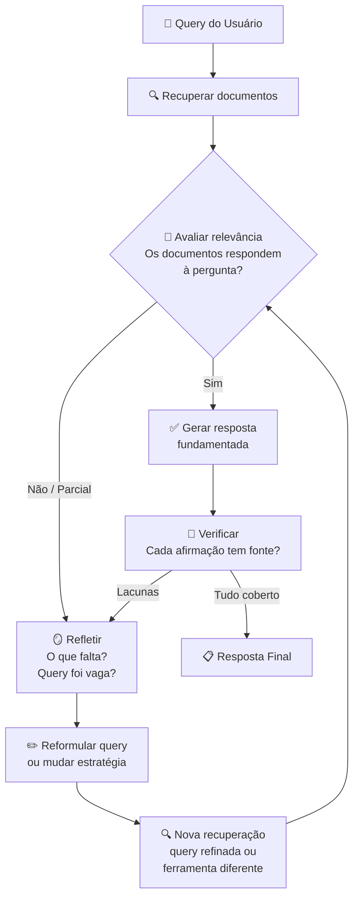
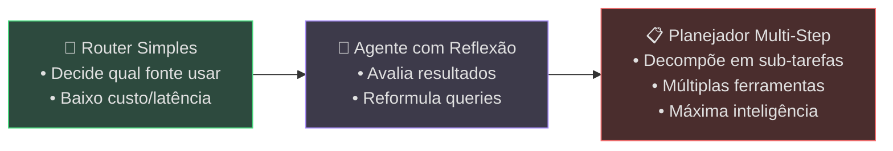

# Agentic RAG — De Busca Passiva a Raciocínio Ativo

> A maioria dos pipelines de RAG é passiva: recebe uma pergunta, recupera documentos e entrega tudo ao LLM para resumir. Agentic RAG inverte essa lógica — o agente raciocina sobre o que recuperou, tenta novamente se necessário e reflete antes de responder.

## 🔍 Conceito Fundamental

$$\text{Agentic RAG} = \text{Recuperação} + \text{Reflexão} + \text{Reformulação} + \text{Re-tentativa}$$

No RAG básico, a recuperação é uma etapa única e opaca: query → chunks → resposta. Não há feedback, não há avaliação da qualidade dos documentos, não há consciência de lacunas. O Agentic RAG transforma essa etapa em um **loop de raciocínio**, onde o agente decide *quando*, *o que* e *como* recuperar — e verifica se o resultado é suficiente antes de responder.

---

## 📊 RAG Básico vs. Agentic RAG

| Dimensão | 🔵 RAG Básico | 🟢 Agentic RAG |
|---|---|---|
| **Recuperação** | Uma vez, sem avaliação | Iterativa, com inspeção de resultados |
| **Qualidade do contexto** | Aceita o que vier | Avalia relevância, identifica lacunas |
| **Reformulação** | Não existe | Agente reescreve queries se necessário |
| **Feedback loop** | Ausente | Retrieve → Reflect → Retry |
| **Ferramentas** | Apenas vector store | Vector store, web search, SQL, APIs |
| **Resultado** | Resumo superficial | Explicação estruturada e fundamentada |

---

## 🔄 Arquitetura — O Loop Retrieve-Reflect-Retry

O diferencial do Agentic RAG é um loop de controle onde o agente inspeciona, avalia e decide se precisa de mais informação antes de gerar a resposta final.



### O que cada etapa faz

| Etapa | Ação do Agente | Pergunta-Guia |
|---|---|---|
| 🔍 **Recuperar** | Busca documentos no vector store ou outra fonte | "Quais documentos podem responder a esta pergunta?" |
| 🧠 **Avaliar** | Inspeciona se os chunks contêm entidades e conceitos relevantes | "Estes documentos realmente respondem à pergunta?" |
| 🪞 **Refletir** | Identifica lacunas, contradições ou informação superficial | "O que está faltando para uma resposta completa?" |
| ✏️ **Reformular** | Reescreve a query com termos mais específicos ou sub-perguntas | "Como posso buscar a informação que falta?" |
| ✅ **Gerar** | Produz a resposta usando apenas contexto verificado | "Posso sustentar cada frase com uma fonte?" |

---

## 📚 Estudo de Caso — Zillow Offers

O programa Zillow Offers (2018–2021) é um exemplo real que ilustra a diferença entre RAG passivo e RAG agêntico. O algoritmo de precificação do Zillow precificava e comprava casas automaticamente — e falhou espetacularmente, resultando em prejuízo de mais de US$ 500 milhões.

### RAG Básico: resposta rasa

| Etapa | Comportamento |
|---|---|
| **Query** | "Por que o algoritmo do Zillow para compra de casas falhou?" |
| **Documentos recuperados** | Zillow encerrou o iBuying; mercado imobiliário volátil; CEO citou imprevisibilidade |
| **Resposta gerada** | "O algoritmo falhou devido a condições imprevisíveis do mercado imobiliário." |
| **Problema** | ⚠️ Superficial — não explica *o que* o algoritmo fazia nem *por que* as previsões falharam |

### Agentic RAG: explicação em camadas

| Etapa | Comportamento |
|---|---|
| **Recuperação inicial** | Mesmos 3 documentos |
| **Reflexão** | "Faltam detalhes sobre o modelo em si — feedback loops, como as compras do Zillow distorciam o mercado, se o modelo falhou por dados ruins ou premissas erradas" |
| **Reformulação** | "Quais falhas *técnicas* e *estratégicas* levaram ao fracasso do iBuying do Zillow?" / "Como o algoritmo de precificação do Zillow influenciou suas próprias compras?" |
| **Nova recuperação** | Relatórios de analistas financeiros, cientistas de dados e reportagens investigativas |
| **Evidências encontradas** | O modelo não se adaptava a nuances locais; Zillow pagou acima do mercado com base em previsões infladas; loop de retroalimentação — compras agressivas distorciam os dados usados pelo próprio modelo |
| **Resposta final** | Explicação multi-fatorial: premissas do modelo não resistiram à complexidade real; volatilidade expôs fragilidade do sistema; incentivos de negócio se sobrepuseram a mecanismos de cautela |

> **Lição:** Um agente repete o que está visível. O outro faz perguntas melhores, refina sua recuperação e constrói uma explicação real.

---

## 🧠 O Que Torna um RAG Agent "Agêntico"?

Quatro capacidades distinguem um agente de RAG agêntico de um pipeline passivo:

### 1. Decisão de quando recuperar

Nem toda pergunta exige recuperação. O agente avalia se o contexto já disponível é suficiente ou se precisa buscar mais informação.

```
Se o contexto do prompt já contém a resposta → responde diretamente
Se não → planeja: primeiro buscar definições, depois evidências, depois sintetizar
```

### 2. Inspeção dos resultados

O agente não trata a recuperação como uma caixa-preta. Ele inspeciona:

- Os chunks contêm as entidades ou palavras-chave da pergunta?
- Alguma passagem responde diretamente ao "o que" ou "por que"?
- Existe contradição, informação desatualizada ou ambiguidade?

### 3. Reformulação autônoma

Se a query original era vaga ou os resultados são irrelevantes, o agente:

- Extrai palavras-chave e simplifica a formulação
- Gera sub-perguntas para si mesmo
- Decompõe perguntas complexas em etapas

### 4. Pivotamento de ferramentas

Se nenhum conteúdo recuperado é útil, o agente não para — ele adapta:

- Lança uma busca na web em vez de usar o vector store
- Consulta um banco de dados diferente
- Usa uma ferramenta de sumarização em vez de resposta direta

> **A flexibilidade é o que o torna agêntico.** O agente não está preso a um único pipeline — ele se adapta.

---

## 🔎 Estratégias de Avaliação e Retry

O agente não é perfeito, mas pode aprender a se auto-monitorar com heurísticas:

### Heurísticas de qualidade

| Checagem | Pergunta que o agente faz | Ação se falhar |
|---|---|---|
| **Cobertura de entidades** | A passagem contém as entidades/palavras-chave da pergunta? | Reformular query com termos mais específicos |
| **Resposta direta** | A passagem responde a "o que" ou "por que" diretamente? | Buscar fontes mais detalhadas |
| **Sustentação por fonte** | Consigo apoiar cada frase com uma referência? | Recuperar mais documentos antes de responder |

### Técnicas de implementação

**Scoring por LLM:**
```
Prompt: "Esta passagem sustenta a seguinte resposta? Avalie de 1 a 5."
```

O LLM pontua cada passagem recuperada, e o agente decide se precisa buscar mais contexto.

**Reflexão pré-resposta:**
```
Prompt: "Antes de responder, resuma o que você sabe e o que ainda está incerto."
```

O agente gera um resumo interno de lacunas antes de produzir a resposta final, aumentando a chance de identificar informação faltante.

**Métricas de frameworks de avaliação:**

| Métrica | O que mede | Quando usar |
|---|---|---|
| **Faithfulness** | A resposta é fiel aos documentos recuperados? | Evitar alucinações |
| **Relevancy** | Os documentos recuperados são relevantes para a pergunta? | Avaliar qualidade da recuperação |
| **Answer Correctness** | A resposta está factualmente correta? | Validação end-to-end |

---

## 📐 Espectro de Complexidade

Nem todo agente de RAG precisa ser um planejador completo. Existe um espectro de trade-offs:



| Nível | Capacidade | Trade-off |
|---|---|---|
| **Router** | Decide qual ferramenta/fonte usar | ⚡ Rápido, barato — mas sem reflexão |
| **Reflexivo** | Avalia resultados, reformula queries | ⚖️ Equilíbrio entre custo e qualidade |
| **Planejador** | Multi-step, múltiplas ferramentas, sub-tarefas | 🧠 Máxima inteligência — maior custo e latência |

> Em todos os níveis, o princípio é o mesmo: **o agente não está apenas recuperando — está pensando sobre como recuperar.**

---

## 📌 Resumo Executivo

$$\text{Agentic RAG} = \underbrace{\text{Recuperar}}_{\text{buscar contexto}} + \underbrace{\text{Refletir}}_{\text{avaliar qualidade}} + \underbrace{\text{Reformular}}_{\text{melhorar a query}} + \underbrace{\text{Decidir}}_{\text{retry ou pivot}}$$

| Ponto-Chave | Significado |
|---|---|
| 🔄 **Loop, não pipeline** | Retrieve → Reflect → Retry substitui o one-shot do RAG básico |
| 🧠 **Reflexão é a diferença** | O agente avalia se os documentos são suficientes antes de responder |
| ✏️ **Reformulação autônoma** | Queries vagas são refinadas automaticamente pelo agente |
| 🔀 **Pivotamento de ferramentas** | Se o vector store falha, o agente usa web search, SQL ou outra fonte |
| 📊 **Auto-monitoramento** | Heurísticas e scoring guiam decisões de retry |
| 📐 **Espectro de complexidade** | De routers simples a planejadores multi-step — o nível certo depende do caso de uso |

---

## 📎 Recursos

- 📰 [Inside AI News — The $500MM Debacle at Zillow Offers](https://insideainews.com/2021/12/13/the-500mm-debacle-at-zillow-offers-what-went-wrong-with-the-ai-models/)
- 📰 [Wired — Zillow iBuyer Real Estate](https://www.wired.com/story/zillow-ibuyer-real-estate/)
- 📊 [Zillow Group — Q3 2021 Financial Results](https://investors.zillowgroup.com/investors/news-and-events/news/news-details/2021/Zillow-Group-Reports-Third-Quarter-2021-Financial-Results--Shares-Plan-to-Wind-Down-Zillow-Offers-Operations/default.aspx)

---

[← Tópico Anterior: Interagindo com Bancos de Dados](07-interacting-with-databases.md) | [Próximo Tópico: Memória de Longo Prazo em Agentes →](09-long-term-memory.md)
