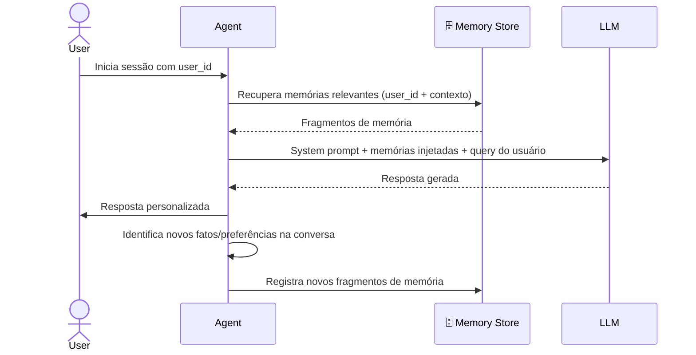

# Memória de Longo Prazo em Agentes

> Agentes sem memória são estranhos que recomeçam do zero a cada sessão. A **memória de longo prazo** transforma o agente em um assistente persistente — que recorda preferências, aprende com experiências passadas e personaliza respostas ao longo do tempo.

## 🧠 Conceito Fundamental

$$\text{Long-Term Memory} = \text{Fatos} + \text{Experiências} + \text{Comportamentos} \text{ persistidos entre sessões}$$

Enquanto a memória de curto prazo simula continuidade dentro de uma única sessão, a memória de longo prazo persiste além do término da conversa. Cada sessão começa não do zero, mas a partir do que o agente acumulou sobre aquele usuário, equipe ou contexto.

---

## 🗂️ Taxonomia Completa de Memória

| Tipo | Escopo | Persiste? | Identificador | Exemplo |
|---|---|---|---|---|
| **Estado** (`State`) | Uma execução (`run`) | ❌ Descartado ao fim do `run` | `run_id` | Tool calls pendentes |
| **Curto Prazo** | Uma sessão | ❌ Descartado ao fim da sessão | `session_id` | Histórico da conversa |
| **Longo Prazo** | Múltiplas sessões | ✅ Persiste em banco de dados | `user_id` / `team_id` | Preferências, fatos, padrões |

> **Nota:** A diferença entre memória de curto e longo prazo não é apenas duração — é **propósito**. Curto prazo mantém a conversa coerente; longo prazo constrói um relacionamento.

---

## 🔵 Os Três Tipos de Memória de Longo Prazo

### 1. 🧩 Memória Semântica — "O que sei sobre você"

Armazena fatos e preferências aprendidos nas interações.

| Exemplo | Onde é armazenado |
|---|---|
| "Seu jogo favorito é Zelda: Breath of the Wild" | Perfil do usuário (key-value) |
| "Seu time usa Trello, não Jira" | Coleção de conhecimento (vector store) |
| "Você prefere respostas em português" | Metadados de configuração |

A memória semântica é recuperada por **similaridade semântica** ou **contexto** — o agente chega ao fato certo a partir de uma pergunta relacionada, sem precisar armazenar uma chave exata.

### 2. 🎞️ Memória Episódica — "O que já aconteceu entre nós"

Registra eventos e interações passadas. Funciona como um diário de sessões anteriores.

```
Sessão anterior (resumo):
- Usuário perguntou como conectar ao banco PostgreSQL
- Agente forneceu os passos de configuração com SSL
- Usuário confirmou: "funcionou, obrigado"
→ Memória: "O usuário resolveu problema de conexão PostgreSQL com tutorial de SSL"
```

Esses resumos servem como **exemplos few-shot** automáticos — quando uma situação similar surge, o agente recupera a abordagem que funcionou.

### 3. ⚙️ Memória Procedural — "Como devo agir com você"

Encoda adaptações comportamentais. Não é sobre fatos nem eventos — é sobre **como o agente se comporta**.

| Padrão observado | Adaptação procedural |
|---|---|
| Usuário sempre pede e-mails formais | Agente atualiza tom padrão para formal |
| Usuário prefere respostas curtas e diretas | Agente remove explicações longas |
| Usuário corrige jargões técnicos constantemente | Agente simplifica o vocabulário |

Essa memória atualiza regras internas, prompts dinâmicos ou parâmetros de geração — fazendo o agente **evoluir** como assistente.

---

## 🏗️ Arquitetura — Ciclo de Vida da Memória



---

## 🗃️ Armazenamento e Escopo

### Backends de armazenamento

| Tipo de Banco | Uso Ideal | Exemplos |
|---|---|---|
| **Vector Database** | Recuperação por similaridade semântica | ChromaDB, Pinecone, Weaviate |
| **Relacional** | Fatos estruturados e consultas exatas | PostgreSQL, SQLite |
| **Document Store** | Perfis e objetos semi-estruturados | MongoDB, DynamoDB |

### Escopos de memória

| Escopo | Acesso | Caso de uso |
|---|---|---|
| **User-scoped** | Privado por `user_id` / e-mail | Preferências pessoais, histórico individual |
| **Team-scoped** | Compartilhado por `team_id` | Convenções da equipe, projetos compartilhados |
| **Global-scoped** | Universal — todos os usuários | Padrões gerais aprendidos across interactions |

> **Regra prática:** Comece com user-scoped. Só expanda para team ou global quando houver uma razão clara de negócio — escopo errado causa **vazamento de memória** entre usuários.

---

## 💻 Implementação — `LongTermMemory` com Vector Store

### Estruturas de dados

```python
from dataclasses import dataclass, field
from typing import List, Dict, Optional
from datetime import datetime

@dataclass
class MemoryFragment:
    """Unidade atômica de memória de longo prazo."""
    content: str           # Conteúdo da memória
    owner: str             # Identificador do dono (user_id, team_id)
    namespace: str = "default"  # Agrupa memórias por contexto
    timestamp: int = field(
        default_factory=lambda: int(datetime.now().timestamp())
    )

@dataclass
class MemorySearchResult:
    """Resultado de uma busca na memória."""
    fragments: List[MemoryFragment]
    metadata: Dict

@dataclass
class TimestampFilter:
    """Filtro temporal para recuperação de memórias."""
    greater_than_value: int = None   # Apenas memórias após esta data
    lower_than_value: int = None     # Apenas memórias antes desta data
```

### Classe `LongTermMemory`

```python
class LongTermMemory:
    """Gerencia registro e recuperação de memória de longo prazo."""

    def __init__(self, db: VectorStoreManager):
        self.vector_store = db.create_store("long_term_memory", force=True)

    def register(
        self,
        memory_fragment: MemoryFragment,
        metadata: Optional[Dict[str, str]] = None
    ) -> None:
        """Persiste um fragmento de memória no vector store."""
        doc_metadata = {
            "owner": memory_fragment.owner,
            "namespace": memory_fragment.namespace,
            "timestamp": str(memory_fragment.timestamp),
            **(metadata or {}),
        }
        document = Document(
            content=memory_fragment.content,
            metadata=doc_metadata,
        )
        self.vector_store.add(document)

    def search(
        self,
        query_text: str,
        owner: str,
        limit: int = 3,
        timestamp_filter: Optional[TimestampFilter] = None,
        namespace: Optional[str] = "default",
    ) -> MemorySearchResult:
        """Recupera memórias relevantes por similaridade semântica."""
        filters = {"owner": owner}
        if namespace:
            filters["namespace"] = namespace
        if timestamp_filter:
            if timestamp_filter.greater_than_value:
                filters["timestamp__gt"] = str(timestamp_filter.greater_than_value)
            if timestamp_filter.lower_than_value:
                filters["timestamp__lt"] = str(timestamp_filter.lower_than_value)

        results = self.vector_store.search(
            query_text=query_text,
            n_results=limit,
            where=filters,
        )
        fragments = [
            MemoryFragment(
                content=r.content,
                owner=r.metadata.get("owner", owner),
                namespace=r.metadata.get("namespace", "default"),
                timestamp=int(r.metadata.get("timestamp", 0)),
            )
            for r in results
        ]
        return MemorySearchResult(fragments=fragments, metadata={})
```

### Uso básico

```python
from lib.vector_db import VectorStoreManager

db = VectorStoreManager(OPENAI_API_KEY)
ltm = LongTermMemory(db)

# Registrar memórias do usuário
memories = [
    MemoryFragment(content="Prefiro modo escuro na interface", owner="alice"),
    MemoryFragment(content="Tenho um Nintendo Switch", owner="alice"),
    MemoryFragment(content="Trabalho com Python e FastAPI", owner="alice"),
]
for m in memories:
    ltm.register(m)

# Recuperar memórias relevantes para um contexto
result = ltm.search(
    query_text="Quais são minha preferências de iluminação?",
    owner="alice",
    limit=1,
)
print(result.fragments[0].content)
# → "Prefiro modo escuro na interface"
```

---

## 🔧 Integrando com Agentes via Tools

A abordagem recomendada expõe a memória como **ferramentas do agente**, permitindo que ele decida quando registrar e quando consultar.

```python
def build_memory_registration_tool(ltm: LongTermMemory, owner: str, namespace: str):
    """Cria ferramenta para o agente registrar novas memórias."""

    def register_memory(content: str) -> str:
        """
        Registra um fato ou preferência do usuário para uso futuro.
        Use quando o usuário compartilhar informação relevante sobre si mesmo.
        """
        fragment = MemoryFragment(
            content=content,
            owner=owner,
            namespace=namespace,
        )
        ltm.register(fragment)
        return f"Memória registrada: '{content}'"

    return register_memory


def build_memory_search_tool(ltm: LongTermMemory, owner: str, namespace: str):
    """Cria ferramenta para o agente recuperar memórias relevantes."""

    def search_memory(query: str) -> str:
        """
        Busca informações conhecidas sobre o usuário relevantes para a query.
        Use antes de responder perguntas que dependam de contexto pessoal.
        """
        result = ltm.search(
            query_text=query,
            owner=owner,
            namespace=namespace,
            limit=3,
        )
        if not result.fragments:
            return "Nenhuma memória encontrada para este contexto."
        return "\n".join(f"- {f.content}" for f in result.fragments)

    return search_memory
```

### Agente com memória de longo prazo

```python
from lib.agents import Agent

ltm = LongTermMemory(db)

agent = Agent(
    model_name="gpt-4o-mini",
    tools=[
        build_memory_registration_tool(ltm, owner="alice", namespace="conversation"),
        build_memory_search_tool(ltm, owner="alice", namespace="conversation"),
    ],
)

# Sessão 1 — o agente aprende
agent.invoke("Prefiro respostas curtas e diretas", session_id="s1")

# Sessão 2 — o agente recorda
result = agent.invoke("Como devo formatar e-mails?", session_id="s2")
# O agente consulta a memória e adapta a resposta ao estilo preferido
```

---

## 🔍 Long-Term Memory vs. RAG

Uma dúvida comum: **memória semântica não é apenas RAG?**

| Dimensão | RAG | Long-Term Memory (Semântica) |
|---|---|---|
| **Origem dos dados** | Documentos estáticos escritos por terceiros | Fatos emergidos da interação com o usuário |
| **Quem escreve** | Autores, equipes de conteúdo | O próprio agente durante conversas |
| **Atualização** | Reprocessamento manual do corpus | Incremental — cada sessão pode adicionar fragmentos |
| **Propósito** | Responder perguntas sobre um domínio | Personalizar respostas para aquele usuário específico |
| **Evolução** | Estática entre atualizações | Evolui continuamente com as interações |

> **Distinção essencial:** RAG recupera o que *outros* escreveram. Long-term memory recupera o que *o usuário* revelou ao agente.

---

## ⚠️ Boas Práticas e Armadilhas

| Prática | Racional |
|---|---|
| **Seletividade** | Não armazene cada linha do diálogo — priorize o que é útil e relevante |
| **TTL (Time-to-Live)** | Configure expiração automática para memórias que ficam obsoletas |
| **Namespaces** | Separe memórias por contexto (`work`, `personal`, `preferences`) para evitar colisões |
| **Controle de escopo** | User-scoped por padrão — evite vazamentos entre usuários |
| **Privacidade** | Trate memórias como dados pessoais sensíveis — aplique os mesmos controles de privacidade |

> **Perguntas de design:** *O que deve ser lembrado? Por quanto tempo? Quem pode acessar?* Responder antes de implementar evita problemas difíceis de corrigir depois.

---

## 📌 Resumo Executivo

$$\text{Long-Term Memory} = \underbrace{\text{Semântica}}_{\text{fatos e preferências}} + \underbrace{\text{Episódica}}_{\text{eventos passados}} + \underbrace{\text{Procedural}}_{\text{adaptações de comportamento}}$$

| Ponto-Chave | Significado |
|---|---|
| 🔁 **Persiste entre sessões** | O agente não começa do zero — ele recorda |
| 🧩 **Três tipos distintos** | Semântica (fatos) · Episódica (eventos) · Procedural (comportamento) |
| 🗄️ **Múltiplos backends** | Vector store para semântica, relacional para estruturado, document store para perfis |
| 🔍 **Recuperação por contexto** | Similaridade semântica, tags, tempo ou `user_id` determinam o que é injetado |
| ⚠️ **Não é só RAG** | LTM é construída pela interação — evolui; RAG vem de documentos estáticos |
| 🛡️ **Governança é obrigatória** | TTL, namespaces e escopo evitam vazamentos, dados obsoletos e violações de privacidade |

---

[← Tópico Anterior: Agentic RAG — De Busca Passiva a Raciocínio Ativo](08-agentic-rag.md) | [Próximo Tópico: Módulo 3 — Índice →](README.md)
