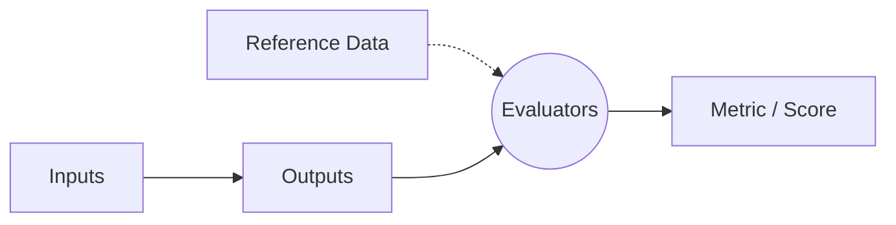

# Agentic Evaluation: Medindo o Que Importa

> Apenas construir um agente não é suficiente. Sem avaliação, você está operando no escuro — um comportamento indesejado pode passar despercebido até causar problemas. A **avaliação de agentes** fornece o ciclo de feedback necessário para entender, melhorar e confiar no seu sistema.

## 🎯 Por Que a Avaliação é Essencial?

Agentes são dinâmicos e atuam de forma autônoma. Sem monitoramento e avaliação, o comportamento do agente pode desviar (drift). 
Diferente de software determinístico, uma alteração em um prompt ou a falha de uma ferramenta pode levar o agente a comprometer tokens, realizar chamadas incorretas ou até executar ações prejudiciais (ex: excluir registros de usuários em vez de contatá-los).

A avaliação garante **visibilidade sobre a performance e segurança**, permitindo a iteração e evolução contínua da ferramenta. Não se trata de buscar um placar perfeito, mas de ter uma **bússola** que aponte para a direção certa.

---

## 📐 As Quatro Dimensões da Avaliação

Uma avaliação eficaz analisa múltiplas dimensões, não apenas o resultado final:

| Dimensão | O que mede? | Exemplo de Perguntas |
|---|---|---|
| **Task Completion** (Conclusão) | O agente alcançou seu objetivo? | Funcionou? Quantos passos levou? Precisou de intervenção humana? |
| **Quality Control** (Controle de Qualidade) | A saída respeitou as regras? | O formato estava correto? Seguiu as instruções do prompt? Usou o contexto? |
| **Tool Interaction** (Interação com Ferramentas) | As decisões intermediárias foram corretas? | Escolheu a ferramenta certa? Os argumentos (parâmetros) eram válidos? A ferramenta retornou algo útil? |
| **System Metrics** (Métricas de Sistema) | Quão eficiente foi a execução? | Quantos tokens foram gastos? As chamadas de ferramenta foram rápidas? Ocorreram falhas silenciosas? |

---

## 🔬 Três Estratégias de Avaliação

A abordagem varia de acordo com a profundidade que você precisa observar.

### 1. 📦 Final Response Evaluation (Black Box)
Avalia **apenas o resultado final**. Ideal para testes end-to-end.
- **Vantagem:** Foco no sucesso da tarefa de forma geral. Rápido e prático para verificar se "funcionou". Pode usar técnica de LLM-as-judge para validar o resultado baseando-se no prompt.
- **Desvantagem:** Não diz *como* o agente chegou ao resultado nem *por que* algo falhou.

### 2. 🔍 Single-Step Evaluation
Foca em **uma decisão por vez**, como a seleção de uma ferramenta específica ou a formatação de uma consulta.
- **Vantagem:** Mais rápido para debugar. Você sabe exatamente se, num determinado ponto, a chamada de ferramenta bate com o comportamento esperado.
- **Desvantagem:** Não garante que todo o conjunto da tarefa será bem-sucedido. Avalia apenas um instante no tempo.

### 3. ✈️ Trajectory Evaluation
Como uma **caixa-preta de avião** (flight recorder): mapeia o caminho completo do agente (quais ferramentas ele chamou, em qual ordem, com quais argumentos e o que ele fez com as respostas).
- **Vantagem:** Fornece a análise de causa raiz mais rica, ideal para fluxos de trabalho complexos onde o processo importa tanto quanto o resultado final.
- **Desvantagem:** Exige maior configuração, estruturação e tempo de execução analítico para validar caminhos não determinísticos. Você pode usar LLMs para julgar se a trajetória adotada foi coerente.

---

## 🧱 Componentes Necessários para a Avaliação

Independentemente da estratégia escolhida, você precisará de 4 componentes base fundamentais:



1. **Inputs (Entradas):** O prompt do usuário, a lista de ferramentas disponíveis para o agente, instruções de sistema e contexto (memória).
2. **Outputs (Saídas):** A resposta final do agente ou a sequência de chamadas de ferramentas geradas no caminho.
3. **Reference Data (Dados de Referência):** Respostas conhecidas (ground truth), a sequência correta e esperada de uso da ferramenta ou requisitos de comportamento.
4. **Evaluators (Avaliadores):** Regras (heurísticas baseadas em código), padrões de expressão regular (regex), ou mesmo **LLM-as-judge** (usar um LLM maior para julgar o resultado).

---

## 🛠️ Exemplo de Experimentação

Criar testes significa estruturar essas métricas em código observável. Exemplo em pseudocódigo simplificado do ecossistema Udacity:

```python
# Definindo as Entradas, Referências e Critérios
test_case = TestCase(
    id="game_query_1",
    description="Find the best game in the dataset",
    user_query="What's the best game in the dataset?",
    expected_tools=["get_games"],   # Validando a Tool Interaction
    reference_answer="The Legend of Zelda: Breath of the Wild with score 98", # Ground truth
    max_steps=4 # Validando Task Completion / System Metrics
)

# Rodando uma avaliação de tipo "Single-Step" cruzado com "Black Box"
evaluator = AgentEvaluator()
evaluation_result = evaluator.evaluate(agent, test_case)

# O output nos indicará problemas:
# - Errou de ferramenta? → Ver descrições de ferramentas ou prompt.
# - Gastou tokens demais? → Reduzir contexto (truncate).
# - Passos excessivos? → Focar em melhorias de planejamento.
```

---

## 📌 Resumo Executivo

- **Avaliação é uma bússola:** Não existe uma métrica "bala de prata"; a ideia é monitorar com constância para melhorar de forma sistemática.
- **Além do final feliz (Black Box):** Entender as decisões ao longo do tempo (Trajectory) e a eficácia momentânea (Single-Step) é crucial para projetos escaláveis.
- **Não meça só o fim:** Uso de APIs, token rate, formatação adequada, latência de recuperação e alinhamento com a promessa da ferramenta são tão cruciais quanto responder à pergunta corretamente.

---

[← Tópico Anterior: Memória de Longo Prazo em Agentes](09-long-term-memory.md) | [Próximo Tópico: Módulo 3 — Índice →](3_Building_Agents/README.md)
