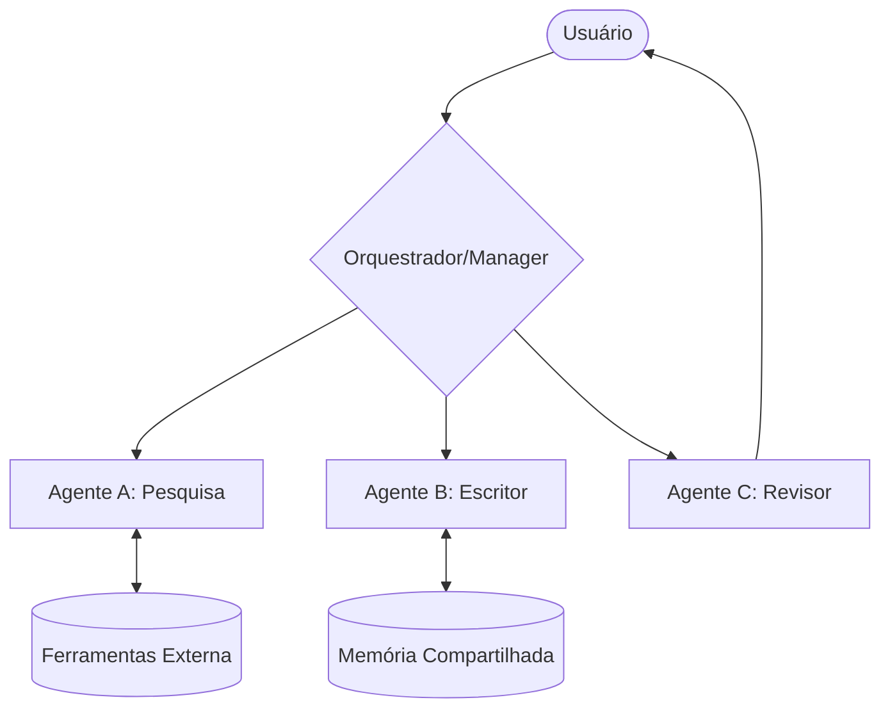

# Introdução a Sistemas Multi-Agente (Multi-Agent Systems)

Sistemas Multi-Agente (MAS) são programas computacionais capazes de receber solicitações complexas em linguagem natural e responder de forma **agentética**. Diferente de fluxos heurísticos rígidos, um MAS não possui uma sequência estritamente definida de verificações; em vez disso, ele coordena múltiplos agentes com funções e personalidades distintas para resolver problemas de forma interativa.

## 🧠 Conceito Fundamental

A essência de um MAS reside na colaboração entre entidades especializadas. Podemos definir a dinâmica de um sistema multi-agente como:

$$MAS = \sum (Agente_{i} + Papel_{i} + Ferramentas_{i}) + Coordenação$$

### A Metáfora do Restaurante 🍴

A melhor maneira de entender um MAS é observar a operação de um restaurante:

*   **Host (Anfitrião):** Saúda clientes e gerencia assentos.
*   **Waiter (Garçom):** Anota pedidos e entrega a comida.
*   **Chef:** Especialista no preparo dos pratos.
*   **Busboy (Ajudante):** Limpa as mesas.
*   **Manager (Gerente):** Supervisiona toda a operação.

Cada "agente" tem um papel claro e eles se comunicam para entregar uma experiência completa.

## 🛠️ Componentes e Capacidades

Para que um sistema multi-agente seja eficaz, ele deve integrar três pilares principais:

| Componente | Função Principal | Impacto |
| :--- | :--- | :--- |
| **Papéis (Roles)** | Define metas e personalidades distintas. | Reduz ambiguidades e melhora o foco. |
| **Ferramentas (Tools)** | Permite que agentes interajam com sistemas de negócio. | Reduz alucinações via verificação externa. |
| **Memória e Roteamento** | Gerencia o fluxo de dados e contexto entre agentes. | Garante continuidade em tarefas multi-etapas. |

### Fluxo Agentético vs. Sequencial

Ao contrário de algoritmos tradicionais, o fluxo agentético é dinâmico:
1.  **Decentralização:** Não há um script fixo de "A então B".
2.  **Roteamento Contextual:** Os dados são enviados para o agente mais qualificado no momento.
3.  **Aumentação de Contexto:** Agentes refinam solicitações para modelos de IA com informações relevantes.

## 📐 Arquitetura de Comunicação

## 🎯 Objetivos de Aprendizagem

Ao final deste módulo, você será capaz de:
*   **Projetar e desenvolver** sistemas MAS para procedimentos de múltiplas etapas.
*   **Abstrair fluxos complexos** através de *agentic prompt flows*.
*   **Reduzir alucinações** capacitando agentes com ferramentas de verificação e experimentação.

## 🧪 Exercícios Práticos

- 📓 [Introdução ao Planejamento](../exercises/01-planning-intro.ipynb) — Primeiros passos na estruturação de tarefas multi-agente.

---
&#91;← Tópico Anterior: Módulo 4 — Índice&#93;&#40;README.md&#41; | &#91;Próximo Tópico: Design de Arquitetura Multi-Agente →&#93;&#40;02-designing-multi-agent-architecture.md&#41;
