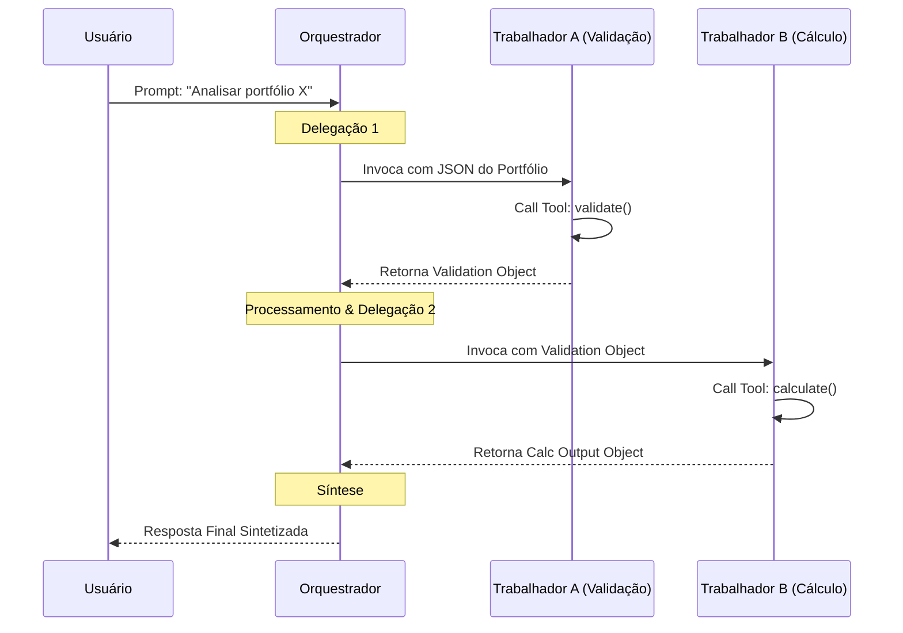
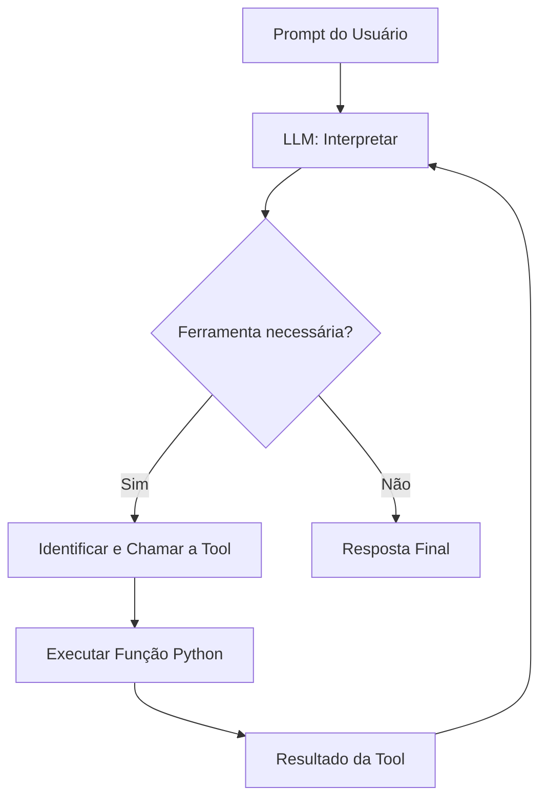

# Implementação de Arquitetura Multi-Agente

Após desenhar a planta da arquitetura do seu sistema (o pensamento arquitetural), o próximo passo é a **Implementação**. Este processo traduz os modelos conceituais abstratos ("caixas e setas") em código funcional e componentes de software reais.

O modelo mental para esta etapa é o **treinamento de trabalho corporativo para IAs**: você precisa definir as "descrições de cargo" (System Prompts), equipar os agentes com "habilidades" (Tools) e estabelecer a "política de comunicação" da empresa (Protocolos de Mensagens e Serialização).

## 🏢 Instanciação e Papéis (System Prompts)

Na maioria dos frameworks, um agente é instanciado como uma **classe** (geralmente herdando de uma classe base `Agent`). O atributo mais crítico durante a instanciação é o **System Prompt**, sua descrição imutável de trabalho.

Um prompt de sistema eficaz define limites absolutos (*guide rails*) para o agente:

| Atributo | Exemplo Prático | Propósito |
| :--- | :--- | :--- |
| **Quem você é** | *"Você é um Agente de Validação de Dados."* | Estabelece a persona e o enquadramento. |
| **O que você faz** | *"Seu único objetivo é checar dados contra esquemas."* | Foca a atenção do LLM na responsabilidade primária. |
| **O que não faz** | *"Você não realiza cálculos nem chama APIs."* | Previne alucinações de escopo e ações não autorizadas. |
| **Ferramentas (*Tools*)** | *"Você SÓ acessa a ferramenta `validate_schema`."* | Restringe o vetor de ação de forma explícita. |

A ambiguidade no System Prompt é o maior inimigo da confiabilidade em sistemas multi-agente, atrapalhando a capacidade do Orquestrador de rotear as tarefas de forma eficiente.

## 🛠 Atribuição de Ferramentas e Tratamento de Erros

Ferramentas (Tools) dão aos agentes a capacidade de atuar além do processamento de linguagem (ex: acessar bancos de dados, consultar APIs, realizar contas matemáticas complexas). 

**Regras Ouro na Criação de Ferramentas:**
1. **Descrições de Ferramentas são Críticas:** O texto descritivo e a assinatura tipada dão ao LLM o contexto sobre *quando* e *como* extrair os parâmetros corretos. Use docstrings robustos.
2. **Defesa Contra Falhas:** Ferramentas devem encapsular lógicas de negócio em blocos `try/except`. 

### Padrão de Implementação Segura (*Tool Implementation*)

```python
# Poor Tool Implementation
def check_inventory(product_id: str):
    return db.query(f"SELECT stock FROM inventory WHERE id = '{product_id}'")

# Optimized Tool Implementation
def check_inventory_safe(product_id: str) -> str:
    """
    Checks the current inventory stock level for a specific product ID.
    Returns the current stock count or a clear error message.
    """
    try:
        stock = db.query_inventory(product_id)
        if stock is None:
            return f"Error: Product ID {product_id} not found in inventory."
        return f"Current stock count: {stock}"
    except DatabaseConnectionError as e:
        # Registra stack trace real em log interno
        logger.error(f"DB Error: {traceback.format_exc()}")
        # Retorna erro legível para o LLM não quebrar a cadeia
        return f"Tool execution failed due to database timeout. Suggest trying later."
```

## 🔄 Comunicação e Fluxo no Padrão Orquestrador

Em uma arquitetura de orquestrador, a codificação do fluxo de conversação exige a passagem estruturada de estados e resultados entre agentes e o líder.



## 📦 O Detalhe Oculto: Serialização e Deserialização

Para trocar comunicações ricas (*structured communication*) — como composições de portfólio, recomendações de investimento ou logs densos — os agentes dependem do empacotamento transacional dos dados via **Serialização**. 

Não podemos passar um Objeto Python diretamente pela rede se os agentes habitam processos ou máquinas diferentes.

*   **Serialização (Envio):** Conversão de objetos Python de abstração alta (dicionários, *Pydantic models*) para uma string transmissível contínua (ex: string JSON).
*   **Deserialização (Recebimento):** Reconstrução do objeto estruturado na outra ponta (parseamento da string de volta à entidade da linguagem).

**A "Magia" do Framework vs. Necessidade de Debug:**
A maioria dos frameworks modernos abstraem esse passo transacional: ferramentas que retornam *Pydantic models* são convertidas para JSON nos bastidores. No entanto, o engenheiro de IA deve compreender os conceitos intrínsecos de *descriptive object models* com *Type Hints* porque falhas subjacentes (ex: *Malformed JSON* ou *Deserialization Failed*) são bugs iminentes ao tentar integrar o retorno de ferramentas não tipadas, requerendo atenção especial à estrutura de dados base das mensagens inter-agentes.

## 🤖 Smolagents: Um Framework Python para Sistemas Multi-Agente

**Smolagents** é um framework Python projetado para construir sistemas multi-agente alimentados por LLMs. Ele combina raciocínio de linguagem com execução de ferramentas Python, permitindo criar agentes que usam ferramentas, mantêm estado e colaboram para resolver tarefas complexas.

$$\text{Agente} = \text{LLM} + \text{Ferramentas Python} + \text{Estado}$$

### Componentes Principais

| Componente | Papel |
| :--- | :--- |
| `@tool` | Decorator que expõe funções Python como ferramentas acessíveis pelo agente |
| `ToolCallingAgent` | Classe base para agentes com capacidade de identificar e invocar ferramentas |
| `OpenAIServerModel` | Adapter que conecta o agente a um LLM via API compatível com OpenAI |

### `ToolCallingAgent`: O Agente Principal

`ToolCallingAgent` é a classe central do Smolagents. Ela representa um agente orientado a LLM capaz de:

1. **Interpretar prompts** e entrada do usuário
2. **Decidir quando chamar ferramentas** (funções Python decoradas com `@tool`)
3. **Executar ferramentas** e integrar seus resultados ao raciocínio em curso

O ciclo interno de um `ToolCallingAgent`:



### Padrão de Implementação

```python
from smolagents import ToolCallingAgent, OpenAIServerModel, tool

# 1. Inicializar o modelo de linguagem
model = OpenAIServerModel(model_id="gpt-4o-mini", api_key="...")

# 2. Definir ferramentas com @tool
@tool
def fetch_data(source: str) -> str:
    """Retrieves data from the given source identifier.

    Args:
        source: The identifier of the data source to query.

    Returns:
        A string with the retrieved data or an error message.
    """
    try:
        result = data_store.get(source)
        return result if result else f"No data found for source: {source}"
    except Exception as e:
        return f"Error fetching data: {str(e)}"

@tool
def process_result(data: str, operation: str) -> str:
    """Applies a named operation to the provided data.

    Args:
        data: The raw data string to process.
        operation: The operation name (e.g., 'summarize', 'count').

    Returns:
        The processed result as a string.
    """
    return f"Processed [{operation}]: {data[:100]}..."

# 3. Criar o agente especializado via herança
class DataAgent(ToolCallingAgent):
    def __init__(self):
        super().__init__(
            tools=[fetch_data, process_result],
            model=model,
            name="data_specialist"
        )

# 4. Usar o agente
agent = DataAgent()
result = agent.run("Fetch data from 'sales_q4' and summarize it.")
```

> **Regra de Ouro:** A docstring de cada `@tool` é o que o LLM lê para decidir *quando* e *como* invocar a ferramenta. Uma docstring pobre leva a chamadas erradas ou ausentes — trate-as como contratos de interface.

### Smolagents vs. Implementação Manual

| Aspecto | Implementação Manual | Smolagents |
| :--- | :--- | :--- |
| **Registro de Ferramentas** | Parsing manual do output do LLM | Decorator `@tool` + auto-discovery |
| **Despacho de Ferramentas** | Lógica `if/elif` manual | Automático pelo framework |
| **Multi-agente** | Orquestração manual de classes | Herança de `ToolCallingAgent` |
| **Estado** | Variáveis globais ou contexto manual | Estado encapsulado no objeto agente |
| **Adapter de LLM** | Chamadas diretas à API do provedor | `OpenAIServerModel` e outros adapters |

---
&#91;← Tópico Anterior: Design de Arquitetura Multi-Agente&#93;&#40;02-designing-multi-agent-architecture.md&#41; | &#91;Próximo Tópico: Orquestrando Atividades de Agentes →&#93;&#40;04-orchestrating-agent-activities.md&#41;
