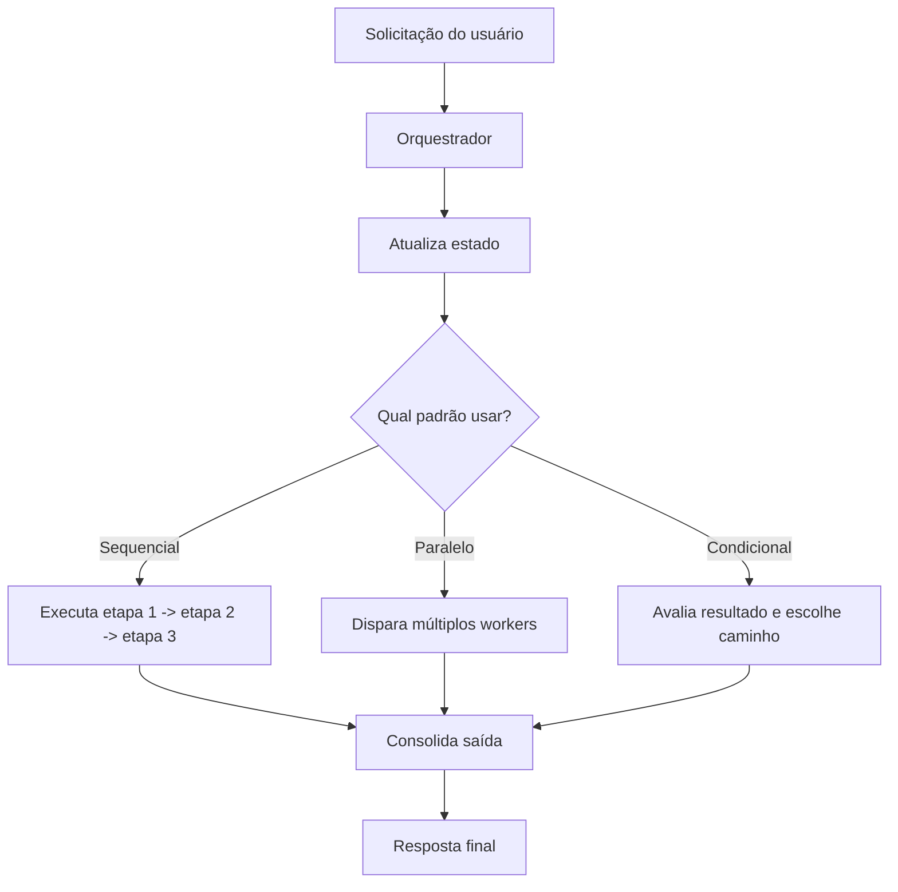
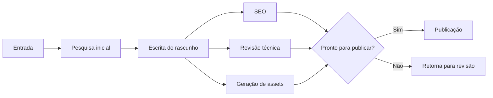

# Orquestrando Atividades de Agentes

Se desenhar a arquitetura é criar a planta e implementar agentes é treinar cada especialista, a **orquestração** é a camada que coordena o trabalho em produção. Em um sistema multi-agente, não basta ter agentes competentes: alguém precisa definir ordem, paralelismo, critérios de decisão, tratamento de erro e compartilhamento de estado.

O modelo mental mais útil aqui é o de um **maestro conduzindo uma orquestra**. O maestro não toca todos os instrumentos, mas controla o tempo, ativa cada seção no momento certo e garante que o conjunto produza uma execução coerente em vez de ruído.

## 🧠 Conceito Fundamental

Podemos resumir a orquestração como:

$$\text{Orquestração} = \text{Workflow} + \text{Estado} + \text{Decisões} + \text{Tratamento de Erros}$$

Em termos práticos:

*   **Workflow** define a ordem ou simultaneidade das tarefas.
*   **Estado** mantém o contexto compartilhado entre agentes.
*   **Decisões** escolhem o próximo passo com base em resultados.
*   **Tratamento de Erros** evita que uma falha isolada derrube todo o fluxo.

## 🔑 Termos-Chave

| Termo | Definição | Papel no Sistema |
| :--- | :--- | :--- |
| **Orchestration** | Configuração, coordenação e gerenciamento automatizado de múltiplos agentes e tarefas. | Controla o fluxo fim a fim. |
| **Workflow** | Sequência de tarefas executadas por um ou mais agentes. | Estrutura o processo. |
| **Sequential Execution** | Execução etapa por etapa, em ordem definida. | Garante dependências corretas. |
| **Parallel Execution** | Execução simultânea de tarefas independentes. | Reduz latência total. |
| **Conditional Branching** | Ramificação do fluxo conforme uma condição ou resultado. | Permite decisões dinâmicas. |
| **State Management** | Controle do progresso e dos dados compartilhados do workflow. | Mantém consistência entre agentes. |

## 🎼 O Orquestrador: O Cérebro do Workflow

No centro do sistema está o **Orchestrator**. Ele não precisa executar o trabalho especializado, mas precisa:

*   delegar a tarefa certa ao agente certo;
*   fornecer o contexto necessário para cada execução;
*   escutar resultados e erros;
*   atualizar o estado global;
*   decidir o próximo passo sem acoplar essa lógica aos workers.

Esse modelo reduz a complexidade distribuída. Em vez de cada agente decidir sozinho o que fazer em seguida, os workers executam sua parte e devolvem o resultado ao orquestrador, que mantém a lógica de negócio centralizada.



## 🔄 Padrões Fundamentais de Orquestração

A maior parte dos workflows multi-agente é construída a partir de três padrões básicos.

### 1. Execução Sequencial

Na **execução sequencial**, uma etapa depende diretamente da anterior. O resultado de um agente se torna entrada do próximo.

**Quando usar:**

*   há dependência explícita entre as tarefas;
*   uma validação precisa ocorrer antes da próxima ação;
*   a saída intermediária precisa ser enriquecida passo a passo.

**Exemplo:** em um suporte técnico para problemas de Wi-Fi:

1.  um agente de diagnóstico identifica o problema;
2.  um agente de solução gera instruções com base nesse diagnóstico;
3.  um agente de verificação confirma se a correção funcionou.

Nesse fluxo, pular ou inverter a ordem compromete o resultado.

### 2. Execução Paralela

Na **execução paralela**, tarefas independentes são iniciadas ao mesmo tempo e seus resultados são reunidos depois.

**Quando usar:**

*   as tarefas não dependem umas das outras;
*   o custo principal é tempo de espera;
*   a resposta final pode ser composta por múltiplas análises independentes.

**Exemplo:** para um relatório de análise de mercado, o orquestrador pode disparar em paralelo:

*   um agente de notícias para resumir eventos recentes;
*   um agente de dados financeiros para buscar preços atuais;
*   um agente de concorrência para verificar filings e movimentações.

O ganho aqui é de latência, não de lógica.

### 3. Ramificação Condicional

Na **ramificação condicional**, o orquestrador avalia o estado atual do processo e decide qual caminho seguir.

**Quando usar:**

*   um resultado pode levar a diferentes fluxos;
*   regras de negócio exigem bifurcação explícita;
*   o sistema precisa responder de forma diferente para sucesso, falha ou elegibilidade.

**Exemplo:** em um processo de devolução de e-commerce:

*   se a solicitação for **elegível**, o fluxo segue para inventário e reembolso;
*   se for **inelegível**, segue para um agente de negação e comunicação ao cliente.

## 🧭 Orquestração na Prática

Raramente um sistema real usa um único padrão puro. O mais comum é combinar os três:

1.  executar uma etapa sequencial obrigatória;
2.  iniciar análises independentes em paralelo;
3.  decidir os próximos passos com base em um dos resultados.



## 🧩 Gerenciamento de Estado e Erros

O orquestrador também precisa manter o **estado compartilhado** do workflow. Sem isso, cada agente trabalha em isolamento e o processo perde continuidade.

| Responsabilidade | Exemplo | Risco se faltar |
| :--- | :--- | :--- |
| **Rastrear progresso** | Saber quais etapas já concluíram. | Execuções duplicadas ou perdidas. |
| **Compartilhar contexto** | Passar diagnóstico, rascunho ou score entre agentes. | Respostas desconectadas. |
| **Capturar falhas** | Registrar timeout, resposta inválida ou ferramenta indisponível. | Workflow interrompido sem recuperação. |
| **Definir fallback** | Repetir, trocar de agente ou abortar com mensagem clara. | Comportamento imprevisível. |

Uma regra útil:

> O orquestrador não deve assumir sucesso. Ele deve assumir que qualquer agente, tool ou chamada externa pode falhar e ainda assim preservar o estado do sistema.

## 💻 Exemplo de Orquestrador

O exemplo abaixo combina sequência e um ponto de extensão para paralelismo:

```python
class ContentCreationOrchestrator:
    def __init__(self, research_agent, writing_agent, editing_agent, publishing_agent):
        self.research_agent = research_agent
        self.writing_agent = writing_agent
        self.editing_agent = editing_agent
        self.publishing_agent = publishing_agent

    def run(self, topic: str) -> str:
        print("--- Orchestrator: Starting content creation workflow ---")

        research_notes = self.research_agent.research(topic)
        draft = self.writing_agent.write_draft(topic, research_notes)

        print("--- Orchestrator: Starting finalization stage ---")
        final_text = self.editing_agent.edit(draft)
        publish_status = self.publishing_agent.publish(final_text)

        print("--- Orchestrator: Workflow complete ---")
        return publish_status
```

### O que este exemplo demonstra

*   **Sequencial:** pesquisa vem antes da escrita; escrita vem antes da edição.
*   **Ponto de controle central:** o orquestrador coordena todos os passos.
*   **Fluxo de dados explícito:** `research_notes -> draft -> final_text`.

### Onde o paralelismo realmente faria sentido

No exemplo acima, publicação depende do texto final editado, então ela **não é um bom candidato a paralelismo verdadeiro**. Um desenho melhor seria executar em paralelo tarefas realmente independentes, como:

*   geração de imagem de capa;
*   análise de SEO;
*   extração de tags e metadados.

Depois, o orquestrador agregaria essas saídas antes da publicação.

## 🛠 Regras de Engenharia para um Bom Orquestrador

1.  **Centralize a lógica de fluxo.**
    Os workers devem executar especialidades, não controlar o processo global.
2.  **Modele estado explicitamente.**
    Use objetos, dicionários tipados ou modelos validados para representar progresso.
3.  **Separe dependência de paralelismo.**
    Nem toda etapa posterior pode rodar em paralelo só porque vem depois.
4.  **Projete para expansão.**
    Adicionar um novo agente não deve exigir redesenhar todo o workflow.
5.  **Trate falhas como parte normal do fluxo.**
    Retry, fallback, timeout e logging precisam fazer parte da orquestração.

## 🎯 Takeaways

*   Orquestração é a camada que coordena agentes, tarefas, estado e erros.
*   Os três blocos fundamentais são **sequência**, **paralelismo** e **ramificação condicional**.
*   Um bom orquestrador mantém o workflow flexível sem espalhar regras de negócio entre workers.
*   Sistemas reais combinam padrões, em vez de usar apenas um.

## 🧪 Exercícios Práticos

- 🐍 [Implementação de Arquitetura Multi-Agente](../exercises/2-multi-agent-architecture-implementation/exercises/2-multi-agent-architecture-implementation.py) — exercício principal de coordenação entre agentes, estado compartilhado e respostas do orquestrador.
- 📓 [README do Exercício de Implementação](../exercises/2-multi-agent-architecture-implementation/exercises/README.md) — visão geral dos objetivos de implementação e conceitos praticados.
- 🐍 [Demo de Implementação de Arquitetura Multi-Agente](../exercises/2-multi-agent-architecture-implementation/demo/2-multi-agent-architecture-implementation-demo.py) — exemplo guiado de interação entre pinguins e cientista com coordenação central.

---
&#91;← Tópico Anterior: Implementação de Arquitetura Multi-Agente&#93;&#40;03-implementing-multi-agent-architecture.md&#41; | &#91;Próximo Tópico: Módulo 4 — Índice →&#93;&#40;README.md&#41;
