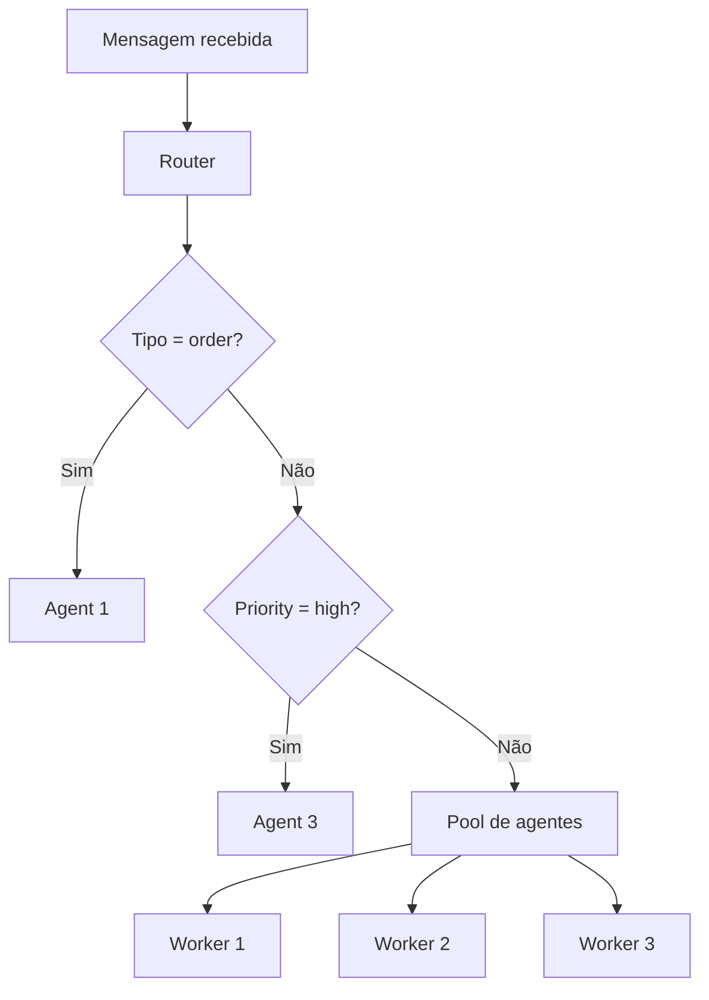
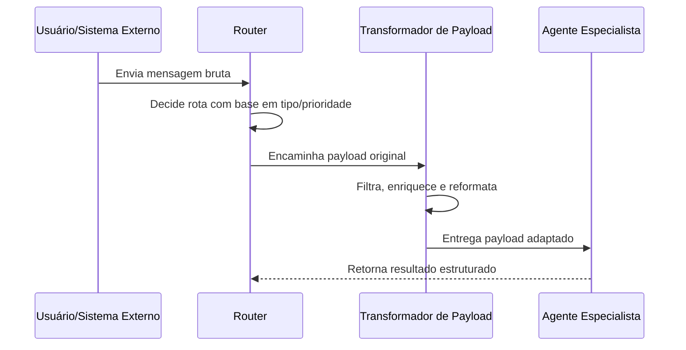

# Routing e Fluxo de Dados em Sistemas Agênticos

Se a arquitetura define quem participa e a orquestração define quando cada agente atua, o **routing** define **para onde uma mensagem deve ir**. Já o **data flow management** define **em que formato essa mensagem deve chegar** para que o próximo agente consiga trabalhar sem fricção.

O modelo mental mais útil aqui é o de uma **central de triagem interna**. Imagine uma empresa recebendo pedidos, alertas urgentes e logs rotineiros. Algumas mensagens precisam ir para um especialista específico, outras devem ser distribuídas entre agentes equivalentes para balancear carga, e outras precisam furar fila por criticidade. Mesmo depois da decisão de rota, os dados ainda podem precisar de limpeza, enriquecimento ou transformação antes do handoff.

## 🧠 Conceito Fundamental

Podemos resumir o tópico assim:

$$\text{Routing} = \text{Inspeção da Mensagem} + \text{Decisão} + \text{Despacho}$$

$$\text{Data Flow} = \text{Payload} + \text{Transformação} + \text{Contexto}$$

Em termos práticos:

*   **Routing** decide qual agente, fila ou grupo de agentes deve receber a tarefa.
*   **Data Flow** decide como o conteúdo será adaptado antes de seguir para o próximo passo.
*   **Os dois conceitos trabalham juntos**: enviar a mensagem correta para o agente certo não basta se o payload chegar no formato errado.

## 🔑 Termos-Chave

| Termo | Definição | Papel no Sistema |
| :--- | :--- | :--- |
| **Routing** | Processo de direcionar mensagens ou tarefas ao agente mais adequado. | Define o caminho da execução. |
| **Content-Based Routing** | Roteamento orientado por conteúdo ou metadados da mensagem. | Encaminha para especialistas corretos. |
| **Round-Robin Routing** | Distribuição circular entre agentes equivalentes. | Balanceia carga entre workers similares. |
| **Priority-Based Routing** | Roteamento com tratamento diferente para níveis de urgência. | Protege SLAs e respostas críticas. |
| **Data Flow** | Gestão do payload enquanto ele se move entre agentes. | Garante handoffs compatíveis. |
| **Transformation** | Mudança estrutural ou semântica dos dados entre etapas. | Evita incompatibilidade entre agentes. |

## 🧭 Quando o Orquestrador Vira Router

Em workflows simples e previsíveis, o próprio **orquestrador** já faz o papel de router:

1. recebe um resultado;
2. avalia a regra do fluxo;
3. delega a próxima etapa ao worker correto.

Isso funciona bem quando o caminho já é conhecido. O problema aparece quando:

*   mensagens chegam de múltiplas fontes externas;
*   há pools de agentes equivalentes;
*   a urgência altera a ordem de processamento;
*   diferentes agentes exigem formatos de entrada diferentes.

Nesses casos, o sistema precisa de uma camada de roteamento mais explícita.



## 🔀 Padrões de Routing

### 1. Content-Based Routing

No **content-based routing**, o sistema inspeciona a própria mensagem antes de tomar a decisão. Essa inspeção pode usar:

*   tipo de mensagem (`type = order`);
*   metadados (`source = monitoring`);
*   palavras-chave;
*   tags produzidas por um classificador;
*   formato do dado (`image`, `text`, `json`).

**Quando usar:**

*   quando existem agentes especialistas por domínio;
*   quando as mensagens são heterogêneas;
*   quando a decisão depende da semântica da entrada.

**Exemplo:** pedidos de compra vão para o agente de fulfillment, solicitações de reembolso vão para o agente de policy, e incidentes técnicos vão para o agente de resposta operacional.

### 2. Round-Robin Routing

No **round-robin routing**, a lógica não pergunta "quem é o especialista?", mas sim "qual worker equivalente recebe a próxima tarefa?".

Esse padrão é ideal quando múltiplos agentes executam o mesmo papel e o objetivo principal é **distribuir carga**.

**Quando usar:**

*   para workloads repetitivos e paralelizáveis;
*   quando há várias instâncias do mesmo agente;
*   quando a prioridade é throughput e não especialização.

**Exemplo:** três agentes de análise de imagem recebem arquivos em sequência: o primeiro arquivo vai para o Agente A, o segundo para o B, o terceiro para o C, e então o ciclo recomeça.

### 3. Priority-Based Routing

No **priority-based routing**, a mensagem carrega um nível de urgência e o sistema decide não apenas o destino, mas também **a precedência**.

**Quando usar:**

*   em sistemas com alertas críticos;
*   quando algumas tarefas precisam interromper a fila comum;
*   quando há SLAs diferentes por tipo de evento.

**Exemplo:** um alerta de sinais vitais críticos em um hospital deve ser processado antes de relatórios periódicos de rotina, mesmo que o sistema já esteja ocupado.

## 📊 Comparando os Padrões

| Padrão | Critério de decisão | Melhor para | Risco principal |
| :--- | :--- | :--- | :--- |
| **Content-Based** | Conteúdo, intenção ou metadados | Especialização e precisão | Regras ambíguas ou classificação errada |
| **Round-Robin** | Próximo worker disponível na rotação | Escala horizontal e balanceamento | Ignorar diferenças reais de carga |
| **Priority-Based** | Urgência ou classe de serviço | Resposta a eventos críticos | Starvation de tarefas de baixa prioridade |

> Um sistema real frequentemente combina os três. Por exemplo: primeiro checa prioridade, depois classifica por conteúdo, e por fim distribui a carga entre workers equivalentes.

## 📦 Data Flow Management: O Payload Também Precisa de Orquestração

Routing resolve o **destino**. Data flow resolve o **handoff**.

Entre dois agentes, o payload pode precisar de:

*   **enhancement**: adicionar contexto, IDs, histórico ou dados recuperados de outras fontes;
*   **filtering**: remover campos irrelevantes, sensíveis ou redundantes;
*   **transformation**: mudar estrutura, tipos ou nomes de campos;
*   **normalization**: padronizar unidades, formatos de data, labels e enums.

Sem isso, um agente pode devolver uma saída tecnicamente válida para ele, mas inutilizável para o próximo componente.



### Três transformações comuns

| Operação | O que faz | Exemplo |
| :--- | :--- | :--- |
| **Enhancement** | Acrescenta dados úteis ao payload | Adicionar histórico do cliente antes de chamar o agente de suporte |
| **Filtering** | Remove excesso ou ruído | Excluir logs verbosos antes de enviar a um sumarizador |
| **Transformation** | Reestrutura o formato | Converter um dicionário livre em um objeto com campos estáveis |

## 💻 Exemplo de Implementação

O exemplo abaixo combina inspeção de conteúdo, prioridade e transformação de payload antes de delegar ao agente final.

```python
from collections import deque
from dataclasses import dataclass, field
from typing import Any


@dataclass
class Message:
    payload: dict[str, Any]
    metadata: dict[str, Any] = field(default_factory=dict)


class AgentRouter:
    def __init__(self) -> None:
        self.round_robin_pool = deque(
            ["image_worker_1", "image_worker_2", "image_worker_3"]
        )

    def route(self, message: Message) -> str:
        """Choose the best destination for the incoming message."""
        if message.metadata.get("priority") == "high":
            return "incident_agent"

        if message.metadata.get("type") == "order":
            return "order_agent"

        if message.metadata.get("type") == "image_batch":
            worker = self.round_robin_pool[0]
            self.round_robin_pool.rotate(-1)
            return worker

        return "general_agent"

    def transform_for_agent(
        self, message: Message, destination: str
    ) -> dict[str, Any]:
        """Prepare a clean payload for the receiving agent."""
        cleaned_payload = {
            "request_id": message.metadata.get("request_id"),
            "body": message.payload.get("body"),
            "source": message.metadata.get("source", "unknown"),
        }

        if destination == "incident_agent":
            cleaned_payload["severity"] = message.metadata.get("severity", "medium")

        if destination == "order_agent":
            cleaned_payload["customer_id"] = message.payload.get("customer_id")
            cleaned_payload["items"] = message.payload.get("items", [])

        return cleaned_payload


router = AgentRouter()
incoming = Message(
    payload={
        "body": "Customer cannot receive package update",
        "customer_id": "C-1024",
        "items": ["SKU-1", "SKU-8"],
    },
    metadata={
        "request_id": "REQ-77",
        "type": "order",
        "priority": "low",
        "source": "support_portal",
    },
)

destination = router.route(incoming)
prepared_payload = router.transform_for_agent(incoming, destination)
```

### O que este exemplo demonstra

*   **Roteamento por prioridade:** mensagens críticas têm precedência.
*   **Roteamento por conteúdo:** pedidos são enviados ao agente de pedidos.
*   **Balanceamento de carga:** batches de imagem seguem round-robin.
*   **Transformação explícita:** cada agente recebe apenas os campos relevantes.

## 🛠 Regras de Engenharia

1.  **Separe decisão de rota da transformação do payload.**
    Misturar os dois passos cria routers monolíticos e difíceis de manter.
2.  **Modele metadados de forma explícita.**
    `type`, `priority`, `source` e `request_id` devem ser previsíveis.
3.  **Defina contratos entre agentes.**
    O agente emissor e o receptor precisam concordar sobre o formato esperado.
4.  **Tenha fallback claro.**
    Toda mensagem precisa de uma rota padrão ou fila de exceção.
5.  **Proteja filas críticas.**
    Prioridade alta sem limite pode bloquear todo o resto indefinidamente.

## ⚠️ Armadilhas Comuns & Debugging

| Armadilha | Sintoma | Correção |
| :--- | :--- | :--- |
| **Regras de routing sobrepostas** | A mesma mensagem parece válida para múltiplas rotas | Defina precedência explícita entre regras |
| **Payload incompatível** | O agente destino falha ao parsear campos | Introduza etapa formal de transformação/normalização |
| **Prioridade mal calibrada** | Tudo vira urgente | Restrinja quem pode marcar `high` e audite uso |
| **Round-robin ingênuo** | Um worker fica sobrecarregado apesar da rotação | Evolua para least-loaded ou health-aware routing |
| **Acoplamento excessivo** | Alterar um agente exige mudar todos os anteriores | Estabilize contratos de entrada e saída |

## 🎯 Takeaways

*   Routing decide **quem recebe** a mensagem.
*   Data flow management decide **como a mensagem chega**.
*   Content-based routing favorece especialização.
*   Round-robin favorece escala e balanceamento.
*   Priority-based routing protege tarefas críticas.
*   Sistemas robustos combinam boa decisão de rota com payloads limpos e compatíveis.

## 🧪 Exercícios Práticos

- 📓 [README do Exercício de Orquestração de Atividades](../exercises/03-orchestrating-agent-activities/exercises/README.md) — cenário de coordenação entre agentes onde o roteamento de tarefas e a passagem de contexto já aparecem de forma implícita.
- 🐍 [Demo de Orquestração de Atividades](../exercises/03-orchestrating-agent-activities/demo/03-orchestrating-agent-activities-demo.py) — demonstração prática de delegação entre agentes, útil para observar como decisões de fluxo afetam a execução.
- 📓 [README da Demo de Orquestração](../exercises/03-orchestrating-agent-activities/demo/README.md) — visão rápida do cenário “Skate State”, que ajuda a mapear eventos, destinos e responsabilidades.

---
&#91;← Tópico Anterior: Orquestrando Atividades de Agentes&#93;&#40;04-orchestrating-agent-activities.md&#41; | &#91;Próximo Tópico: Módulo 4 — Índice →&#93;&#40;README.md&#41;
