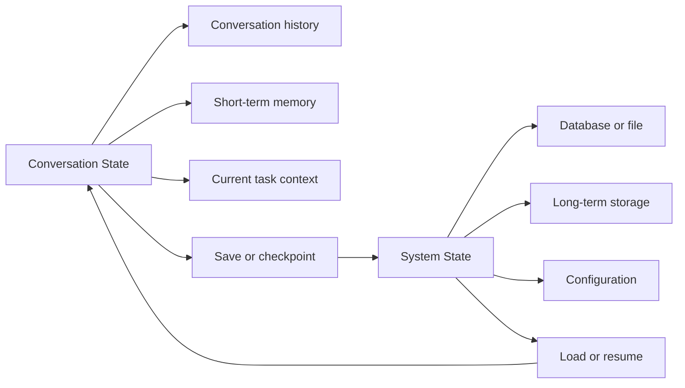
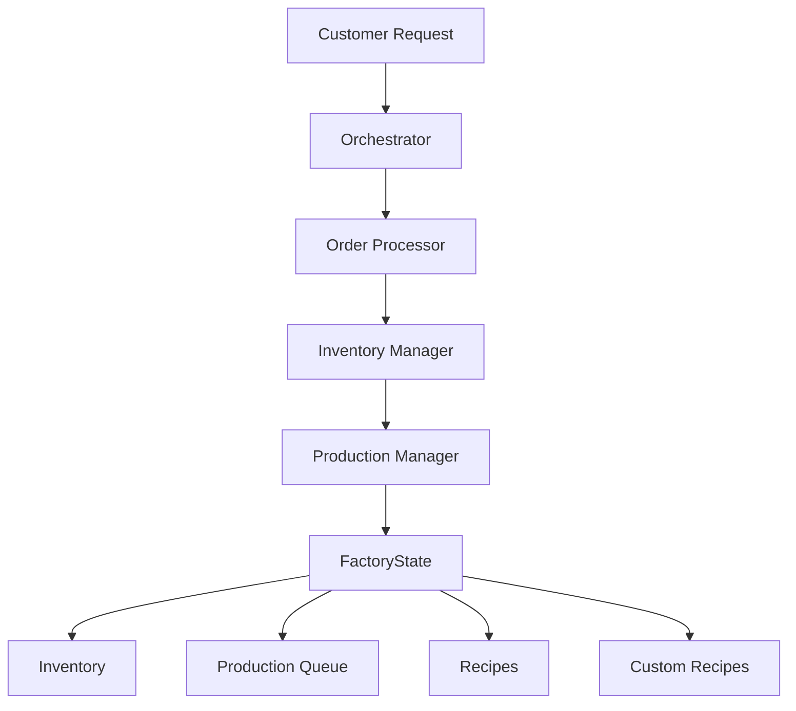
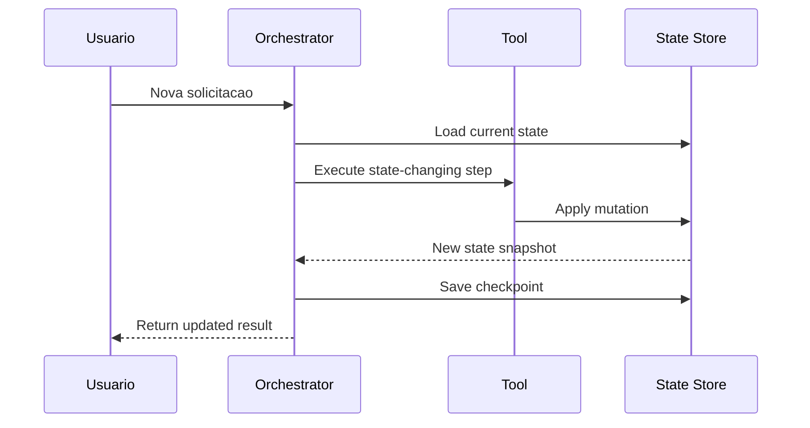

# Gerenciamento de Estado em Sistemas Multi-Agente

Se routing decide para onde o trabalho vai e orquestração decide quando cada agente atua, o **state management** decide **o que o sistema lembra** entre uma etapa e outra. Sem isso, cada agente trabalha como se estivesse entrando na conversa pela primeira vez.

O modelo mental mais útil aqui é o de um **dashboard compartilhado de projeto**. Cada agente consulta esse painel para entender o que já aconteceu, o que ainda falta fazer e quais dados são fonte de verdade do sistema. Parte desse estado é temporária e existe só durante a sessão atual. Outra parte precisa sobreviver a novas execuções, reinícios e fluxos longos.

## 🧠 Conceito Fundamental

Podemos resumir o tópico assim:

$$\text{State Management} = \text{Contexto} + \text{Transições} + \text{Persistência} + \text{Recuperação}$$

$$\text{Estado Efêmero} = \text{Histórico Atual} + \text{Memória de Curto Prazo}$$

$$\text{Estado Persistente} = \text{Fonte de Verdade Durável} + \text{Recovery Points}$$

Em termos práticos:

*   **State** é tudo o que o sistema sabe sobre o processo atual.
*   **Ephemeral state** guarda o contexto imediato da conversa ou execução.
*   **Persistent state** guarda dados que precisam sobreviver a novas sessões.
*   **Failure handling** protege a consistência quando alguma etapa falha.

## 🔑 Termos-Chave

| Termo | Definição | Papel no Sistema |
| :--- | :--- | :--- |
| **State** | Informação mantida sobre o status de uma interação ou workflow. | Dá continuidade ao processo. |
| **State Management** | Técnicas para rastrear, atualizar e persistir estado. | Mantém consistência e memória. |
| **Ephemeral State** | Estado temporário, válido só durante a sessão atual. | Sustenta contexto imediato. |
| **Persistent State** | Estado salvo de forma durável em arquivo, banco ou storage. | Permite retomada entre sessões. |
| **State Transition** | Mudança de um estado para outro após uma ação. | Representa progresso real do workflow. |
| **Recovery Point** | Snapshot seguro para retomada após falha. | Evita recomeço total ou inconsistência. |
| **Retry Logic** | Nova tentativa após falhas transitórias. | Recupera chamadas instáveis. |
| **Fallback** | Caminho alternativo quando o plano principal falha. | Mantém o fluxo útil. |
| **Compensating Action** | Ação que desfaz um efeito persistente anterior. | Corrige estados parciais. |
| **Human-in-the-Loop** | Escalada para revisão humana. | Protege casos críticos ou ambíguos. |

## 🗂 Conversa Atual vs Fonte de Verdade

O erro mais comum em sistemas multi-agente é tratar todo estado como se fosse igual. Não é.

Há duas camadas diferentes:

1.  **Conversation state**: o que está acontecendo agora.
2.  **System state**: o que o sistema precisa lembrar no futuro.



### O que costuma ser efêmero

*   a mensagem atual do usuário;
*   resultados intermediários que só importam nesta execução;
*   observações temporárias do orquestrador;
*   contexto derivado que pode ser reconstruído depois.

### O que costuma ser persistente

*   preferências do usuário;
*   histórico de compras ou pedidos;
*   fila de produção;
*   inventário;
*   configurações do sistema;
*   checkpoints para retomada.

> A pergunta decisiva é esta: se o processo parar agora e voltar depois, o que ainda precisa existir?

## 🍍 Exemplo 1: Estado Compartilhado no Mercado de Frutas

O demo [`05-state-management-in-multi-agent-systems-demo.py`](../exercises/05-state-management-in-multi-agent-systems/demo/05-state-management-in-multi-agent-systems-demo.py) usa um estado global simples:

```python
user_states = {}
```

Esse dicionário centraliza, por usuário:

*   `preferences`
*   `purchases`

Ferramentas como `add_fruit_preference`, `record_purchase` e `get_purchase_history` leem e atualizam essa estrutura. O ponto importante não é o formato em si, mas o padrão:

1.  há uma **fonte compartilhada** de estado;
2.  agentes especializados manipulam apenas o pedaço relevante;
3.  o orquestrador consulta esse estado antes de decidir o próximo passo.

No método `process_user_message`, o orquestrador injeta o contexto atual no prompt:

*   preferências correntes;
*   número de compras anteriores;
*   mensagem atual do usuário;
*   regras de workflow para decidir quando salvar estado.

Isso evita que os agentes atuem no escuro.

### O que esse exemplo ensina

| Elemento | Onde aparece | O que demonstra |
| :--- | :--- | :--- |
| **`user_states`** | demo 05 | Fonte central simples para memória compartilhada |
| **`PreferenceAgent`** | demo 05 | Atualização de preferências como estado persistido no processo |
| **`PurchaseAgent`** | demo 05 | Histórico transacional acumulado |
| **novo `Orchestrator` na Session 2** | demo 05 | Reuso do estado entre instâncias do orquestrador |

### Limitação importante do demo

Aqui vale uma leitura cuidadosa do código: o estado sobrevive entre duas sessões do exemplo porque o script cria um **novo orquestrador no mesmo processo Python**, não porque exista banco de dados real.

Além disso, a tool `save_user_state` funciona como um **marcador didático de persistência**, mas não grava dados em storage externo.

Ou seja:

$$\text{Persistência no Demo} = \text{Estado em Memória Global} + \text{Mesma Execução do Processo}$$

Isso já é útil para ensinar **state sharing**, mas ainda não é persistência durável de verdade.

## 🍝 Exemplo 2: Evoluindo para Estado Estruturado na Fábrica de Massas

No exercício [`06-multi-agent-state-coordination-and-orchestration.py`](../exercises/06-multi-agent-state-coordination-and-orchestration/exercise/06-multi-agent-state-coordination-and-orchestration.py), o estado evolui para uma estrutura explícita com `dataclass`:

*   `PastaOrder`
*   `FactoryState`

Esse desenho é muito mais próximo de um sistema real porque o estado deixa de ser só um dicionário solto e passa a modelar entidades e regras:

*   `inventory`
*   `production_queue`
*   `pasta_recipes`
*   `custom_recipes`
*   `order_counter`
*   `known_pasta_shapes`

Isso melhora três coisas ao mesmo tempo:

1.  **legibilidade** do domínio;
2.  **consistência** das mutações;
3.  **capacidade de serialização** via `to_dict()`.



### O que muda de verdade nesse desenho

No mercado de frutas, o foco está em lembrar preferências e compras do usuário.

Na fábrica de massas, o estado já controla:

*   recursos concorrentes;
*   fila operacional;
*   prioridades;
*   criação de novas receitas;
*   impacto de uma mutação em várias áreas do sistema.

Em outras palavras:

$$\text{Estado Compartilhado Rico} = \text{Dados do Domínio} + \text{Regras de Negócio} + \text{Capacidade de Coordenação}$$

## 🎯 Stateful Orchestration: Contexto Certo para o Agente Certo

Gerenciar estado não significa despejar tudo para todo agente. O orquestrador precisa passar **apenas o contexto relevante**.

### No mercado de frutas

| Agente | Estado que precisa | Estado que não precisa |
| :--- | :--- | :--- |
| **`FruitInfoAgent`** | `fruit_name` | histórico completo de compras |
| **`PreferenceAgent`** | `user_id`, `fruit_name`, preferências atuais | detalhes de preço e fila operacional |
| **`PurchaseAgent`** | `user_id`, `fruit_name`, `quantity`, compras anteriores | descrição detalhada de todas as frutas |

### Na fábrica de massas

| Agente | Estado que precisa | Estado que não precisa |
| :--- | :--- | :--- |
| **Order Processor** | pedido bruto do cliente, shapes disponíveis | inventário completo bruto em toda decisão |
| **Inventory Manager** | receita, quantidade, níveis de estoque | texto completo da conversa com o cliente |
| **Production Manager** | `order_id`, quantidade, prioridade, fila atual | preferências sem impacto logístico |
| **CustomPastaDesignerAgent** | ingredientes existentes, regras da nova receita | pedidos antigos sem relação com o novo design |

Esse é o coração da orquestração stateful:

> Compartilhar estado não significa compartilhar tudo. Significa compartilhar o suficiente para a próxima decisão ser correta.

## 🔄 Transições de Estado e Recovery Points

Sempre que uma tool atualiza dados, o sistema sofre uma **state transition**. Exemplos:

*   preferência adicionada;
*   compra registrada;
*   inventário reduzido;
*   pedido inserido na fila;
*   prioridade alterada;
*   receita customizada criada.

Em workflows curtos, isso pode parecer simples. Em workflows maiores, cada transição precisa ser tratada como um ponto que pode exigir:

*   validação;
*   persistência;
*   rollback;
*   checkpoint.



## 💥 Failure Handling: O Que Fazer Quando Algo Quebra

Sistemas reais falham. A diferença entre um workflow frágil e um robusto está em **como** o estado é protegido quando isso acontece.

### 1. Retry Logic

Use retry quando a falha é provavelmente transitória:

*   timeout de API;
*   rate limit;
*   conexão intermitente;
*   lock temporário em recurso externo.

Regra prática:

$$\text{Retry Seguro} = \text{Operação Idempotente} + \text{Backoff} + \text{Limite de Tentativas}$$

### 2. Fallback

Se a etapa principal falhar, o sistema precisa de um plano B:

*   usar outro agente;
*   responder com versão simplificada;
*   pular uma etapa não crítica;
*   devolver mensagem clara com contexto.

No demo da fábrica de massas, já vemos o começo desse padrão no `try/except` do orquestrador com uma resposta de falha limpa ao cliente.

### 3. Graceful Failure Reporting

Falhar com elegância é melhor do que travar silenciosamente.

O usuário ou sistema chamador precisa receber:

*   o que falhou;
*   em qual etapa falhou;
*   o que foi preservado;
*   o que precisa ser tentado de novo.

### 4. Compensating Actions

Esse é o ponto mais importante quando há mutações persistentes.

Imagine este fluxo:

1.  o inventário é debitado;
2.  a entrada na fila de produção falha;
3.  o pedido não existe, mas o estoque já foi consumido.

Se o sistema parar aí, o estado fica inconsistente. A solução é aplicar uma **compensating action**, por exemplo:

*   devolver os ingredientes ao inventário;
*   cancelar a reserva de recursos;
*   marcar o pedido como falho com motivo explícito.

### 5. Human-in-the-Loop Escalation

Alguns erros não devem ser resolvidos automaticamente:

*   conflito financeiro;
*   dados contraditórios;
*   decisão regulatória;
*   alteração crítica de prioridade ou estoque sem confiança suficiente.

Nesses casos, o sistema deve pausar e anexar:

*   input original;
*   estado intermediário;
*   logs de falha;
*   próximos passos sugeridos.

## 💻 Exemplo de Implementação

O padrão abaixo mostra uma abordagem genérica para separar estado de conversa, armazenamento persistente e recuperação.

```python
from dataclasses import dataclass, field
from typing import Any
from copy import deepcopy


@dataclass
class ConversationState:
    user_id: str
    current_request: str
    history: list[str] = field(default_factory=list)
    working_memory: dict[str, Any] = field(default_factory=dict)


class PersistentStore:
    def __init__(self) -> None:
        self.records: dict[str, dict[str, Any]] = {}

    def load(self, user_id: str) -> dict[str, Any]:
        return deepcopy(self.records.get(user_id, {}))

    def save(self, user_id: str, state: dict[str, Any]) -> None:
        self.records[user_id] = deepcopy(state)


class StateCoordinator:
    def __init__(self, store: PersistentStore) -> None:
        self.store = store

    def start_session(self, user_id: str, request: str) -> ConversationState:
        persistent_state = self.store.load(user_id)
        return ConversationState(
            user_id=user_id,
            current_request=request,
            working_memory={"persistent_state": persistent_state},
        )

    def checkpoint(self, session: ConversationState) -> None:
        durable_slice = session.working_memory.get("persistent_state", {})
        self.store.save(session.user_id, durable_slice)

    def apply_purchase(self, session: ConversationState, item: str, total: float) -> None:
        persistent = session.working_memory.setdefault("persistent_state", {})
        purchases = persistent.setdefault("purchases", [])
        purchases.append({"item": item, "total": total})

    def safe_update(self, session: ConversationState, operation) -> str:
        before = deepcopy(session.working_memory.get("persistent_state", {}))

        try:
            result = operation()
            self.checkpoint(session)
            return result
        except Exception:
            session.working_memory["persistent_state"] = before
            return "Operation failed. State restored to last checkpoint."
```

### O que este exemplo demonstra

*   **separação entre sessão e armazenamento durável**;
*   **checkpoint explícito** após mutações relevantes;
*   **rollback local** para evitar estado parcial;
*   **slice persistente** isolado da memória temporária da conversa.

## 🛠 Regras de Engenharia

1.  **Defina a fonte de verdade antes de distribuir responsabilidades.**
    Se ninguém sabe onde o estado oficial vive, cada agente vai improvisar.
2.  **Separe estado efêmero de estado persistente.**
    Nem tudo precisa ir para banco, mas o que importa no futuro precisa sair da memória transitória.
3.  **Faça mutações explícitas.**
    Atualizações escondidas em prompts tornam debugging e recuperação muito mais difíceis.
4.  **Projete para retomada.**
    Checkpoints, IDs e logs de transição reduzem perda de progresso.
5.  **Planeje compensação antes de gravar externamente.**
    Se uma etapa persistente puder falhar no meio, o rollback precisa existir antes do problema aparecer.

## ⚠️ Armadilhas Comuns & Debugging

| Armadilha | Sintoma | Correção |
| :--- | :--- | :--- |
| **Estado demais no prompt** | agentes recebem contexto enorme e erram o foco | passe apenas o slice necessário para a tarefa |
| **Persistência falsa** | tudo funciona no demo, mas some ao reiniciar o processo | mover a fonte de verdade para storage durável |
| **Mutações implícitas** | difícil descobrir quem alterou o quê | centralizar transições em tools ou serviços explícitos |
| **Sem recovery point** | uma falha obriga a recomeçar tudo | criar checkpoints após etapas críticas |
| **Sem compensação** | inventário, pagamento ou fila ficam desalinhados | implementar rollback ou ação compensatória |
| **Estado compartilhado sem contrato** | agentes sobrescrevem campos de forma incompatível | definir schema estável para o estado |

## 🎯 Takeaways

*   State management é a memória operacional do sistema multi-agente.
*   Estado efêmero sustenta a conversa atual; estado persistente sustenta continuidade real.
*   O orquestrador deve passar contexto relevante, não o estado inteiro.
*   Os exemplos do módulo mostram uma progressão útil: `user_states` simples no mercado de frutas e `FactoryState` estruturado na fábrica de massas.
*   Failure handling não é opcional quando há mutações persistentes.
*   Sistemas confiáveis tratam transições, checkpoints e recuperação como parte da arquitetura.

## 🧪 Exercícios Práticos

*   📓 [README da Demo de State Management](../exercises/05-state-management-in-multi-agent-systems/demo/README.md) — introdução ao cenário do mercado de frutas e à ideia de memória compartilhada entre sessões.
*   🐍 [Demo de State Management](../exercises/05-state-management-in-multi-agent-systems/demo/05-state-management-in-multi-agent-systems-demo.py) — mostra `user_states`, coordenação entre agentes e reaproveitamento de estado ao criar um novo orquestrador.
*   📓 [README do Exercício de State Management](../exercises/05-state-management-in-multi-agent-systems/exercise/README.md) — detalha a evolução para histórico de compras e analytics como parte do estado acumulado do usuário.
*   🐍 [Exercício de State Management](../exercises/05-state-management-in-multi-agent-systems/exercise/05-state-management-in-multi-agent-systems.py) — ponto de prática para implementar `purchase_fruit`, `get_purchase_summary` e ampliar a coordenação via estado.
*   📓 [README da Demo de State Coordination](../exercises/06-multi-agent-state-coordination-and-orchestration/demo/README.md) — amplia o conceito para estado compartilhado operacional, inventário e fila de produção.
*   🐍 [Demo de State Coordination](../exercises/06-multi-agent-state-coordination-and-orchestration/demo/06-multi-agent-state-coordination-and-orchestration-demo.py) — mostra coordenação via `factory_state`, mudanças transacionais e tratamento de erro no orquestrador.
*   📓 [README do Exercício de State Coordination](../exercises/06-multi-agent-state-coordination-and-orchestration/exercise/README.md) — explica como estender o sistema com receitas customizadas, prioridade e mutações consistentes.
*   🐍 [Exercício de State Coordination](../exercises/06-multi-agent-state-coordination-and-orchestration/exercise/06-multi-agent-state-coordination-and-orchestration.py) — prática para modelar transições mais ricas de estado, customização e priorização.

---
&#91;← Tópico Anterior: Routing e Fluxo de Dados em Sistemas Agênticos&#93;&#40;05-routing-and-data-flow-in-agentic-systems.md&#41; | &#91;Próximo Tópico: Módulo 4 — Índice →&#93;&#40;README.md&#41;
