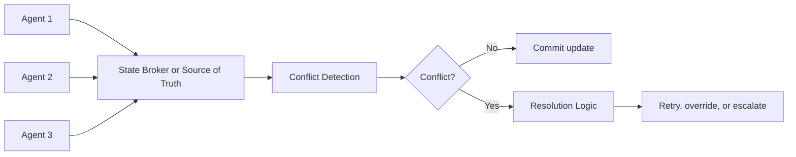
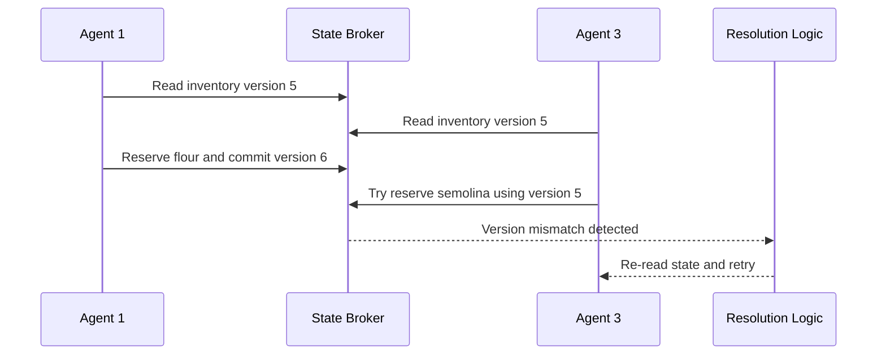

# Orquestração Multi-Agente e Coordenação de Estado

Se gerenciamento de estado é a capacidade de lembrar o que já aconteceu, **coordenação de estado** é a capacidade de garantir que múltiplos agentes ajam sobre uma visão consistente desse mesmo mundo. Em sistemas simples, um agente lê e atualiza o estado quase sozinho. Em sistemas mais avançados, vários agentes podem disputar os mesmos recursos, reagir a eventos diferentes e chegar a conclusões incompatíveis se não houver regras de sincronização.

O modelo mental mais útil aqui é o de uma **torre de controle em um aeroporto**. Não basta saber onde cada avião está. O sistema precisa garantir que dois aviões não tentem usar a mesma pista ao mesmo tempo, que a prioridade de um pouso de emergência seja respeitada e que todos reajam a mudanças críticas sem operar com informação velha.

## 🧠 Conceito Fundamental

Podemos resumir o tópico assim:

$$\text{State Coordination} = \text{Shared State} + \text{Synchronization} + \text{Conflict Detection} + \text{Conflict Resolution}$$

$$\text{Coordenação Robusta} = \text{Fonte de Verdade} + \text{Revalidação} + \text{Regras de Resolução}$$

Em termos práticos:

*   **orquestração** decide quem faz o quê e em que ordem;
*   **coordenação de estado** garante que todos atuem sobre dados coerentes;
*   **concorrência** aparece quando múltiplos agentes ou processos disputam o mesmo recurso;
*   **resolução de conflitos** devolve o sistema a um estado consistente.

## 🔑 Termos-Chave

| Termo | Definição | Papel no Sistema |
| :--- | :--- | :--- |
| **State Coordination** | Conjunto de mecanismos que mantém múltiplos agentes alinhados sobre o mesmo estado compartilhado. | Evita decisões divergentes sobre a mesma realidade. |
| **Synchronization** | Processo de manter dados consistentes entre agentes, serviços ou stores. | Reduz leitura de estado desatualizado. |
| **Concurrency** | Situação em que múltiplos agentes ou processos acessam ou modificam o mesmo recurso ao mesmo tempo. | Introduz risco de corrida, sobrescrita e inconsistência. |
| **Conflict Detection** | Identificação de ações incompatíveis sobre o mesmo estado. | Descobre quando duas operações produzem um estado inválido. |
| **Conflict Resolution** | Estratégia usada para resolver um conflito detectado. | Restaura consistência e decide quem vence. |
| **Source of Truth** | Fonte autoritativa do estado real do sistema. | Define onde a verdade oficial vive. |
| **State Broker** | Camada que distribui ou coordena atualizações de estado. | Ajuda agentes a reagirem a mudanças críticas. |
| **Optimistic Concurrency Control** | Estratégia que assume conflitos raros, mas valida versão ou timestamp antes de gravar. | Evita lost updates sem bloquear tudo o tempo inteiro. |
| **Rollback and Retry** | Desfaz a operação inválida e reexecuta com o estado mais recente. | Recupera conflitos transitórios ou de versão. |

## 🧭 De Gerenciamento para Coordenação

No tópico anterior, o foco era lembrar contexto e persistir progresso. Aqui a pergunta muda:

1.  onde está o estado compartilhado?
2.  quem pode alterá-lo?
3.  o que acontece se dois agentes agirem ao mesmo tempo?
4.  como o sistema detecta que uma decisão foi tomada com base em estado velho?

Essa mudança de foco é importante porque **coordenação** não é só armazenar dados. É definir regras para quando múltiplos agentes dependem dos mesmos dados ao mesmo tempo.



## 🍝 O Que o Demo da Fábrica de Massas Já Mostra

O demo [`06-multi-agent-state-coordination-and-orchestration-demo.py`](../exercises/06-multi-agent-state-coordination-and-orchestration/demo/06-multi-agent-state-coordination-and-orchestration-demo.py) já apresenta a base correta para coordenação:

*   um `factory_state` centralizado;
*   agentes especializados com papéis claros;
*   tools que leem e escrevem nesse estado;
*   um orquestrador que controla o fluxo.

O ponto principal é este:

$$\text{Coordenação Inicial no Demo} = \text{Estado Compartilhado} + \text{Agentes Especializados} + \text{Orquestrador Central}$$

### Onde o estado compartilhado aparece

No demo, a fonte de verdade em memória contém:

*   `inventory`
*   `production_queue`
*   `current_orders`
*   `order_counter`

Cada agente acessa apenas o que precisa:

| Agente | O que consulta ou modifica | Risco de conflito |
| :--- | :--- | :--- |
| **OrderProcessorAgent** | shape, quantidade, `order_id` | gerar decisões a partir de catálogo desatualizado |
| **InventoryManagerAgent** | `inventory`, receita, reserva de ingredientes | duas reservas consumirem o mesmo estoque |
| **ProductionManagerAgent** | `production_queue`, entrega estimada | fila ignorar prioridade ou capacidade atual |
| **Orchestrator** | coordena tudo | usar resposta antiga como se fosse verdade atual |

Esse desenho já é um passo forte além de um sistema sem coordenação, porque o estado não fica espalhado em cada agente.

## 🔄 Sincronização: Como Manter Todo Mundo Alinhado

Quando há estado compartilhado, três estratégias aparecem com frequência.

### 1. Apoiar-se na Fonte de Verdade

A abordagem mais segura é tratar banco de dados, store transacional ou serviço central como a verdade oficial.

No demo da fábrica, isso aparece na forma simplificada de `factory_state`. Em produção, o equivalente seria uma base com:

*   transações;
*   locks;
*   controle de versão;
*   garantias de integridade.

### 2. Broadcasting e Eventing

Nem sempre os agentes devem ficar consultando o estado o tempo todo. Às vezes, o sistema precisa **avisar** quando algo muda.

Exemplos:

*   estoque caiu abaixo do mínimo;
*   uma order mudou de prioridade;
*   uma receita customizada foi criada;
*   a fila de produção ficou congestionada.

Nesse padrão, uma tool que atualiza estado pode publicar um evento, e os agentes interessados reagem a ele.

### 3. Revalidação Antes do Commit

Mesmo num fluxo aparentemente sequencial, o estado pode mudar entre o momento de leitura e o momento da ação. Por isso, sistemas robustos revalidam condições críticas antes de gravar.

Exemplo:

1.  o agente lê que há farinha suficiente;
2.  outro fluxo consome parte da farinha;
3.  a gravação original tentaria reservar um estoque que já não existe.

Sem revalidação, o sistema age sobre um mundo que já mudou.

## ⚡ Concorrência e Condições de Corrida

A versão de exercício [`06-multi-agent-state-coordination-and-orchestration.py`](../exercises/06-multi-agent-state-coordination-and-orchestration/exercise/06-multi-agent-state-coordination-and-orchestration.py) deixa isso ainda mais claro.

Ela introduz estruturas e TODOs que apontam diretamente para cenários de coordenação mais difíceis:

*   `priority` em `PastaOrder`;
*   `custom_recipes`;
*   `known_pasta_shapes`;
*   `check_production_capacity`;
*   `prioritize_order`;
*   `create_custom_pasta_recipe`.

Esses pontos tornam o sistema mais rico, mas também aumentam o número de conflitos possíveis.

### Exemplos de conflito reais nesse domínio

| Situação | Conflito |
| :--- | :--- |
| Dois pedidos grandes chegam juntos | ambos acreditam que o mesmo estoque ainda está disponível |
| Uma receita customizada é criada enquanto outro agente lista shapes válidos | um agente pode operar com catálogo antigo |
| Um pedido é repriorizado enquanto outro calcula data de entrega | a fila pode ficar inconsistente |
| Um agente atualiza inventário e outro calcula capacidade com snapshot antigo | a estimativa final pode ficar incorreta |



## 🧪 Detecção de Conflitos

Conflito não é só "dois agentes discordaram". É quando duas ações produzem um estado que o sistema considera inválido ou incoerente.

Estratégias comuns de detecção:

### Versionamento ou Timestamp

Cada leitura recebe uma versão do estado. A escrita só é aceita se a versão ainda for a mesma.

$$\text{Atualização Válida} = \text{Versão Lida} = \text{Versão Atual}$$

Se a versão mudar no meio do caminho, a atualização falha de forma segura.

### Validação por Regra de Negócio

Mesmo sem versionamento, o sistema pode detectar conflitos verificando invariantes como:

*   estoque nunca pode ficar negativo;
*   pedido não pode receber prioridade inválida;
*   shape customizado não pode duplicar nome existente;
*   delivery date não pode ignorar a fila real.

### Recheque de Pré-condições

Antes de efetivar a mudança, o sistema reexecuta checks críticos:

*   ainda existe inventário suficiente?
*   essa receita continua válida?
*   o pedido ainda está na fila?
*   a prioridade continua permitida?

## 🛠 Estratégias de Resolução de Conflitos

Detectar o conflito é só metade do trabalho. Depois o sistema precisa decidir o que fazer.

### 1. Regras Predefinidas

A solução mais simples é embutir políticas claras:

*   prioridade 3 vence prioridade 1;
*   pedido confirmado vence sugestão ainda não confirmada;
*   atualização mais recente vence;
*   operação do agente responsável pelo domínio vence.

No contexto da fábrica, isso pode significar:

*   ordens emergenciais entram na frente;
*   criação de receita valida primeiro o catálogo oficial;
*   reserva de inventário só acontece se todas as verificações passarem.

### 2. Rollback e Retry

Esse é o padrão mais comum com concorrência otimista.

Fluxo:

1.  a escrita falha por conflito;
2.  o sistema desfaz a operação parcial;
3.  recarrega o estado novo;
4.  tenta novamente com base na verdade atual.

### 3. Negociação ou Consenso

Mais raro em exemplos didáticos, mas útil em cenários distribuídos: agentes trocam propostas para chegar a uma resolução em conjunto.

### 4. Escalada Humana

Se o conflito for crítico, ambíguo ou tiver alto impacto, o sistema deve parar e pedir intervenção humana.

Exemplos:

*   pedido urgente competindo com estoque já comprometido;
*   receita customizada que viola política de produção;
*   divergência entre sistema interno e sistema externo.

## 💻 Exemplo de Implementação

O exemplo abaixo mostra uma forma genérica de aplicar concorrência otimista com detecção de conflito, retry e publishing de evento.

```python
from dataclasses import dataclass, field
from typing import Any
from copy import deepcopy


@dataclass
class SharedResource:
    data: dict[str, Any]
    version: int = 0
    events: list[str] = field(default_factory=list)


class ConflictError(Exception):
    pass


class StateBroker:
    def __init__(self) -> None:
        self.resource = SharedResource(
            data={"inventory": {"flour": 10.0}, "queue": []}
        )

    def read(self) -> tuple[dict[str, Any], int]:
        return deepcopy(self.resource.data), self.resource.version

    def update_if_version_matches(
        self, expected_version: int, mutate
    ) -> dict[str, Any]:
        if self.resource.version != expected_version:
            raise ConflictError("State changed before commit.")

        new_state = deepcopy(self.resource.data)
        event = mutate(new_state)

        self.resource.data = new_state
        self.resource.version += 1

        if event:
            self.resource.events.append(event)

        return deepcopy(self.resource.data)


def reserve_flour(broker: StateBroker, amount: float, max_retries: int = 2) -> dict[str, Any]:
    for _ in range(max_retries + 1):
        state, version = broker.read()
        current_flour = state["inventory"]["flour"]

        if current_flour < amount:
            return {"success": False, "reason": "insufficient_inventory"}

        def mutation(draft_state: dict[str, Any]) -> str:
            draft_state["inventory"]["flour"] -= amount
            return "inventory_updated"

        try:
            updated_state = broker.update_if_version_matches(version, mutation)
            return {"success": True, "state": updated_state}
        except ConflictError:
            continue

    return {"success": False, "reason": "conflict_after_retries"}
```

### O que este exemplo demonstra

*   leitura com versão;
*   commit condicional;
*   detecção explícita de conflito;
*   retry sobre estado novo;
*   emissão simples de evento após mutação bem-sucedida.

## 🛠 Regras de Engenharia

1.  **Escolha uma fonte de verdade clara.**
    Se cada agente mantiver sua própria verdade, coordenação vira adivinhação.
2.  **Revalide antes de gravar.**
    Leitura correta no início não garante que a gravação ainda será válida no fim.
3.  **Defina políticas de conflito antes de precisar delas.**
    Resolver conflito na emergência costuma produzir regras inconsistentes.
4.  **Faça mutações rastreáveis.**
    Logs, versões e eventos ajudam a reconstruir o que aconteceu.
5.  **Trate concorrência como requisito, não como detalhe.**
    Mesmo workflows sequenciais podem sofrer com mudanças externas e estado velho.

## ⚠️ Armadilhas Comuns & Debugging

| Armadilha | Sintoma | Correção |
| :--- | :--- | :--- |
| **Fonte de verdade difusa** | agentes discordam sobre estoque, fila ou prioridade | centralize o estado oficial |
| **Atualização sem versão** | mudanças se perdem silenciosamente | adote versionamento, timestamp ou lock |
| **Fila sem política de prioridade** | urgências não têm efeito real | formalize regras de ordenação |
| **Check sem recheck** | decisão correta vira erro ao gravar | revalide pré-condições antes do commit |
| **Sem estratégia de conflito** | o sistema detecta o problema, mas não sabe agir | defina rollback, retry, override ou escalada |
| **Eventos ausentes** | agentes continuam operando com snapshot velho | publique mudanças críticas ou force refresh |

## 🎯 Takeaways

*   coordenação de estado é o que transforma vários agentes competentes em um sistema realmente coeso;
*   sincronização protege a consistência da visão compartilhada;
*   concorrência cria risco de conflito sempre que o mesmo recurso é disputado;
*   detectar conflito cedo é melhor do que corrigir estado corrompido depois;
*   resolução precisa de regras explícitas: retry, rollback, prioridade, consenso ou escalada humana.

## 🧪 Exercícios Práticos

*   📓 [README da Demo de State Coordination](../exercises/06-multi-agent-state-coordination-and-orchestration/demo/README.md) — visão geral do cenário de coordenação entre agentes com estado compartilhado.
*   🐍 [Demo de State Coordination](../exercises/06-multi-agent-state-coordination-and-orchestration/demo/06-multi-agent-state-coordination-and-orchestration-demo.py) — mostra `factory_state`, agentes especializados e um orquestrador central coordenando inventário, pedidos e fila.
*   📓 [README do Exercício de State Coordination](../exercises/06-multi-agent-state-coordination-and-orchestration/exercise/README.md) — destaca custom recipes, prioridade e integração entre agentes como pontos centrais de coordenação.
*   🐍 [Exercício de State Coordination](../exercises/06-multi-agent-state-coordination-and-orchestration/exercise/06-multi-agent-state-coordination-and-orchestration.py) — prática ideal para explorar conflitos de inventário, priorização, catálogo dinâmico e consistência de fila.

---
&#91;← Tópico Anterior: Gerenciamento de Estado em Sistemas Multi-Agente&#93;&#40;06-state-management-in-multi-agent-systems.md&#41; | &#91;Próximo Tópico: Multi-Agent Retrieval Augmented Generation →&#93;&#40;08-multi-agent-retrieval-augmented-generation.md&#41;
