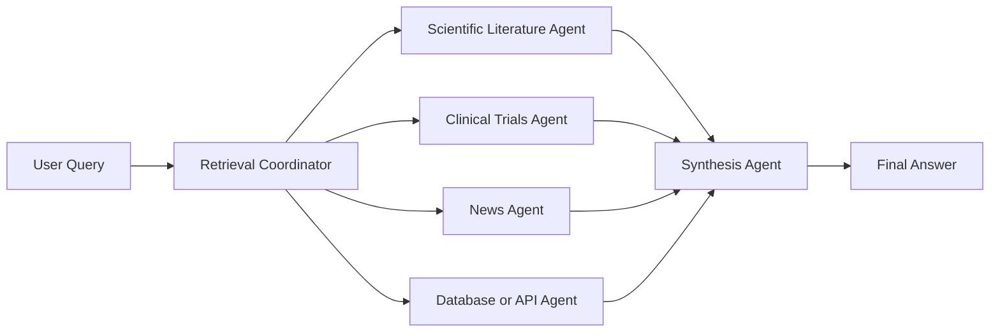
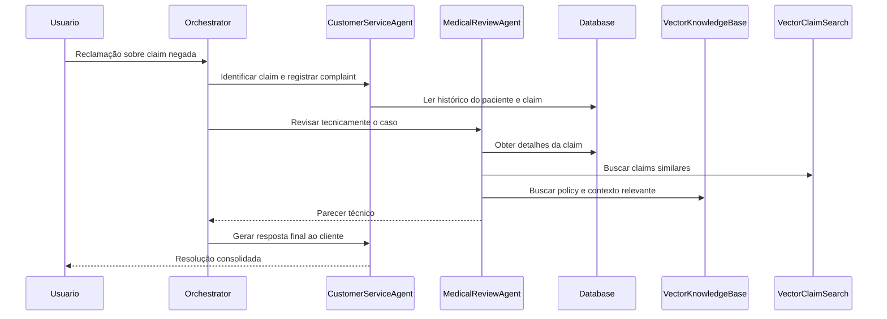

# Multi-Agent Retrieval Augmented Generation

Se um agente sozinho já consegue responder perguntas com base em um PDF ou em uma base vetorial, um sistema **Multi-Agent RAG** vai além: ele distribui a busca entre especialistas diferentes e depois combina os achados em uma resposta única. Isso é especialmente útil quando a pergunta exige cruzar fontes heterogêneas, como artigos científicos, notícias recentes, bases internas e dados estruturados.

O modelo mental mais útil aqui é o de um **time de pesquisa especializado**. Em vez de pedir para um único agente saber buscar em tudo, o sistema usa agentes focados em fontes específicas. Um coordenador decide quem deve pesquisar o quê. Depois, um agente de síntese organiza os resultados em uma resposta coerente.

## 🧠 Conceito Fundamental

Podemos resumir o tópico assim:

$$\text{MA-RAG} = \text{Coordinator} + \text{Specialized Retrieval Agents} + \text{Synthesis}$$

$$\text{Resposta Robusta} = \text{Recuperação Multi-Fonte} + \text{Especialização} + \text{Gap Analysis}$$

Em termos práticos:

*   **RAG** injeta contexto recuperado antes da geração.
*   **especialização** faz cada agente recuperar melhor dentro do seu próprio domínio.
*   **coordenação** escolhe quais buscas são necessárias e em que ordem.
*   **síntese** transforma resultados fragmentados em uma resposta utilizável.
*   **knowledge gap** aparece quando a primeira rodada de retrieval ainda não basta.

## 🔑 Termos-Chave

| Termo | Definição | Papel no Sistema |
| :--- | :--- | :--- |
| **Retrieval-Augmented Generation (RAG)** | Técnica de fornecer contexto externo ao modelo antes da resposta final. | Reduz alucinação e ancora a resposta em dados reais. |
| **Specialized Retrieval Agent** | Agente configurado para recuperar dados de uma fonte específica. | Aumenta profundidade e precisão do retrieval. |
| **Retrieval Coordinator** | Agente orquestrador que analisa a consulta e delega buscas. | Decide quais especialistas acionar e coleta resultados. |
| **Synthesis Agent** | Agente que combina os achados recuperados. | Produz uma resposta final única e coerente. |
| **Knowledge Gap** | Informação faltante que impede uma resposta completa. | Dispara novas buscas ou follow-up queries. |
| **Vector Search** | Busca por similaridade semântica em embeddings ou vetores derivados de texto. | Recupera contexto relevante além de match exato por palavra-chave. |
| **Structured Data Retrieval** | Recuperação em fontes como bancos SQL, APIs ou registros tabulares. | Permite unir fatos operacionais com texto não estruturado. |
| **Access Control** | Regras que limitam quem pode recuperar quais dados. | Protege privacidade e reduz vazamento de informação. |

## 🔍 De RAG Simples para MA-RAG

Num RAG simples, um único agente faz três coisas ao mesmo tempo:

1.  interpreta a pergunta;
2.  consulta uma fonte externa;
3.  gera a resposta final.

Isso funciona bem quando a base é única e homogênea. O problema aparece quando a consulta exige múltiplas fontes ou diferentes estratégias de recuperação.

Exemplo:

> "Quais são os avanços mais recentes de CRISPR para tratamento de fibrose cística?"

Responder bem pode exigir:

*   literatura científica;
*   ensaios clínicos;
*   notícias recentes;
*   aprovações regulatórias.

Um único agente tende a misturar papéis. Já em MA-RAG, cada agente vira especialista em um tipo de fonte.

## 🧩 Papéis em um Sistema Multi-Agent RAG

### 1. Specialized Retrieval Agents

Cada agente conhece melhor sua fonte, seu formato de consulta e suas restrições.

Exemplos comuns:

*   agente de banco SQL;
*   agente de vector store;
*   agente de web search;
*   agente de notícias;
*   agente de base médica;
*   agente de documentos internos.

Essa separação melhora:

*   qualidade das queries;
*   tratamento de formatos diferentes;
*   respeito a políticas de acesso;
*   clareza arquitetural.

### 2. Retrieval Coordinator

O coordenador recebe a pergunta do usuário e decide:

*   quais especialistas devem ser acionados;
*   quais chamadas podem rodar em paralelo;
*   quais resultados são suficientes;
*   se há lacunas que exigem nova rodada de retrieval.

Em outras palavras:

$$\text{Coordinator} = \text{Query Analysis} + \text{Task Delegation} + \text{Result Collection}$$

### 3. Synthesis Agent

Depois que os resultados chegam, alguém precisa conectá-los.

O papel do sintetizador é:

*   remover redundância;
*   reconciliar conflitos;
*   destacar evidências relevantes;
*   entregar uma resposta única, clara e útil.

Sem essa camada, o usuário recebe apenas uma coleção de snippets desconectados.

### 4. Re-Querying e Gap Analysis

Às vezes a primeira recuperação não resolve tudo.

Exemplos de lacuna:

*   temos histórico de reclamação, mas não a justificativa da decisão;
*   temos a policy, mas falta o caso parecido;
*   temos o caso parecido, mas falta a regra de acesso ou cobertura.

Nesse momento, o sistema precisa reconsultar a fonte certa, e não repetir a mesma busca genérica.

## 🏗 Por Que Especialização Faz Diferença

### Expert Querying

Um agente SQL pode ser otimizado para filtros, joins e agregações. Um agente vetorial pode ser otimizado para semântica e thresholds. Um agente web pode ser desenhado para recência, reputação da fonte e expansão de consulta.

Tentar fazer um agente único dominar tudo tende a gerar:

*   queries piores;
*   menos controle;
*   mais acoplamento;
*   síntese menos confiável.

### Integração de Dados Estruturados e Não Estruturados

Esse é um dos pontos mais importantes de MA-RAG em cenários reais.

$$\text{Enterprise MA-RAG} = \text{Structured Data} + \text{Unstructured Data} + \text{Orchestration}$$

Você pode combinar:

*   registros operacionais;
*   políticas internas;
*   histórico de atendimento;
*   documentos;
*   similaridade semântica;
*   regras de negócio.

### Flexibilidade de Orquestração

Nem toda pergunta precisa do sistema inteiro.

| Tipo de Pergunta | Agentes Necessários |
| :--- | :--- |
| "Qual o estoque do Produto X?" | banco de dados |
| "Quais notícias recentes falam do concorrente Y?" | news agent + web agent |
| "Compare specs do concorrente com nosso produto" | news/web + base interna |
| "Explique por que uma claim foi negada e como responder ao cliente" | histórico da claim + KB de política + agente de atendimento |

## 🏥 Relação com o Demo do Repositório

O demo [`07-multi-agent-retrieval-augmented-generation-demo.py`](../exercises/07-multi-agent-retrieval-augmented-generation/demo/07-multi-agent-retrieval-augmented-generation-demo.py) mostra uma versão concreta de MA-RAG aplicada a **insurance claims**.

Em vez de um agente único, o sistema combina:

*   **`ClaimProcessingAgent`** para processamento de claims;
*   **`CustomerServiceAgent`** para histórico do paciente, reclamações e comunicação;
*   **`MedicalReviewAgent`** para revisão técnica do caso;
*   **`ComplaintResolutionOrchestrator`** para coordenar a sequência.

O retrieval não acontece só em uma fonte. O demo mistura:

*   base vetorial de conhecimento via `VectorKnowledgeBase`;
*   busca híbrida de claims similares via `VectorClaimSearch`;
*   dados estruturados da `Database`;
*   controle de privacidade via `PrivacyLevel` e `AccessControl`.

Isso faz o demo ser um bom exemplo de MA-RAG porque ele combina:

$$\text{Demo 07} = \text{Agentes Especializados} + \text{Retrieval Vetorial} + \text{Dados Estruturados} + \text{Orquestração} + \text{Controle de Acesso}$$

### O que cada parte do demo ensina

| Componente | Onde aparece | O que demonstra |
| :--- | :--- | :--- |
| **`VectorKnowledgeBase`** | demo 07 | RAG sobre política, processos e procedure codes com busca semântica |
| **`VectorClaimSearch`** | demo 07 | recuperação de claims parecidas com score híbrido entre semântica e regras |
| **`AccessControl`** | demo 07 | retrieval precisa respeitar permissões, não apenas relevância |
| **`ClaimProcessingAgent`** | demo 07 | agente que usa contexto recuperado para decidir sobre claims |
| **`MedicalReviewAgent`** | demo 07 | especialista que consulta casos similares e base de conhecimento |
| **`CustomerServiceAgent`** | demo 07 | agente que usa retrieval para responder com contexto e empatia |
| **`ComplaintResolutionOrchestrator`** | demo 07 | coordenador que encadeia subagentes e consolida o fluxo |

## 🔄 Como o Fluxo de MA-RAG Aparece no Demo

No fluxo de reclamações, o orquestrador não tenta fazer tudo sozinho.

Ele:

1.  identifica a claim relevante;
2.  registra a reclamação;
3.  envia o caso ao agente de revisão médica;
4.  recupera detalhes, casos similares e regras da base;
5.  pede uma resposta final ao atendimento;
6.  fecha a reclamação com uma síntese final.

Esse fluxo mostra uma ideia central:

> Em MA-RAG, retrieval não é uma etapa isolada. Ele é distribuído ao longo do workflow, conforme cada agente precisa de contexto especializado para agir.

Outro detalhe importante do código é que a síntese final aparece de forma **implícita**. Não existe uma classe chamada `SynthesisAgent`, mas o fechamento do caso pelo `CustomerServiceAgent`, após a revisão do `MedicalReviewAgent`, cumpre esse papel ao transformar achados técnicos e históricos em uma resolução final compreensível.

## 🧪 Retrieval Híbrido no Código

O demo não faz apenas busca vetorial pura.

No `VectorClaimSearch`, a recuperação combina:

*   similaridade semântica via TF-IDF + cosine similarity;
*   boost por mesmo `procedure_code`;
*   boost por valores financeiros próximos;
*   boost por mesmo paciente.

Isso é útil porque, em sistemas operacionais, relevância não depende só de semântica textual.

$$\text{Hybrid Retrieval} = \text{Semantic Similarity} + \text{Domain Heuristics}$$

## 🧪 Relação com o Exercício

O exercício [`07-multi-agent-retrieval-augmented-generation.py`](../exercises/07-multi-agent-retrieval-augmented-generation/exercise/07-multi-agent-retrieval-augmented-generation.py) amplia o sistema com um novo especialista: **fraud detection**.

Os TODOs do exercício pedem exatamente a evolução arquitetural típica de MA-RAG:

*   criar uma base de conhecimento de padrões de fraude;
*   implementar um `FraudPatternDetector`;
*   usar vector search para recuperar padrões semelhantes;
*   criar um `FraudDetectionAgent`;
*   inserir esse agente no workflow de processamento.

Ou seja:

$$\text{Exercício 07} = \text{Adicionar Novo Especialista de Retrieval} + \text{Novo Domínio de Conhecimento}$$

Essa é uma ótima demonstração de como sistemas multi-agente escalam: em vez de reescrever tudo, você adiciona um novo agente especializado e o conecta ao coordenador.

### Diferença entre demo e exercício

| Arquivo | Foco | O que você pratica |
| :--- | :--- | :--- |
| **demo 07** | fluxo completo de complaint resolution com RAG | entender a arquitetura base de agentes, retrieval e síntese |
| **exercise 07** | extensão com detecção de fraude | adicionar um novo retrieval specialist e evoluir a orquestração |

## 🛠 Regras de Engenharia

1.  **Especialize por fonte, não por conveniência.**
    Um agente deve ter um domínio de retrieval claro.
2.  **Separe coordenação de síntese.**
    Quem delega não precisa ser o mesmo componente que escreve a resposta final.
3.  **Combine relevância com permissão.**
    O dado mais relevante ainda pode ser inacessível para aquele agente.
4.  **Trate lacunas como parte normal do fluxo.**
    Se faltar contexto, faça re-query direcionado.
5.  **Misture retrieval semântico com regras explícitas quando necessário.**
    Similaridade pura nem sempre basta em domínios operacionais.

## 🧱 Limitações do Exemplo

Como material didático, o código simplifica vários pontos importantes:

*   usa **TF-IDF**, não embeddings densos de produção;
*   usa banco em memória, não storage persistente real;
*   extrai IDs em alguns passos por parsing de texto do agente, o que é frágil;
*   concentra a síntese final em agentes existentes, sem uma camada dedicada e isolada.

Essas simplificações são aceitáveis para ensino, mas valem atenção ao migrar o padrão para um sistema real.

## ⚠️ Armadilhas Comuns & Debugging

| Armadilha | Sintoma | Correção |
| :--- | :--- | :--- |
| **Um agente genérico para tudo** | respostas rasas e retrieval inconsistente | crie especialistas por fonte e responsabilidade |
| **Sem coordenador claro** | buscas redundantes ou fora de ordem | centralize delegação e coleta de resultados |
| **Sem síntese final** | usuário recebe snippets soltos | introduza agente ou etapa explícita de síntese |
| **Sem gap analysis** | resposta final ainda fica incompleta | detecte lacunas e dispare follow-up retrieval |
| **RAG sem controle de acesso** | vazamento de dados sensíveis | combine relevância com políticas de permissão |
| **Só busca vetorial, sem regra de negócio** | casos operacionais ficam mal interpretados | adicione heurísticas, filtros e validações de domínio |

## 🎯 Takeaways

*   MA-RAG é uma evolução arquitetural de RAG, não apenas uma busca maior.
*   Especialização melhora a qualidade do retrieval e reduz ambiguidade.
*   O coordenador decide quem pesquisa; o sintetizador decide como responder.
*   Gap analysis torna o sistema iterativo e mais completo.
*   O demo 07 mostra MA-RAG combinando vetores, banco estruturado, agentes e privacidade.
*   O exercício 07 mostra como expandir a arquitetura com um novo especialista de fraude.

## 🧪 Exercícios Práticos

*   📓 [README da Demo de Multi-Agent RAG](../exercises/07-multi-agent-retrieval-augmented-generation/demo/README.md) — visão geral da arquitetura com claims, complaint handling, vector search e access control.
*   🐍 [Demo de Multi-Agent RAG](../exercises/07-multi-agent-retrieval-augmented-generation/demo/07-multi-agent-retrieval-augmented-generation-demo.py) — demonstra retrieval em múltiplas fontes, agentes especializados e um orquestrador que consolida a resolução de reclamações.
*   📓 [README do Exercício de Multi-Agent RAG](../exercises/07-multi-agent-retrieval-augmented-generation/exercise/README.md) — descreve a extensão do sistema com detecção de fraude baseada em RAG.
*   🐍 [Exercício de Multi-Agent RAG](../exercises/07-multi-agent-retrieval-augmented-generation/exercise/07-multi-agent-retrieval-augmented-generation.py) — prática ideal para adicionar um novo retrieval specialist, criar base de padrões de fraude e integrar o agente ao fluxo existente.

---
&#91;← Tópico Anterior: Orquestração Multi-Agente e Coordenação de Estado&#93;&#40;07-multi-agent-orchestration-and-state-coordination.md&#41; | &#91;Próximo Tópico: Módulo 4 — Índice →&#93;&#40;README.md&#41;
